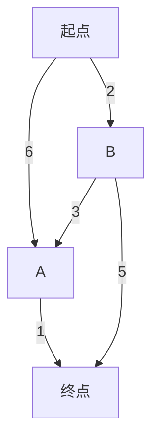
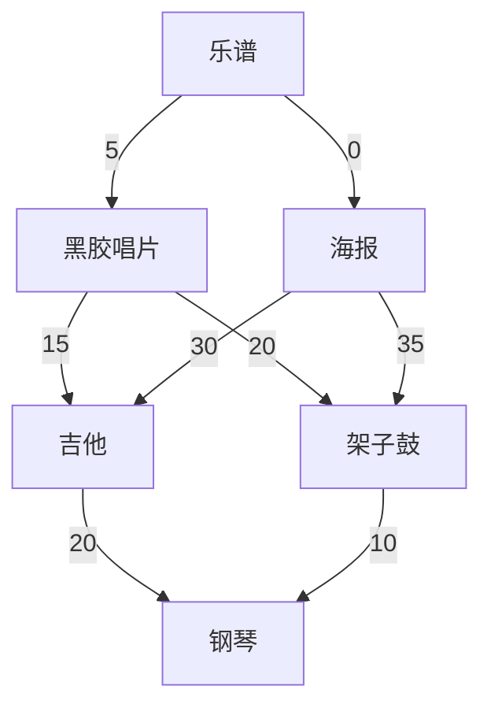

# 狄克斯特拉算法

> 狄克斯特拉算法能够找出加权图中前往X的最短路径

## 最短路径的值

狄克斯特拉算法的4个步骤:

* 找出“最便宜”的节点，即可在最短时间内到达的节点
* 更新该节点的邻居的开销
* 重复这个过程，直到图中的每个节点都这样做了
* 计算最终路劲

第一步，找出最便宜的节点。从起点出来，前往A节点6分钟，前往B节点是2分钟。至于前往终点还不知道，假设无穷大。得出节点B最近--2分钟。

节点 | 耗时
--- | ---
A | 6
B | 2
终点 | 无穷大

第二步，计算经过节点B前往各个邻居所需的时间。

* 发现 前往节点A的更短路径 5
* 发现 前往终点的最短路径 7

节点 | 耗时
--- | ---
A | ~~6~~ 5
B | 2
终点 | 7

第三步，重复，更新节点A的所有邻居，发现 前往终点最短路径为 6

最终得出:

* 前往A节点 5分钟
* 前往B节点 2分钟
* 前往终点 6分钟

节点 | 耗时
--- | ---
A | 5
B | 2
终点 | 6

## 最短路径的节点

交换图:

还是迪克拉特斯的4个步骤:

* 找出最便宜的节点；
* 对于该节点的邻居，若存在前往的更短路径，更新其开销；
* 重复步骤2，直到每个节点都遍历了；
* 计算得出最终路径

第一步，得出换唱片、海报的开销，为得出最短路径，需记录父节点。

父节点 | 节点 | 耗时
--- | --- | ---
乐谱 | 唱片 | 5
乐谱 | 海报 | 0
- | 吉他 | -
- | 架子鼓 | -
- | 钢琴 | -

第二步，前往`海报`的邻居的开销

父节点 | 节点 | 耗时
--- | --- | ---
乐谱 | 唱片 | 5
乐谱 | 海报 | 0
海报 | 吉他 | 30
海报 | 架子鼓 | 35
- | 钢琴 | -

重复，下一个便宜节点是`唱片`

父节点 | 节点 | 耗时
--- | --- | ---
乐谱 | 唱片 | 5
乐谱 | 海报 | 0
~~海报~~唱片 | 吉他 | ~~30~~20
~~海报~~唱片 | 架子鼓 | ~~35~~25
- | 钢琴 | -

再重复，最便宜的是`吉他`

父节点 | 节点 | 耗时
--- | --- | ---
乐谱 | 唱片 | 5
乐谱 | 海报 | 0
唱片 | 吉他 | 20
唱片 | 架子鼓 | 25
吉他 | 钢琴 | 40

最后，同样处理`架子鼓`

父节点 | 节点 | 耗时
--- | --- | ---
乐谱 | 唱片 | 5
乐谱 | 海报 | 0
唱片 | 吉他 | 20
唱片 | 架子鼓 | 25
~~吉他~~架子鼓 | 钢琴 | ~~40~~35

显而易见，得出最小开销是35，置换路径是 乐谱-->唱片-->架子鼓-->钢琴。

## 术语，及不适用场景

**权重**(weighted) 图的边上的数字

带`权重`的图称为**加权图**(weighted graph)

不带的是**非加权图**(unweighted graph)

`非加权图`的最短路径计算用 `广度优先搜索`

`加权图`的最短路径得用 `狄克斯特拉算法`

`狄克斯特拉算法`只适用于`有向无环图`

`狄克斯特拉算法`不适用于`有负权边`的图

## 实现

以最开始的例子为例，来看看如何使用代码实现狄克斯特拉算法。

这个算法的解决方案需要三个散列表: Graph(原始图)、Costs(开销)、Parents(父节点)。

实现代码: [dijkstra.py](dijkstra.py)

## 总结

* 广度优先搜索用于非加权图中查找最短路径
* 狄克斯特拉算法用于加权图中查找最短路径
* 当存在权重为负数的边时狄克斯特拉算法不适用，请使用贝尔曼-福德算法

## leetcode

* leetCode 505 - 迷宫 II
[network-delay-time](https://leetcode-cn.com/problems/network-delay-time/)
