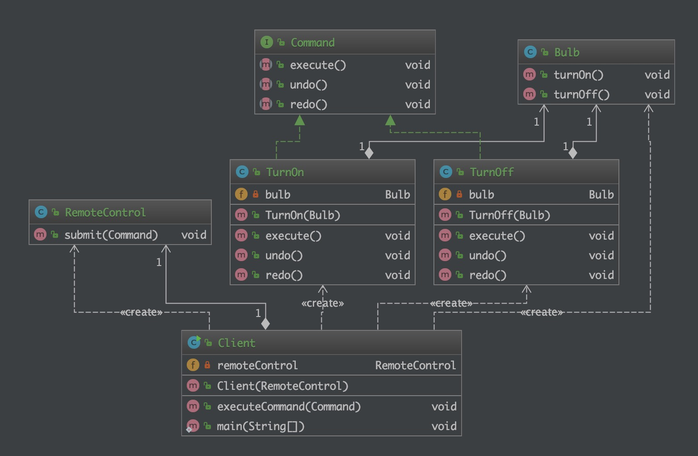

# 命令行模式（Command）

## 目的

> 将一个请求封装成一个对象，从而使您可以用不同的请求对客户进行参数化，请求入队(队列)或者日志记录，并且支持撤销。

## 现实世界的例子

> 一个通用的例子是你在餐厅点餐。您（Client）要求服务员（Invoker）携带一些食物（Command），服务员只是将请求转发给主厨（Receiver），该主厨知道什么以及如何烹饪。

## 类图



## 程序化

接收器

```java
/**
 * 描述: Receiver
 *
 * @author Lin
 * @since 2019-12-18 6:50 AM
 */
public class Bulb {

    public void turnOn() {
        System.out.println("Bulb has been lit");
    }

    public void turnOff() {
        System.out.println("Darkness!");
    }
}
```

有一组命令

```java
/**
 * 命令
 * 
 * Created by Lin on 2019/12/18.
 */
public interface Command {
    void execute();

    void undo();

    void redo();
}

public class TurnOn implements Command {

    private Bulb bulb;

    public TurnOn(Bulb bulb) {
        this.bulb = bulb;
    }

    @Override
    public void execute() {
        bulb.turnOn();
    }

    @Override
    public void undo() {
        bulb.turnOff();
    }

    @Override
    public void redo() {
        this.execute();
    }
}

public class TurnOff implements Command {

    private Bulb bulb;

    public TurnOff(Bulb bulb) {
        this.bulb = bulb;
    }

    @Override
    public void execute() {
        bulb.turnOff();
    }

    @Override
    public void undo() {
        bulb.turnOn();
    }

    @Override
    public void redo() {
        this.execute();
    }
}
```

Invoker, 与客户端交互

```java
/**
 * 描述: Invoker
 *
 * @author Lin
 * @since 2019-12-18 6:57 AM
 */
public class RemoteControl {
    public void submit(Command command) {
        command.execute();
    }
}
```

客户端使用

```java
public class Client {

    private RemoteControl remoteControl;

    public Client(RemoteControl remoteControl) {
        this.remoteControl = remoteControl;
    }

    public void executeCommand(Command command) {
        remoteControl.submit(command);
    }

    public static void main(String[] args) {
        Bulb bulb = new Bulb();

        TurnOn turnOn = new TurnOn(bulb);
        TurnOff turnOff = new TurnOff(bulb);

        RemoteControl remoteControl = new RemoteControl();
        Client client = new Client(remoteControl);

        client.executeCommand(turnOn);
        client.executeCommand(turnOff);
    }
}
```

## 何时使用

> 在某些场合，比如要对行为进行"记录、撤销/重做、事务"等处理，这种无法抵御变化的紧耦合是不合适的。在这种情况下，如何将"行为请求者"与"行为实现者"解耦？将一组行为抽象为对象(命令)，可以实现二者之间的松耦合。

## 参考

* [design-patterns-for-humans](https://github.com/kamranahmedse/design-patterns-for-humans)
* [command](https://github.com/iluwatar/java-design-patterns/tree/master/command)
* [命令模式](https://www.runoob.com/design-pattern/command-pattern.html)
