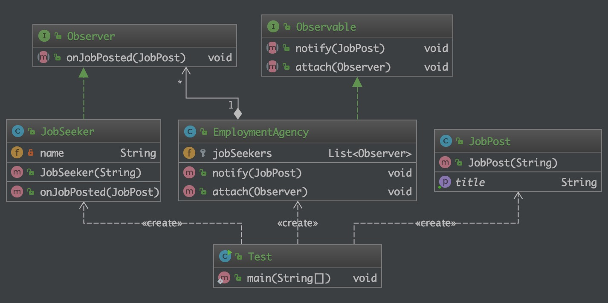

# 观察者模式（Observer）

## 目的

> 定义对象间的一种一对多的依赖关系，当一个对象的状态发生改变时，所有依赖于它的对象都得到通知并被自动更新。

## 现实世界的例子

> 一个很好的例子是求职者，他们订阅了一些职位发布网站，只要有匹配的工作机会，他们就会得到通知。

## 类图



## 程序化

有求职者需要通知职位发布:

```java
/**
 * 描述:
 *
 * @author Lin
 * @since 2019-12-18 11:30 PM
 */
@Getter
public class JobPost {

    private String title;

    public JobPost(String title) {
        this.title = title;
    }
}

/**
 * 描述:
 *
 * @author Lin
 * @since 2019-12-18 11:31 PM
 */
public class JobSeeker implements Observer {

    private String name;

    public JobSeeker(String name) {
        this.name = name;
    }

    @Override
    public void onJobPosted(JobPost jobPost) {
        // 有新的职位招聘发布
        System.out.println("Hola, " + this.name + "! New job posted: " + jobPost.getTitle());
    }
}
```

求职者会订阅的招聘信息:

```java
/**
 * 描述: 订阅的招聘信息
 *
 * @author Lin
 * @since 2019-12-18 11:35 PM
 */
public class EmploymentAgency implements Observable {

    protected List<Observer> jobSeekers;

    @Override
    public void notify(JobPost jobPost) {
        for (Observer jobSeeker : jobSeekers) {
            jobSeeker.onJobPosted(jobPost);
        }
    }

    @Override
    public void attach(Observer observer) {
        jobSeekers.add(observer);
    }
}
```

测试:

```java
public class Test {
    public static void main(String[] args) {
        JobSeeker jobSeeker = new JobSeeker("Linnn");
        JobSeeker jobSeeker1 = new JobSeeker("Jack");

        EmploymentAgency employmentAgency = new EmploymentAgency();
        employmentAgency.attach(jobSeeker);
        employmentAgency.attach(jobSeeker1);

        employmentAgency.notify(new JobPost("Software Engineer"));
    }
}
```

## 何时使用

一个对象（目标对象）的状态发生改变，所有的依赖对象（观察者对象）都将得到通知，进行广播通知。

## 参考

* [design-patterns-for-humans](https://github.com/kamranahmedse/design-patterns-for-humans)