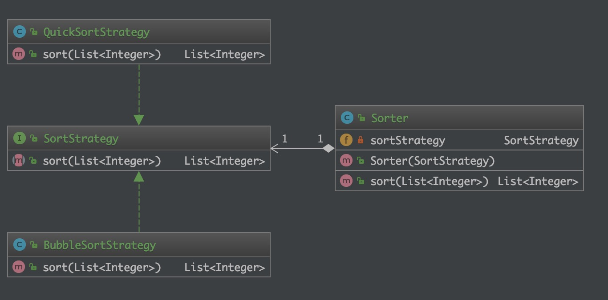

# 策略模式（Strategy）

## 目的

> 定义一系列算法，封装每个算法，并使它们可互换。
> 策略模式允许算法独立于使用它的使用者，随时变化使用。

## 现实世界的例子

> 考虑排序的例子，我们实现了冒泡排序，但数据开始增长，冒泡排序开始变得非常缓慢。为了解决这个问题，我们实现了快速排序。但是现在虽然快速排序算法对大型数据集的效果更好，但对于较小的数据集来说速度非常慢。为了解决这个问题，我们实施了一个策略，对于小型数据集，将使用冒泡排序并进行更大规模的快速排序。

## 类图



## 程序化

策略接口和不同的策略实施

```java
/**
 * 策略interface
 *
 * Created by Lin on 2019/12/17.
 */
public interface SortStrategy {
    List<Integer> sort(List<Integer> list);
}

/**
 * 描述: 冒泡排序策略实现
 *
 * @author Lin
 * @since 2019-12-17 9:58 PM
 */
public class BubbleSortStrategy implements SortStrategy {

    @Override
    public List<Integer> sort(List<Integer> list) {
        // Do sorting
        return new ArrayList<>();
    }
}

/**
 * 描述: 快排策略实现
 *
 * @author Lin
 * @since 2019-12-17 9:59 PM
 */
public class QuickSortStrategy implements SortStrategy {
    @Override
    public List<Integer> sort(List<Integer> list) {
        // Do sorting
        return new ArrayList<>();
    }
}
```

客户端使用任何策略

```java
public class Sorter {
    private SortStrategy sortStrategy;

    public Sorter(SortStrategy sortStrategy) {
        this.sortStrategy = sortStrategy;
    }

    public List<Integer> sort(List<Integer> list) {
        return this.sortStrategy.sort(list);
    }
}
```

## 何时使用

> 1. 一个系统有许多许多类，而区分它们的只是他们直接的行为。
> 2. 一个系统需要动态地在几种算法中选择一种。
> 3. 如果一个对象有很多的行为，如果不用恰当的模式，这些行为就只好使用多重的条件选择语句来实现。

## 参考

* [design-patterns-for-humans](https://github.com/kamranahmedse/design-patterns-for-humans)
* [strategy-design-pattern-in-java-example-tutorial](https://www.journaldev.com/1754/strategy-design-pattern-in-java-example-tutorial)
* [策略模式](https://www.runoob.com/design-pattern/strategy-pattern.html)
