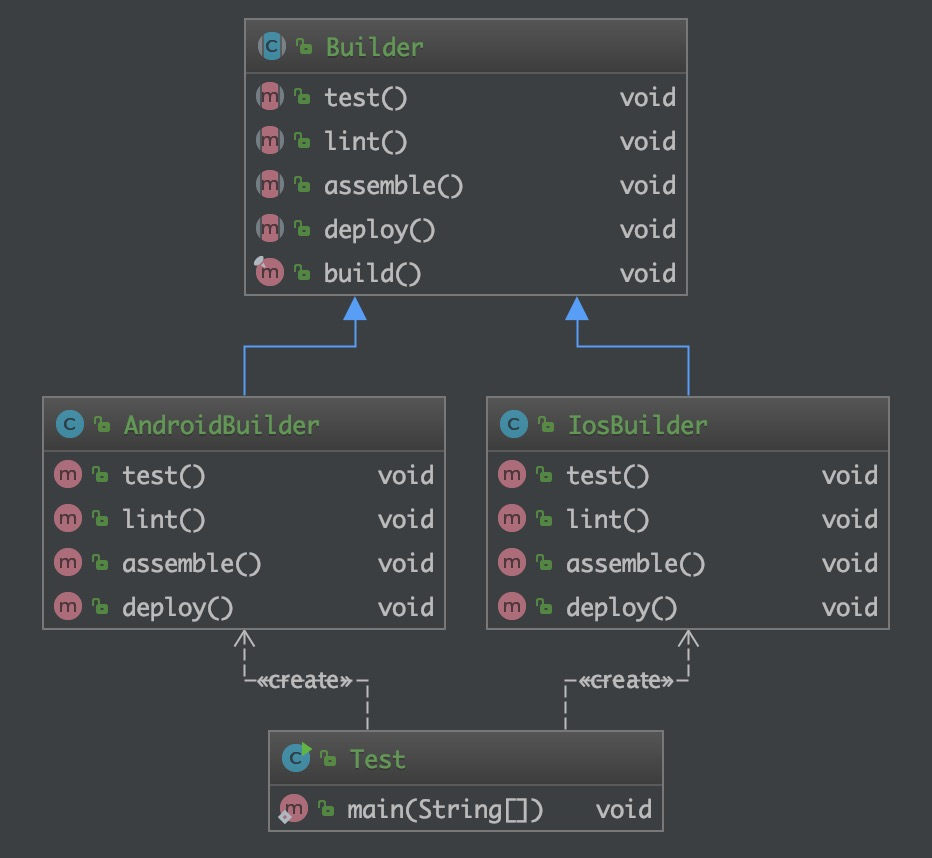

# 模板方法模式(Template Method)

## 目的

> 定义一个操作中的算法的骨架，而将一些步骤延迟到子类中。模板方法使得子类可以不改变一个算法的结构即可重定义该算法的某些特定步骤。

## 现实世界的例子

> 假设我们正在建造一些房屋。构建的步骤可能看起来像
>
> * 准备房子的基地
> * 建造墙壁
> * 添加屋顶
> * 添加其他楼层
>
> 这些步骤的顺序永远不会改变，即在建造墙壁等之前不能建造屋顶，但是每个步骤都可以修改，例如墙壁可以由木头或聚酯或石头制成。

## 类图



## 程序化

```java
/**
 * 描述:
 *
 * @author Lin
 * @since 2019-12-23 9:52 PM
 */
public abstract class Builder {

    public abstract void test();

    public abstract void lint();

    public abstract void assemble();

    public abstract void deploy();

    final public void build() {
        test();
        lint();
        assemble();
        deploy();
    }
}

public class AndroidBuilder extends Builder {
    @Override
    public void test() {
        System.out.println("Running android tests");
    }

    @Override
    public void lint() {
        System.out.println("Linting the android code");
    }

    @Override
    public void assemble() {
        System.out.println("Assembling the android build");
    }

    @Override
    public void deploy() {
        System.out.println("Deploying android build to server");
    }
}

public class IosBuilder extends Builder {
    @Override
    public void test() {
        System.out.println("Running ios tests");
    }

    @Override
    public void lint() {
        System.out.println("Linting the ios code");
    }

    @Override
    public void assemble() {
        System.out.println("Assembling the ios build");
    }

    @Override
    public void deploy() {
        System.out.println("Deploying ios build to server");
    }
}

public class Test {

    public static void main(String[] args) {
        Builder builder = new AndroidBuilder();
        builder.build();

        System.out.println();

        builder = new IosBuilder();
        builder.build();
    }
}
```

## 何时使用

> 有一些通用的方法。

## 参考

* [design-patterns-for-humans](https://github.com/kamranahmedse/design-patterns-for-humans)
* [template-method](https://github.com/iluwatar/java-design-patterns/tree/master/template-method)
* [模板模式](https://www.runoob.com/design-pattern/template-pattern.html)
