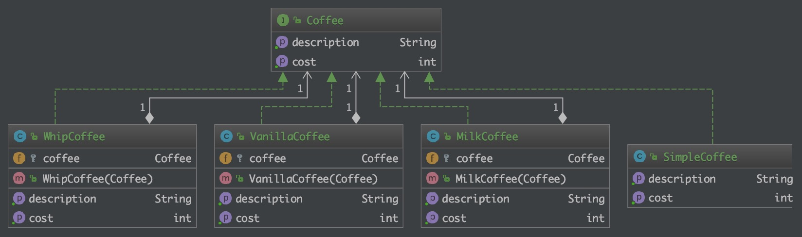

# 装饰模式(Decorator)

## 目的

> 动态地给一个对象添加一些额外的职责。就增加功能来说，装饰器模式相比生成子类更为灵活。

## 现实世界的例子

> 想象一下，您经营一家提供多种服务的汽车服务店。现在你如何计算收费账单？您选择一项服务并动态地向其添加所提供服务的价格，直到您获得最终成本。这里的每种服务都是装饰者。

## 类图



## 程序化

以咖啡为例，一个简单的咖啡实现咖啡界面:

```java
public interface Coffee {
    int getCost();
    String getDescription();
}

public class SimpleCoffee implements Coffee {
    @Override
    public int getCost() {
        return 10;
    }

    @Override
    public String getDescription() {
        return "Simple coffee";
    }
}

public class MilkCoffee implements Coffee {

    protected Coffee coffee;

    public MilkCoffee(Coffee coffee) {
        this.coffee = coffee;
    }

    @Override
    public int getCost() {
        return coffee.getCost() + 2;
    }

    @Override
    public String getDescription() {
        return coffee.getDescription() + ", Milk.";
    }
}

public class WhipCoffee implements Coffee {

    protected Coffee coffee;

    public WhipCoffee(Coffee coffee) {
        this.coffee = coffee;
    }

    @Override
    public int getCost() {
        return coffee.getCost() + 5;
    }

    @Override
    public String getDescription() {
        return coffee.getDescription() + ", wipe.";
    }
}

public class VanillaCoffee implements Coffee {

    protected Coffee coffee;

    public VanillaCoffee(Coffee coffee) {
        this.coffee = coffee;
    }

    @Override
    public int getCost() {
        return coffee.getCost() + 3;
    }

    @Override
    public String getDescription() {
        return coffee.getDescription() + ", vanilla.";
    }
}
```

## 何时使用

> 在不想增加很多子类的情况下扩展类。
> 1、扩展一个类的功能。 2、动态增加功能，动态撤销。

## 参考

* [design-patterns-for-humans](https://github.com/kamranahmedse/design-patterns-for-humans)
* [decorator](https://github.com/iluwatar/java-design-patterns/tree/master/decorator)
* [装饰器模式](https://www.runoob.com/design-pattern/decorator-pattern.html)
