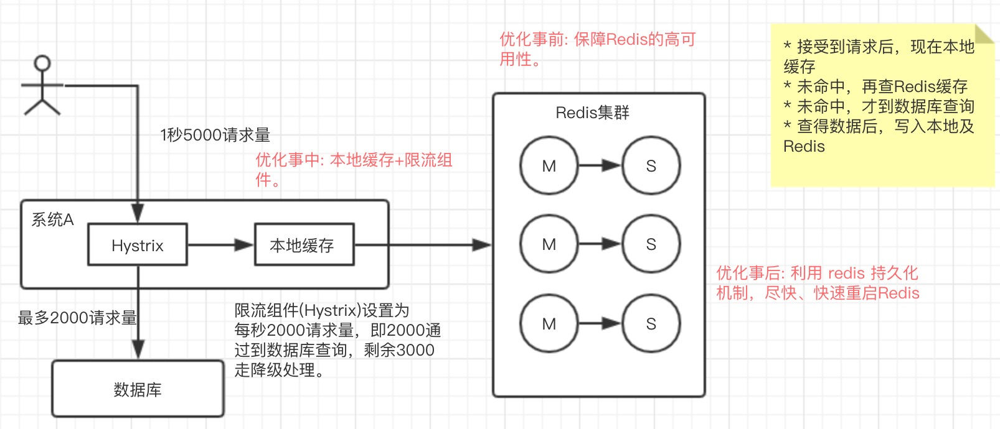
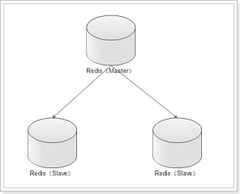

# Redis

> 面试题1: 在项目中缓存如何使用的？缓存如果使用不当会造成什么后果？
> 面试题2: redis 和 memcached 有啥区别？
> 面试题3: 为什么redis单线程模型也能这么高效率？
> 面试题4: 怎么保证redis是高并发以及高可用的？

Redis可以看成就是一个数据库，与MySQL之类数据库不同的是 数据放在内存中，so 读写很快。

广泛用于缓存，也经常用来做分布式锁，还支持事务 、持久化、LUA脚本、LRU驱动事件、多种集群方案。

## 为什么用Redis

* 高性能
* 高并发

相比从数据库读取，需从硬盘上读，redis的操作都是在内存上，速度相当快。 -- 高性能

直接操作缓存的并发量远大于直接访问数据库的 -- 高并发

### 为什么不用map/guava做缓存，非用Redis

map/guava可作为本地缓存，特点是轻量、快速，当在多实例的情况下，每个实例都会保存一份缓存，这样会出现缓存不一致问题。

Redis作为分布式缓存，在多实例时，各实例共用一份缓存，保证一致性，缺点是程序/架构较为复杂。

## redis 和 memcached 有啥区别

* redis支持更丰富的数据类型（支持更复杂的应用场景）
* Redis支持数据的持久化，可以将内存中的数据保持在磁盘中，重启的时候可以再次加载进行使用,而Memecache把数据全部存在内存之中。
* 集群模式：memcached没有原生的集群模式，需要依靠客户端来实现往集群中分片写入数据；但是 redis 目前是原生支持 cluster 模式的.
* Memcached是多线程，非阻塞IO复用的网络模型；Redis使用单线程的多路 IO 复用模型。

## Redis的线程模式

单线程模式: Redis使用文件事件处理器 `file event handler`，这个文件事件处理器是单线程。文件事件处理器采用 IO 多路复用机制同时监听多个 socket，根据 socket 上的事件来选择对应的事件处理器进行处理。

文件事件处理器 包含四部分:

* 多个 socket
* IO 多路复用程序
* 文件事件分派器
* 事件处理器（连接应答处理器、命令请求处理器、命令回复处理器）

多个 socket 可能会并发产生不同的操作，每个操作对应不同的文件事件，但是 IO 多路复用程序会监听多个 socket，会将 socket 产生的事件放入队列中排队，事件分派器每次从队列中取出一个事件，把该事件交给对应的事件处理器进行处理。

来看客户端与 redis 的一次通信过程：


* 客户端 `socket01` 向 `redis` 的 `server socket` 请求建立连接
  * 此时 `server socket` 会产生一个 `AE_READABLE` 事件
  * IO 多路复用程序监听到 `server socket` 产生的事件后，将该事件压入队列中。
  * 文件事件分派器从队列中获取该事件，交给连接应答处理器。
  * 连接应答处理器会创建一个能与客户端通信的 `socket01`，并将该 `socket01` 的 `AE_READABLE` 事件与命令请求处理器关联。
* 客户端发送了一个 `set key value` 请求
  * 此时 `redis` 中的 `socket01` 会产生 `AE_READABLE` 事件
  * IO 多路复用程序将事件压入队列，
  * 事件分派器从队列中获取到该事件，由于前面 `socket01` 的 `AE_READABLE` 事件已经与命令请求处理器关联，因此事件分派器将事件交给命令请求处理器来处理。
  * 命令请求处理器读取 `socket01` 的 `key value` 并在自己内存中完成 `key value` 的设置。
  * 操作完成后，它会将 `socket01` 的 `AE_WRITABLE` 事件与命令回复处理器关联。
* 当客户端准备好接收返回结果了，
  * `redis` 中的 `socket01` 会产生一个 `AE_WRITABLE` 事件，同样压入队列中，
  * 事件分派器找到相关联的命令回复处理器，由命令回复处理器对 `socket01` 输入本次操作的一个结果，比如 ok，
  * 之后解除 `socket01` 的 `AE_WRITABLE` 事件与命令回复处理器的关联。

以上，完成了一次通信。

### 为什么redis单线程模型也能这么高效率

* 纯内存操作
* 核心是基于非阻塞的IO多路复用机制
* 单线程反而避免了多线程的频繁上下文切换问题

## redis 和 memcached 的区别

* redis支持更丰富的数据类型（支持更复杂的应用场景）：Redis不仅仅支持简单的k/v类型的数据，同时还提供list，set，zset，hash等数据结构的存储。memcache支持简单的数据类型，String。
* Redis支持数据的持久化，可以将内存中的数据保持在磁盘中，重启的时候可以再次加载进行使用,而Memecache把数据全部存在内存之中。
* 集群模式：memcached没有原生的集群模式，需要依靠客户端来实现往集群中分片写入数据；但是 redis 目前是原生支持 cluster 模式的.
* Memcached是多线程，非阻塞IO复用的网络模型；Redis使用单线程的多路 IO 复用模型。

## redis 常见数据结构

### 1. String

> 常用命令: set,get,decr,incr,mget 等。

String数据结构是简单的key-value类型，value其实不仅可以是String，也可以是数字。 常规key-value缓存应用； 常规计数。

### 2. Hash

> 常用命令： hget,hset,hgetall 等。

hash 是一个 string 类型的 field 和 value 的映射表，hash 特别适合用于存储对象，后续操作的时候，你可以直接仅仅修改这个对象中的某个字段的值。 比如我们可以 hash 数据结构来存储用户信息，商品信息等等。比如下面我就用 hash 类型存放了我本人的一些信息：

```text
key=JavaUser293847
value={
  “id”: 1,
  “name”: “SnailClimb”,
  “age”: 22,
  “location”: “Wuhan, Hubei”
}
```

### 3. List

> 常用命令: lpush,rpush,lpop,rpop,lrange等

list 就是链表，Redis list 的应用场景非常多，也是Redis最重要的数据结构之一，比如微博的关注列表，粉丝列表，消息列表等功能都可以用Redis的 list 结构来实现。

Redis list 的实现为一个双向链表，即可以支持反向查找和遍历，更方便操作，不过带来了部分额外的内存开销。

另外可以通过 lrange 命令，就是从某个元素开始读取多少个元素，可以基于 list 实现分页查询，这个很棒的一个功能，基于 redis 实现简单的高性能分页。

### 4.Set

> 常用命令： sadd,spop,smembers,sunion 等

set 对外提供的功能与list类似是一个列表的功能，特殊之处在于 set 是可以自动排重的。

当你需要存储一个列表数据，又不希望出现重复数据时，set是一个很好的选择，并且set提供了判断某个成员是否在一个set集合内的重要接口，这个也是list所不能提供的。可以基于 set 轻易实现交集、并集、差集的操作。

### 5. Sorted Set

> 常用命令： zadd,zrange,zrem,zcard等

和set相比，sorted set增加了一个权重参数score，使得集合中的元素能够按score进行有序排列。

## redis 设置过期时间

set key 的时候，都可以给一个 expire time，就是过期时间，通过过期时间我们可以指定这个 key 可以存活的时间。

redis是怎么对这批key进行删除的？

* 定期删除: redis默认是每隔 100ms 就随机抽取一些设置了过期时间的key，检查其是否过期，如果过期就删除。注意这里是随机抽取的。为什么要随机呢？你想一想假如 redis 存了几十万个 key ，每隔100ms就遍历所有的设置过期时间的 key 的话，就会给 CPU 带来很大的负载！
* 惰性删除: 定期删除可能会导致很多过期 key 到了时间并没有被删除掉。所以就有了惰性删除。假如你的过期 key，靠定期删除没有被删除掉，还停留在内存里，除非你的系统去查一下那个 key，才会被redis给删除掉。这就是所谓的惰性删除，也是够懒的哈！

## redis 内存淘汰机制

如果定期删除漏掉了很多过期 key，然后你也没及时去查，也就没走惰性删除，此时会怎么样？如果大量过期key堆积在内存里，导致redis内存块耗尽了。

Redis使用'内存淘汰机制'来保障。

redis 提供 6种数据淘汰策略:

* volatile-lru：从已设置过期时间的数据集（server.db[i].expires）中挑选最近最少使用的数据淘汰
* 从已设置过期时间的数据集（server.db[i].expires）中挑选将要过期的数据淘汰
* volatile-random：从已设置过期时间的数据集（server.db[i].expires）中任意选择数据淘汰
* allkeys-lru：当内存不足以容纳新写入数据时，在键空间中，移除最近最少使用的key（这个是最常用的）
* allkeys-random：从数据集（server.db[i].dict）中任意选择数据淘汰
* no-eviction：禁止驱逐数据，也就是说当内存不足以容纳新写入数据时，新写入操作会报错。
* volatile-lfu：从已设置过期时间的数据集(server.db[i].expires)中挑选最不经常使用的数据淘汰(4.0新增)
* allkeys-lfu：当内存不足以容纳新写入数据时，在键空间中，移除最不经常使用的key(4.0新增)

redis.conf 中有相关注释参考: <http://download.redis.io/redis-stable/redis.conf>

## redis 持久化机制

持久化数据也就是将内存中的数据写入到硬盘里面，为了之后重用数据（比如重启机器、机器故障之后恢复数据），或者是为了防止系统故障而将数据备份到一个远程位置。

Redis支持两种不同的持久化操作。一种持久化方式叫快照（snapshotting，RDB），另一种方式是只追加文件（append-only file,AOF）。

### 快照（snapshotting）持久化（RDB）

通过创建快照来获得存储在内存里面的数据在某个时间点上的副本。Redis创建快照之后，可以对快照进行备份，可以将快照复制到其他服务器从而创建具有相同数据的服务器副本（Redis主从结构，主要用来提高Redis性能），还可以将快照留在原地以便重启服务器的时候使用。

有此下配置:

* save 900 1           #在900秒(15分钟)之后，如果至少有1个key发生变化，Redis就会自动触发BGSAVE命令创建快照。
* save 300 10          #在300秒(5分钟)之后，如果至少有10个key发生变化，Redis就会自动触发BGSAVE命令创建快照。
* save 60 10000        #在60秒(1分钟)之后，如果至少有10000个key发生变化，Redis就会自动触发BGSAVE命令创建快照。

### AOF（append-only file）持久化

，AOF持久化 的实时性更好，因此已成为主流的持久化方案。默认情况下Redis没有开启AOF（append only file）方式的持久化，可以通过appendonly参数开启：

```xml
appendonly yes
```

开启AOF持久化后每执行一条会更改Redis中的数据的命令，Redis就会将该命令写入硬盘中的AOF文件。AOF文件的保存位置和RDB文件的位置相同，都是通过dir参数设置的，默认的文件名是appendonly.aof。

更多`持久化内容`参考: <https://www.cnblogs.com/kismetv/p/9137897.html>

## redis 事务

Redis 通过 MULTI、EXEC、WATCH 等命令来实现事务(transaction)功能。事务提供了一种将多个命令请求打包，然后一次性、按顺序地执行多个命令的机制，并且在事务执行期间，服务器不会中断事务而改去执行其他客户端的命令请求，它会将事务中的所有命令都执行完毕，然后才去处理其他客户端的命令请求。

## 问题1: 缓存雪崩

什么是缓存雪崩？A: 缓存同一时间大面积的失效，所以，后面的请求都会落到数据库上，造成数据库短时间内承受大量请求而崩掉。

解决方案:

* (事前)尽量保证整个 redis 集群的高可用性，发现机器宕机尽快补上。选择合适的内存淘汰策略。
* (事中)本地ehcache缓存/Map/Guava + hystrix限流&降级，避免MySQL崩掉
* (事后)利用 redis 持久化机制保存的数据尽快恢复缓存



## 问题2: 缓存穿透

缓存穿透说简单点就是大量请求的 key 根本不存在于缓存中，导致请求直接到了数据库上，根本没有经过缓存这一层。举个例子：某个黑客故意制造我们缓存中不存在的 key 发起大量请求，导致大量请求落到数据库。

### 布隆过滤器

布隆过滤器（Bloom Filter）是一个叫做 Bloom 的老哥于1970年提出的。我们可以把它看作由二进制向量（或者说位数组）和一系列随机映射函数（哈希函数）两部分组成的数据结构。相比于我们平时常用的的 List、Map 、Set 等数据结构，它占用空间更少并且效率更高，但是缺点是其返回的结果是概率性的，而不是非常准确的。理论情况下添加到集合中的元素越多，误报的可能性就越大。并且，存放在布隆过滤器的数据不容易删除。

位数组中的每个元素都只占用 1 bit ，并且每个元素只能是 0 或者 1。这样申请一个 100w 个元素的位数组只占用 1000000Bit / 8 = 125000 Byte = 125000/1024 kb ≈ 122kb 的空间。

总结：一个名叫 Bloom 的人提出了一种来检索元素是否在给定大集合中的数据结构，这种数据结构是高效且性能很好的，但缺点是具有一定的错误识别率和删除难度。并且，理论情况下，添加到集合中的元素越多，误报的可能性就越大。

### 原理

当一个元素加入布隆过滤器中的时候，会进行如下操作：

* 使用布隆过滤器中的哈希函数对元素值进行计算，得到哈希值（有几个哈希函数得到几个哈希值）。
* 根据得到的哈希值，在位数组中把对应下标的值置为 1。

当我们需要判断一个元素是否存在于布隆过滤器的时候，会进行如下操作：

* 对给定元素再次进行相同的哈希计算；
* 得到值之后判断位数组中的每个元素是否都为 1，如果值都为 1，那么说明这个值在布隆过滤器中，如果存在一个值不为 1，说明该元素不在布隆过滤器中。

布隆过滤器说某个元素存在，小概率会误判。布隆过滤器说某个元素不在，那么这个元素一定不在。

布隆过滤器使用场景:

* 判断给定数据是否存在：比如判断一个数字是否在于包含大量数字的数字集中（数字集很大，5亿以上！）、 防止缓存穿透（判断请求的数据是否有效避免直接绕过缓存请求数据库）等等、邮箱的垃圾邮件过滤、黑名单功能等等。
* 去重：比如爬给定网址的时候对已经爬取过的 URL 去重。

### Java 自定义布隆过滤器

需要：

* 一个合适大小的位数组保存数据
* 几个不同的哈希函数
* 添加元素到位数组（布隆过滤器）的方法实现
* 判断给定元素是否存在于位数组（布隆过滤器）的方法实现。

```java
/**
 * 描述: 自定义的布隆过滤器
 *
 * @author Lin
 * @since 2019-12-23 11:35 AM
 */
public class MyBloomFilter {
    /**
     * 位数组的大小
     */
    private static final int DEFAULT_SIZE = 2 << 24;
    /**
     * 通过这个数组可以创建 6 个不同的哈希函数
     */
    private static final int[] SEEDS = new int[]{3, 13, 46, 71, 91, 134};
    /**
     * 位数组。数组中的元素只能是 0 或者 1
     */
    private BitSet bits = new BitSet(DEFAULT_SIZE);
    /**
     * 存放包含 hash 函数的类的数组
     */
    private SimpleHash[] func = new SimpleHash[SEEDS.length];

    /**
     * 初始化多个包含 hash 函数的类的数组，每个类中的 hash 函数都不一样
     */
    public MyBloomFilter() {
        // 初始化多个不同的 Hash 函数
        for (int i = 0; i < SEEDS.length; i++) {
            func[i] = new SimpleHash(DEFAULT_SIZE, SEEDS[i]);
        }
    }

    /**
     * 添加元素到位数组
     */
    public void add(Object value) {
        for (SimpleHash f : func) {
            bits.set(f.hash(value), true);
        }
    }

    /**
     * 判断指定元素是否存在于位数组
     */
    public boolean contains(Object value) {
        boolean ret = true;
        for (SimpleHash f : func) {
            ret = ret && bits.get(f.hash(value));
        }
        return ret;
    }

    public static class SimpleHash {

        private int cap;
        private int seed;

        public SimpleHash(int cap, int seed) {
            this.cap = cap;
            this.seed = seed;
        }

        public int hash(Object value) {
            int h;
            return (value == null) ? 0 : Math.abs(seed * (cap - 1) & ((h = value.hashCode()) ^ (h >>> 16)));
        }
    }

    public static void main(String[] args) {
        // test1
        String value1 = "https://javaguide.cn/";
        String value2 = "https://github.com/Snailclimb";
        MyBloomFilter filter = new MyBloomFilter();
        System.out.println(filter.contains(value1));
        System.out.println(filter.contains(value2));
        filter.add(value1);
        filter.add(value2);
        System.out.println(filter.contains(value1));
        System.out.println(filter.contains(value2));

        ////test2
        //Integer value1 = 13423;
        //Integer value2 = 22131;
        //MyBloomFilter filter = new MyBloomFilter();
        //System.out.println(filter.contains(value1));
        //System.out.println(filter.contains(value2));
        //filter.add(value1);
        //filter.add(value2);
        //System.out.println(filter.contains(value1));
        //System.out.println(filter.contains(value2));
    }
}
```

### Guava中自带的布隆过滤器

```java
/**
 * 描述: 利用Google开源的 Guava中自带的布隆过滤器
 *
 * @author Lin
 * @since 2019-12-24 10:58 AM
 */
public class GuavaBloomFilter {

    public static void main(String[] args) {
        // 最多存放 1500个整数的布隆过滤器，容忍的 误判的概率是万分之1
        BloomFilter<Integer> filter = BloomFilter.create(
                Funnels.integerFunnel(),
                1500,
                0.01);
        // 判断是否存在
        System.out.println(filter.mightContain(1));
        System.out.println(filter.mightContain(2));
        // 添加
        filter.put(1);
        filter.put(2);
        System.out.println(filter.mightContain(1));
        System.out.println(filter.mightContain(2));
    }
}
```

Guava 提供的布隆过滤器的实现还是很不错的，但是它有一个重大的缺陷就是只能单机使用（另外，容量扩展也不容易），而现在互联网一般都是分布式的场景。为了解决这个问题，我们就需要用到 Redis 中的布隆过滤器了。

### Redis 中的布隆过滤器

Redis v4.0 之后有了 Module（模块/插件） 功能，Redis Modules 让 Redis 可以使用外部模块扩展其功能 。布隆过滤器就是其中的 Module。

另外，官网推荐了一个 RedisBloom 作为 Redis 布隆过滤器的 Module,地址：<https://github.com/RedisBloom/RedisBloom>。

体验Redis中的布隆过滤器 参考 <https://hub.docker.com/r/redislabs/rebloom/>。

## 问题3: 如何解决 Redis 的并发竞争 Key 问题

Redis 的并发竞争 Key 的问题也就是多个系统同时对一个 key 进行操作，但是最后执行的顺序和我们期望的顺序不同，这样也就导致了结果的不同！

推荐一种方案：分布式锁（zookeeper 和 redis 都可以实现分布式锁）。

基于zookeeper临时有序节点可以实现的分布式锁。大致思想为：每个客户端对某个方法加锁时，在zookeeper上的与该方法对应的指定节点的目录下，生成一个唯一的瞬时有序节点。 判断是否获取锁的方式很简单，只需要判断有序节点中序号最小的一个。 当释放锁的时候，只需将这个瞬时节点删除即可。同时，其可以避免服务宕机导致的锁无法释放，而产生的死锁问题。完成业务流程后，删除对应的子节点释放锁。

首推Zookeeper。

## 问题4: 如何保证缓存与数据库双写时的数据一致性

> 只要是双写，就一定会有数据一致性的问题，那么你如何解决一致性问题？

先说说，缓存更新的套路。更新缓存的的Design Pattern有四种：Cache aside, Read through, Write through, Write behind caching。参考[缓存更新的套路](http://coolshell.cn/articles/17416.html)。

### Cache Aside Pattern(最常用的pattern)

* 失效: 应用程序尝试从cache获取数据，没有得到，再从数据库中获取数据，获取到后，放到缓存中。
* 命中: 应用程序从cache中取数据，获取到就返回
* 更新: 先更新数据库，成功后，让缓存失效(删除)


### Read/Write Through Pattern

Read/Write Through套路是把更新数据库（Repository）的操作由缓存自己代理了，所以，对于应用层来说，就简单很多了。可以理解为，应用认为后端就是一个单一的存储，而存储自己维护自己的Cache。

### Write Behind Caching Pattern

在更新数据的时候，只更新缓存，不更新数据库，而我们的缓存会异步地批量更新数据库。

Cache Aside这个还是会有有并发问题，出现的概率可能非常低。为解决这个低概率的并发问题，可以考虑读请求和写请求串行化。

但，如果你的系统不是严格要求 “缓存+数据库” 必须保持一致性的话，最好不要做这个方案，即：读请求和写请求串行化，串到一个内存队列里去。

参考： Java工程师面试突击第1季

## 问题5: 怎么保证redis是高并发以及高可用的/主从原理/哨兵原理

* redis 单机能承受多少并发？大概能够承受的QPS是 上万到几万(根据具体的业务操作而定)。单机的瓶颈在于`单机`。
* 如果单机扛不住，如何扩容？首先，做`读写分离`，一般都是用来支撑读高并发，写请求比较少。优势: 支持水平扩容，如果读QPS增加，只需要增加redis(slave)就行了。
* 怎么保证redis的高可用性？

### redis replication 主从复制



* 一个master可以有多个slave
* 一个slave只能有一个master
* 数据流是单向的，master到slave

#### 核心机制

* redis采用异步方式复制数据到slave节点，redis 2.8开始，slave node会周期性地确认自己每次复制的数据量
* 一个master node是可以配置多个slave node的
* slave node也可以连接其他的slave node
* slave node做复制的时候，是不会block master node的正常工作的
* slave node在做复制的时候，也不会block对自己的查询操作，它会用旧的数据集来提供服务; 但是复制完成的时候，需要删除旧数据集，加载新数据集，这个时候就会暂停对外服务了
* slave node主要用来进行横向扩容，做读写分离，扩容的slave node可以提高读的吞吐量

#### master持久化(安全保障)

如果采用了主从架构，建议必须开启master的持久化。

故障点: 若master没有开启持久化，出现宕机时，重启后，没有本地数据可以恢复，认为自己的数据是空的，然后同步给slave，salve nodes的数据也将丢失了。

## 使用场景

### 热点数据

存取数据优先从 Redis 操作，如果不存在再从文件（例如 MySQL）中操作，从文件操作完后将数据存储到 Redis 中并返回。同时有个定时任务后台定时扫描 Redis 的 key，根据业务规则进行淘汰，防止某些只访问一两次的数据一直存在 Redis 中。

> 如使用 Zset 数据结构，存储 Key 的访问次数/最后访问时间作为 Score，最后做排序，来淘汰那些最少访问的 Key。

### 会话维持 Session

会话维持 Session 场景，即使用 Redis 作为分布式场景下的登录中心存储应用。每次不同的服务在登录的时候，都会去统一的 Redis 去验证 Session 是否正确。但是在微服务场景，一般会考虑 Redis + JWT 做 Oauth2 模块。

### 分布式锁 SETNX

命令格式：SETNX key value：当且仅当 key 不存在，将 key 的值设为 value。若给定的 key 已经存在，则 SETNX 不做任何动作。

待补充...Redlock

### 表缓存

Redis 缓存表的场景有黑名单、禁言表等。访问频率较高，即读高。根据业务需求，可以使用后台定时任务定时刷新 Redis 的缓存表数据。

### 消息队列 list

主要使用了 List 数据结构。
List 支持在头部和尾部操作，因此可以实现简单的消息队列。

* 发消息：在 List 尾部塞入数据。
* 消费消息：在 List 头部拿出数据。

同时可以使用多个 List，来实现多个队列，根据不同的业务消息，塞入不同的 List，来增加吞吐量。

### 计数器 string

主要使用了 INCR、DECR、INCRBY、DECRBY 方法。

INCR key：给 key 的 value 值增加一 DECR key：给 key 的 value 值减去一

## 参考

* [JavaGuide](https://github.com/Snailclimb/JavaGuide)
* [Redis's documentation](https://redis.io/documentation)
