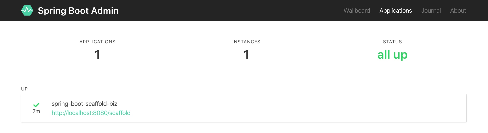

# spring boot scaffold(脚手架)

spring boot scaffold(脚手架) 集成redis、pagehelper、mybatis、log4j2、druid、jwt、mail等，方便于日常业务开发。

## 开发环境

* IDEA(注意：务必使用 IDEA 开发，同时保证安装 lombok 插件)
* Maven、JDK 1.8+
* Springboot(2.1.4.RELEASE)、Mybatis等
* Redis、Mysql 5.7 + (尽量保证使用 5.7 版本以上，因为 5.7 版本加了一些新特性，同时不向下兼容。本 demo 里会尽量避免这种不兼容的地方，但还是建议尽量保证 5.7 版本以上)

-[x] redis
-[x] log4j2
-[x] properties
-[x] aopLog(通过AOP记录web请求日志)
-[x] mybatis & 通用Mapper & 多数据源 && pagehelper
-[ ] PageHelper(通用的Mybatis分页插件) & mybatis-plus(快速操作Mybatis)
-[ ] druid
-[x] Dubbo(采用官方的starter)
-[ ] jwt
-[ ] mail
-[x] actuator(监控)
-[x] admin(可视化的监控)
-[ ] 集成原生 swagger
-[ ] Spring Boot CLI: CLI自动生成

## 一个小彩蛋：动态 Banner

来尝尝鲜。

很简单，只需要在src/main/resources路径下新建一个banner.txt文件，banner.txt中填写好需要打印的字符串内容即可。

借助第三方工具帮忙转化内容，如网站 <http://www.network-science.de/ascii/> 将文字转化成字符串，网站： <http://www.degraeve.com/img2txt.php> 可以将图片转化成字符串。

## 日志 log4j2

使用log4j2，做日志文件框架，移除了springBoot自带的logback。

Log4j2是Log4j的升级版本，Log4j2相对于Log4j1.x 有了很多显著的改善。

```xml
<dependencies>
  <dependency>
      <groupId>org.springframework.boot</groupId>
      <artifactId>spring-boot-starter</artifactId>
      <exclusions>
          <!--移除springBoot自带的logback-->
          <exclusion>
              <groupId>org.springframework.boot</groupId>
              <artifactId>spring-boot-starter-logging</artifactId>
          </exclusion>
      </exclusions>
  </dependency>

  <!--使用log4j2，做日志文件框架-->
  <dependency>
      <groupId>org.springframework.boot</groupId>
      <artifactId>spring-boot-starter-log4j2</artifactId>
  </dependency>

    <!-- 日志文件异步依赖 -->
    <dependency>
        <groupId>com.lmax</groupId>
        <artifactId>disruptor</artifactId>
        <version>3.4.1</version>
    </dependency>
</dependencies>
```

常见错误(Multiple bindings were found on the class path)的解决方案: 通过IDEA查找包之间的依赖，以及按需求排除依赖。 参考 <http://www.slf4j.org/codes.html#multiple_bindings>

小技巧，使用 `@Slf4j` 来替代初始化 `org.slf4j.Logger`，更方便哦。

## properties 多环境配置

获取配置文件的自定义配置，以及多环境下的配置文件信息的获取。

添加依赖:

```xml
<dependency>
    <groupId>org.springframework.boot</groupId>
    <artifactId>spring-boot-configuration-processor</artifactId>
    <optional>true</optional>
</dependency>
```

在 META-INF/additional-spring-configuration-metadata.json 中自定义配置，可以去除 application.yml 中自定义配置的红线警告，并且为自定义配置添加 hint 提醒。

注意: 需要打包编译后生效 `mvn clean package`。

## Actuator

Actuator 是 Spring Boot 提供的对应用系统的自省和监控的集成功能，可以查看应用配置的详细信息，例如自动化配置信息、创建的 Spring beans 以及一些环境属性等。

Actuator 监控分成两类：原生端点和用户自定义端点；自定义端点主要是指扩展性，用户可以根据自己的实际应用，定义一些比较关心的指标，在运行期进行监控。

原生端点是在应用程序里提供众多 Web 接口，通过它们了解应用程序运行时的内部状况。原生端点又可以分成三类：

* 应用配置类：可以查看应用在运行期的静态信息：例如自动配置信息、加载的 springbean 信息、yml 文件配置信息、环境信息、请求映射信息；
* 度量指标类：主要是运行期的动态信息，例如堆栈、请求连、一些健康指标、metrics 信息等；
* 操作控制类：主要是指 shutdown,用户可以发送一个请求将应用的监控功能关闭。

Actuator 提供了 以下接口:

1. /auditevents: 显示应用暴露的审计事件 (比如认证进入、订单失败)
2. /beans: 描述应用程序上下文里全部的 Bean，以及它们的关系
3. /conditions: 提供一份自动配置生效的条件情况，记录哪些自动配置条件通过了，哪些没通过
4. /configprops: 描述配置属性(包含默认值)如何注入Bean
5. /env or /env/{name}: 获取全部环境属性
6. /flyway: 提供一份 Flyway 数据库迁移信息
7. /health: 报告应用程序的健康指标，这些值由 HealthIndicator 的实现类提供
8. /heapdump: dump 一份应用的 JVM 堆信息
9. /httptrace: 显示HTTP足迹，最近100个HTTP request/repsponse
10. /info: 获取应用程序的定制信息，这些信息由info打头的属性提供
11. /loggers: 显示和修改配置的loggers
12. /metrics or /metrics/{name}: 报告各种应用程序度量信息，比如内存用量和HTTP请求计数
13. /scheduledtasks: 展示应用中的定时任务信息
14. /sessions: 如果我们使用了 Spring Session 展示应用中的 HTTP sessions 信息
15. /shutdown: 关闭应用程序，要求endpoints.shutdown.enabled设置为true
16. /mappings: 展示全部的@RequestMapping URI路径，以及它们和控制器
17. /threaddump: 获取线程活动的快照

依赖:

```xml
<!--actuator依赖-->
<dependency>
    <groupId>org.springframework.boot</groupId>
    <artifactId>spring-boot-starter-actuator</artifactId>
</dependency>
```

配置:

```yml
management:
  endpoints:
    web:
      base-path: /monitor
      exposure:
        include: '*'
  endpoint:
    shutdown:
      enabled: true
    health:
      show-details: always
  server:
    port: 7890
```

### Actuator 参考

[Spring Boot Actuator: Production-ready Features](https://docs.spring.io/spring-boot/docs/current/reference/html/production-ready-features.html)

问题记录:

```txt
错误: Exception in thread "main" while scanning for the next token found character '@' that cannot start any token. (Do not use @ for indentation)

A: 由于springboot对于占位符@无法识别，当是普通字符的话，可以使用单引号或者双引号来包起来。这里的解决方案是:如果使用spring-boot-starter-parent，你可以通过@..@占位符引用Maven项目的属性; 但咱们不使用starter parent，可以在pom.xml添加:

<resources>
    <resource>
        <directory>src/main/resources</directory>
        <filtering>true</filtering>
    </resource>
</resources>

以及

<plugin>
    <groupId>org.apache.maven.plugins</groupId>
    <artifactId>maven-resources-plugin</artifactId>
    <version>2.7</version>
    <configuration>
        <delimiters>
            <delimiter>@</delimiter>
        </delimiters>
        <useDefaultDelimiters>false</useDefaultDelimiters>
    </configuration>
</plugin>

```

## Spring Boot Admin

Actuator 提供了对单个 Spring Boot 的监控，信息包含：应用状态、内存、线程、堆栈等等，比较全面的监控了 Spring Boot 应用的整个生命周期。

但是这样监控也有一些问题：第一，所有的监控都需要调用固定的接口来查看，如果全面查看应用状态需要调用很多接口，并且接口返回的 Json 信息不方便运营人员理解；第二，如果 Spring Boot 应用集群非常大，每个应用都需要调用不同的接口来查看监控信息，操作非常繁琐低效。在这样的背景下，就诞生了另外一个开源软件：Spring Boot Admin。

Spring Boot Admin 是一个管理和监控 Spring Boot 应用程序的开源软件。每个应用都认为是一个客户端，通过 HTTP 或者使用 Eureka 注册到 admin server 中进行展示，Spring Boot Admin UI 部分使用 VueJs 将数据展示在前端。

### Admin Server端

依赖:

```xml
<!--admin依赖-->
<dependency>
    <groupId>de.codecentric</groupId>
    <artifactId>spring-boot-admin-starter-server</artifactId>
</dependency>
```

启动类添加: `@EnableAdminServer`

```java
@SpringBootApplication
@EnableDubboConfiguration
@EnableAdminServer
public class ScaffoldApplication {
```

### Admin Client端

依赖:

```xml
<dependency>
    <groupId>de.codecentric</groupId>
    <artifactId>spring-boot-admin-starter-client</artifactId>
</dependency>
```

添加配置信息:

```yml
spring:
  boot:
    admin:
      client:
        # Spring Boot Admin 服务端地址
        url: "http://127.0.0.1:8000"
#        instance:
#          metadata:
#            # 客户端端点信息的安全认证信息
#            user.name: ${spring.security.user.name}
#            user.password: ${spring.security.user.password}
#  security:
#    user:
#      name: icro
#      password: 123456

management:
  endpoints:
    web:
      #      base-path: /monitor
      exposure:
        # 设置端点暴露的哪些内容，默认["health","info"]，设置"*"代表暴露所有可访问的端点
        include: '*'
  endpoint:
    shutdown:
      enabled: true
    health:
      # 端点健康情况，默认值"never"，设置为"always"可以显示硬盘使用情况和线程情况
      show-details: always
  server:
    port: 7890
```

启动应用后，可以在 Admin服务端自动检测，并展示:



### 通过Eureka监控微服务

todo

## 通过AOP记录web请求日志

使用 aop 切面对请求进行日志记录，并且记录 UserAgent 信息。

## 原生swagger2

swagger用于 自动生成 API 文档。

参考:

* swagger 官方网站：<https://swagger.io/>
* swagger 官方文档：<https://github.com/swagger-api/swagger-core/wiki/Swagger-2.X---Getting-started>
* swagger 常用注解：<https://github.com/swagger-api/swagger-core/wiki/Swagger-2.X---Annotations>

依赖:

```xml
<dependency>
    <groupId>io.springfox</groupId>
    <artifactId>springfox-swagger2</artifactId>
    <version>${swagger.version}</version>
</dependency>

<dependency>
    <groupId>io.springfox</groupId>
    <artifactId>springfox-swagger-ui</artifactId>
    <version>${swagger.version}</version>
</dependency>
```

Swagger2 配置:

```java
/**
 * 描述: Swagger2 配置
 *
 * @author Lin
 * @since 2020-02-05 3:24 下午
 */
@Configuration
@EnableSwagger2
public class Swagger2Config {

    @Bean
    public Docket createRestApi() {
        return new Docket(DocumentationType.SWAGGER_2).apiInfo(apiInfo())
                .select()
                .apis(RequestHandlerSelectors.basePackage("me.icro.java.springboot.scaffold.controller"))
                .paths(PathSelectors.any())
                .build();
    }

    private ApiInfo apiInfo() {
        return new ApiInfoBuilder().title("spring-boot-scaffold")
                .description("这是一个简单的 spring boot脚手架 演示")
                .contact(new Contact("Lin", "http://blog.icro.me/", "linli.cro@gmail.com"))
                .version("1.0.0-SNAPSHOT")
                .build();
    }
}
```

API层的注解 示例见 `me.icro.java.springboot.scaffold.controller.TestController`。

最后效果见: <http://localhost:8080/scaffold/swagger-ui.html#/>

### 遇到问题记录

问题:

```txt
The following method did not exist:

    com.google.common.collect.FluentIterable.concat(Ljava/lang/Iterable;Ljava/lang/Iterable;)Lcom/google/common/collect/FluentIterable;
```

解决方案: swagger2的新版本(只要版本高于2.7)，需guava版本20+才能兼容

## 整合 mybatis

最简易方式是 mybatis 官方提供的脚手架 mybatis-spring-boot-starter。

### mybatis-spring-boot-starter 参考

* [Mybatis官方脚手架文档](http://www.mybatis.org/spring-boot-starter/mybatis-spring-boot-autoconfigure/)
* [Mybatis整合Spring Boot官方demo](https://github.com/mybatis/spring-boot-starter/tree/master/mybatis-spring-boot-samples)

补充几点注意:

* 连接到mysql-connector-java 6+以上的需要指定时区
* 使用`com.mysql.cj.jdbc.Driver`，因 `com.mysql.jdbc.Driver`被弃用了。

### 集成 Mybatis 的多数据源

往往随着业务量发展，我们通常会进行数据库拆分或是引入其他数据库，从而我们需要配置多个数据源。

还是基于 SpringBoot+Mybatis。

### 问题: Idea inspects batis mapper bean wrong

一种解决方案是 在 `Mapper` 类上加上:

```java
@Mapper
@Component
```

### 通用Mapper 和 pagehelper

通用Mapper官方文档：<https://github.com/abel533/Mapper/wiki/1.integration>
pagehelper 官方文档：<https://github.com/pagehelper/Mybatis-PageHelper/blob/master/wikis/zh/HowToUse.md>

引入依赖:

```xml
<!-- 通用Mapper -->
<dependency>
    <groupId>tk.mybatis</groupId>
    <artifactId>mapper-spring-boot-starter</artifactId>
    <version>${mybatis.mapper.version}</version>
</dependency>

<!-- 分页助手 -->
<dependency>
    <groupId>com.github.pagehelper</groupId>
    <artifactId>pagehelper-spring-boot-starter</artifactId>
    <version>${mybatis.pagehelper.version}</version>
</dependency>
```

启动类新增注解:

```java
@MapperScan(basePackages = {"me.icro.java.springboot.scaffold.dao.mybatis.mapper"})
```

详细见: `AccountMapper` 及相关测试用例。

## 缓存 redis

整合 redis，操作redis中的数据，并使用redis缓存数据。连接池使用 Lettuce。

spring boot框架在1.x.x的版本时默认使用的jedis客户端，现在是2.x.x版本默认使用的lettuce客户端，两种客户端的区别如下：

相同的的是，Jedis和Lettuce都是Redis Client。但，Jedis 是直连模式，在多个线程间共享一个 Jedis 实例时是线程不安全的，如果想要在多线程环境下使用 Jedis，需要使用连接池，每个线程都去拿自己的 Jedis 实例，当连接数量增多时，物理连接成本就较高了。

Lettuce的连接是基于Netty的，连接实例可以在多个线程间共享，所以，一个多线程的应用可以使用同一个连接实例，而不用担心并发线程的数量。当然这个也是可伸缩的设计，一个连接实例不够的情况也可以按需增加连接实例。基于 netty ，netty 是一个多线程、事件驱动的 I/O 框架，通过异步的方式可以让我们更好的利用系统资源，而不用浪费线程等待网络或磁盘I/O。

所以 Lettuce 可以帮助我们充分利用异步的优势。

### Redis 参考

* [Caching Data with Spring](https://spring.io/guides/gs/caching/)
* [Spring Data Redis](https://docs.spring.io/spring-data/redis/docs/2.0.1.RELEASE/reference/html/)
* [redis 中文文档](http://www.redis.cn/commands.html)

## 全局异常

有3种方式来实现全局异常处理:

* 使用 `@ControllerAdvice` 和 `@ExceptionHandler` 处理全局异常，使用@ControllerAdvice注解 可以通过 assignableTypes 指定特定的类，让异常处理类只处理特定类抛出的异常。
* 使用`@ExceptionHandler` 处理 `Controller` 级别的异常。
* 使用 `ResponseStatusException` 更加方便, 可以避免我们额外的异常类。

但，实际项目中的异常处理解决方案，还需稍加优雅些。

返回的信息应包含异常的下面5部分内容:

* 唯一标示异常的 code
* HTTP状态码
* 错误路径
* 发生错误的时间戳
* 错误的具体信息

以便于前端根据异常做出对应的表现，详细见`GlobalExceptionHandler`。

## Dubbo

Apache Dubbo (incubating) |ˈdʌbəʊ| 是一款高性能、轻量级的开源Java RPC 框架，它提供了三大核心能力：面向接口的远程方法调用，智能容错和负载均衡，以及服务自动注册和发现。

简单来说 Dubbo 是一个分布式服务框架，致力于提供高性能和透明化的RPC远程服务调用方案，以及SOA服务治理方案。

dubbo 官网：<http://dubbo.apache.org/zh-cn/>

这里使用ZooKeeper作为服务注册中心，引入[dubbo-spring-boot-project](https://github.com/apache/dubbo-spring-boot-project)来实现服务编码。

pom:

```xml
<!-- dubbo依赖 -->
<dependency>
    <groupId>com.alibaba.spring.boot</groupId>
    <artifactId>dubbo-spring-boot-starter</artifactId>
    <version>${dubbo.starter.version}</version>
</dependency>
<dependency>
    <groupId>com.101tec</groupId>
    <artifactId>zkclient</artifactId>
    <version>${zkclient.version}</version>
</dependency>
```

application.yml:

```text
spring:
   # dubbo配置
  dubbo:
    application:
      name: spring-boot-scaffold-dubbo-provider
      registry: zookeeper://localhost:2181
```

具体实现见dubbo服务提供`HelloServiceImpl` 和 消费者`HelloController`。

### Filter

使用`Filter`对dubbo请求进行日志记录。详细见 `ExecutionArgumentAndTimeCollectFilter`。
