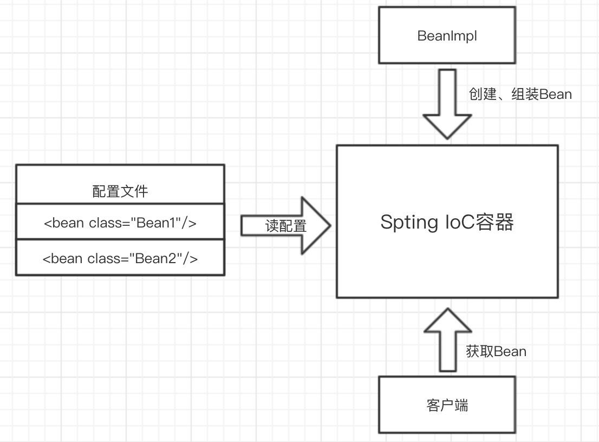
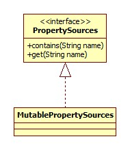
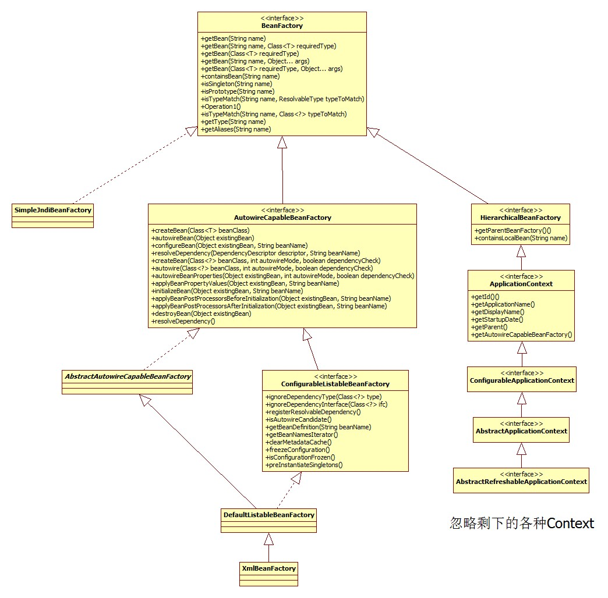
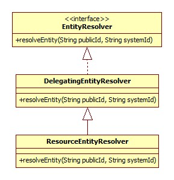
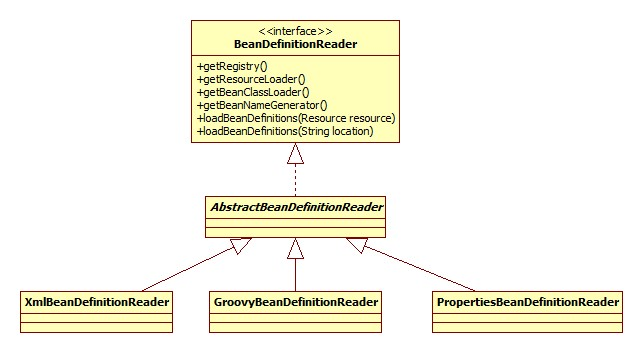
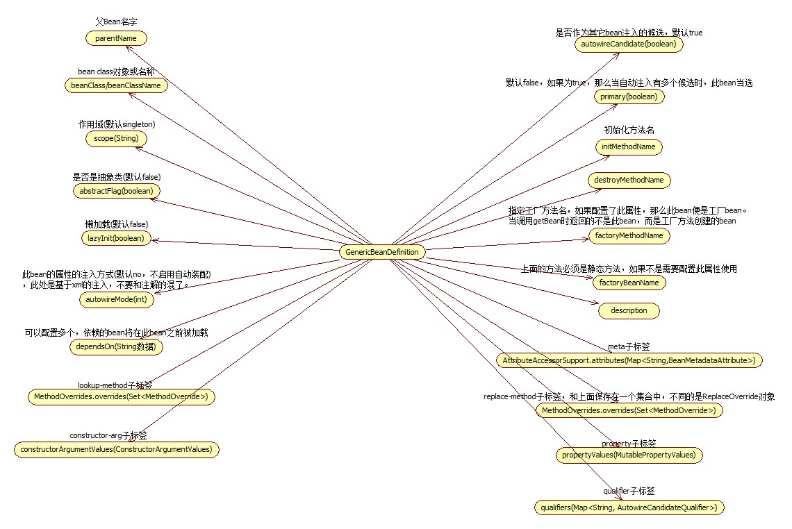

# IoC基础

一个简单例子 > me.icro.java.spring.ch01_basic.Main:

```java
ClassPathXmlApplicationContext context = new ClassPathXmlApplicationContext("ch01_basic/config.xml");
SimpleBean bean = context.getBean(SimpleBean.class);
bean.send();
context.close();
```

通过3个问题:

* 配置文件是如何被加载的
* BeanFactory是如何创建的
* getBean()如何获得实例

来看看IoC的实现。

想加深入的了解IoC和DI，请参考大师级人物Martin Fowler的一篇经典文章《Inversion of Control Containers and the Dependency Injection pattern》，原文地址：<http://www.martinfowler.com/articles/injection.html。>

下面来看看IoC容器的构建，及客户端如何获取容器里的Bean。

## 初探IoC容器

Spring的IoC容器的基本功能由 `BeanFactory` 接口提供，`ApplicationContext`做了扩展，提供了更多支持企业级功能支持（与Spring AOP集成、国际化处理、事件传播及提供不同层次的context实现）。

3种IoC容器实现:

* XmlBeanFactory: 基本的IoC容器功能，从classpath或文件系统等获取资源。

```java
File file = new File("fileSystemConfig.xml");
Resource resource = new FileSystemResource(file);
BeanFactory beanFactory = new XmlBeanFactory(resource);
```

* ClassPathXmlApplicationContext：ApplicationContext实现，从classpath获取配置文件；

```java
BeanFactory beanFactory = new ClassPathXmlApplicationContext("classpath.xml");
```

* FileSystemXmlApplicationContext：ApplicationContext实现，从文件系统获取配置文件。

```java
BeanFactory beanFactory = new FileSystemXmlApplicationContext("fileSystemConfig.xml");
```

IoC容器的工作流程:

* 加载配置文件，实例中的 `config.xml`文件，在配置文件中声明Bean定义也就是为Bean配置元数据。
* 创建IoC容器 并解析元数据，IoC容器的Bean Reader读取并解析配置文件，根据定义生成BeanDefinition配置元数据对象，IoC容器根据BeanDefinition进行实例化、配置及组装Bean。
* 客户端通过`getBean()`获得Bean。

整个过程就是这么简单，下面来看看具体是如何实现的。



## 源码解析

从`ClassPathXmlApplicationContext`开始，代码见`me.icro.java.spring.ch01_basic`。

`ClassPathXmlApplicationContext`：`ApplicationContext`实现之一，从classpath获取配置文件。

整体继承体系是:


`ResourceLoader`代表了加载资源的一种方式，正是`策略模式`的实现。

*`ClassPathXmlApplicationContext`构造过程: 获取资源解析器、设置配置文件路径(Environment、路径占位符处理、解析)、组装

### 获取资源解析器

```java
public ClassPathXmlApplicationContext(String[] configLocations, boolean refresh, ApplicationContext parent) {
    //null
    super(parent);
    // 根据提供的路径，处理配置文件数组(以分号、逗号、空格、tab、换行符分割)
    setConfigLocations(configLocations);
    //默认true
    if (refresh) {
        refresh(); // 这是核心方法
    }
}
```

沿着继承往上找到`AbstractApplicationContext`:

```java
public AbstractApplicationContext(ApplicationContext parent) {
    this();
    setParent(parent);
}
public AbstractApplicationContext() {
    this.resourcePatternResolver = getResourcePatternResolver();
}
```

获取资源解析器 `getResourcePatternResolver`:

```java
protected ResourcePatternResolver getResourcePatternResolver() {
    return new PathMatchingResourcePatternResolver(this);
}
```

默认的资源解析器是`PathMatchingResourcePatternResolver`, supporting Ant-style location patterns.

#### 设置配置文件路径

AbstractRefreshableConfigApplicationContext.setConfigLocations:

```java
public void setConfigLocations(String... locations) {
    if (locations != null) {
        Assert.noNullElements(locations, "Config locations must not be null");
        this.configLocations = new String[locations.length];
        for (int i = 0; i < locations.length; i++) {
            this.configLocations[i] = resolvePath(locations[i]).trim();
        }
    } else {
        this.configLocations = null;
    }
}
```

resolvePath的作用是:

```java
protected String resolvePath(String path) {
    return getEnvironment().resolveRequiredPlaceholders(path);
}
```

此方法的目的在于将占位符(placeholder)解析成实际的地址。比如可以这么写: `new ClassPathXmlApplicationContext("classpath:config.xml")`; 那么`classpath:`就是需要被解析的。

再往里看，发现getEnvironment(), 用来获取当前的所处环境, 自于ConfigurableApplicationContext接口，源码很简单，如果为空就调用createEnvironment创建一个。

```java
protected ConfigurableEnvironment createEnvironment() {
    return new StandardEnvironment();
}
```

##### 插注: Environment

Environment的继承体系:


其主要和profile、Property相关。

**Profile**解决这样一种问题: 线上环境和测试环境使用不同的配置或是数据库或是其它。有了Profile便可以在 不同环境之间无缝切换。

```xml
<beans profile="develop">  
    <context:property-placeholder location="classpath*:jdbc-develop.properties"/>  
</beans>  
<beans profile="production">  
    <context:property-placeholder location="classpath*:jdbc-production.properties"/>  
</beans>  
<beans profile="test">  
    <context:property-placeholder location="classpath*:jdbc-test.properties"/>  
</beans>
```

在启动代码中可以用如下代码设置活跃(当前使用的)Profile:

```java
context.getEnvironment().setActiveProfiles("dev");
```

Profile的更多参考:

* spring3.1 profile 配置不同的环境 <https://www.iteye.com/blog/radiumxie-1851919>
* Spring Profiles example <https://www.mkyong.com/spring/spring-profiles-example/>

**Property**指的是程序运行时的一些参数: properties files, JVM system properties, system environment variables, JNDI, servlet context parameters, ad-hoc Properties objects,Maps, and so on

Environment构造器:

```java
private final MutablePropertySources propertySources = new MutablePropertySources(this.logger);
public AbstractEnvironment() {
    customizePropertySources(this.propertySources);
}
```

构造函数涉及到的PropertySources的继承体系:



默认的MutablePropertySources实现内部含有一个CopyOnWriteArrayList作为存储载体。

返回到设置配置文件路径的默认`StandardEnvironment`实现:

```java
/** System environment property source name: {@value} */
public static final String SYSTEM_ENVIRONMENT_PROPERTY_SOURCE_NAME = "systemEnvironment";
/** JVM system properties property source name: {@value} */
public static final String SYSTEM_PROPERTIES_PROPERTY_SOURCE_NAME = "systemProperties";
@Override
protected void customizePropertySources(MutablePropertySources propertySources) {
    propertySources.addLast(new MapPropertySource
        (SYSTEM_PROPERTIES_PROPERTY_SOURCE_NAME, getSystemProperties()));
    propertySources.addLast(new SystemEnvironmentPropertySource
        (SYSTEM_ENVIRONMENT_PROPERTY_SOURCE_NAME, getSystemEnvironment()));
}
```

使用了`PropertySource`表示键值对的信息，继承体系是:


**插注: Environment部分 结束**

开始处理路径占位符。

进入 AbstractPropertyResolver.resolveRequiredPlaceholders:

```java
@Override
public String resolveRequiredPlaceholders(String text) throws IllegalArgumentException {
    if (this.strictHelper == null) {
        this.strictHelper = createPlaceholderHelper(false);
    }
    return doResolvePlaceholders(text, this.strictHelper);
}

private PropertyPlaceholderHelper createPlaceholderHelper(boolean ignoreUnresolvablePlaceholders) {
    //三个参数分别是${, }, :
    return new PropertyPlaceholderHelper(this.placeholderPrefix, this.placeholderSuffix,
        this.valueSeparator, ignoreUnresolvablePlaceholders);
}

private String doResolvePlaceholders(String text, PropertyPlaceholderHelper helper) {
    //PlaceholderResolver接口依然是策略模式的体现
    return helper.replacePlaceholders(text, new PropertyPlaceholderHelper.PlaceholderResolver() {
        @Override
        public String resolvePlaceholder(String placeholderName) {
            return getPropertyAsRawString(placeholderName);
        }
    });
}
```

到目前为止，是在解析配置文件占位符(placeHolder)，看个case:

```java
System.setProperty("spring", "classpath");
ClassPathXmlApplicationContext context = new ClassPathXmlApplicationContext("${spring}:config.xml");
SimpleBean bean = context.getBean(SimpleBean.class);
```

这样，以上就可以正确解析了。`${spring}`被替换成`classpath`，通过`PropertySourcesPropertyResolver.getProperty`获取。

```java
@Override
protected String getPropertyAsRawString(String key) {
    return getProperty(key, String.class, false);
}
protected <T> T getProperty(String key, Class<T> targetValueType, boolean resolveNestedPlaceholders) {
    if (this.propertySources != null) {
        for (PropertySource<?> propertySource : this.propertySources) {
            Object value = propertySource.getProperty(key);
            return value;
        }
    }
    return null;
}
```

#### 解析

开始解析 Spring bean。

AbstractApplicationContext.refresh:

```java
@Override
public void refresh() throws BeansException, IllegalStateException {
    // 加锁，以防容器再次启动，或者销毁操作
    synchronized (this.startupShutdownMonitor) {
        // 准备工作，记录下容器的启动时间、标记“已启动”状态、处理配置文件中的占位符
        prepareRefresh();
        // 这步完成后，配置文件就会解析成一个个 Bean 定义，注册到 BeanFactory 中
        // Bean 还没有初始化，只是配置信息都提取出来了，
        // 最后就是 beanName-> beanDefinition 的 map
        ConfigurableListableBeanFactory beanFactory = obtainFreshBeanFactory();
        // 设置 BeanFactory 的类加载器
        prepareBeanFactory(beanFactory);
        try {
            // 这里是提供给子类的扩展点，到这里的时候，所有的 Bean 都加载、注册完成了，但是都还没有初始化
            // 具体的子类可以在这步的时候添加一些特殊的 BeanFactoryPostProcessor 的实现类或做点什么事
            postProcessBeanFactory(beanFactory);
            // 调用 BeanFactoryPostProcessor 各个实现类的 postProcessBeanFactory(factory) 方法
            invokeBeanFactoryPostProcessors(beanFactory);
            // 注册 BeanPostProcessor 的实现类，注意看和 BeanFactoryPostProcessor 的区别
            // 此接口两个方法: postProcessBeforeInitialization 和 postProcessAfterInitialization
            // 两个方法分别在 Bean 初始化之前和初始化之后得到执行。注意，到这里 Bean 还没初始化
            registerBeanPostProcessors(beanFactory);
            // 国际化，这里不展开说
            initMessageSource();
            // 初始化当前 ApplicationContext 的事件广播器，不展开
            initApplicationEventMulticaster();
            // 在这里初始化一些特殊的 Bean
            onRefresh();
            // 注册事件监听器，监听器需要实现 ApplicationListener 接口
            registerListeners();
            // !!!重点!!!初始化所有的 singleton beans（lazy-init 的除外）
            finishBeanFactoryInitialization(beanFactory);
            // 最后，广播事件，ApplicationContext 初始化完成
            finishRefresh();
        } catch (BeansException ex) {
            // Destroy already created singletons to avoid dangling resources.
            // 销毁已经初始化的 singleton 的 Beans，以免有些 bean 会一直占用资源
            destroyBeans();
            // Reset 'active' flag.
            cancelRefresh(ex);
            // Propagate exception to caller.
            throw ex;
        } finally {
            // Reset common introspection caches in Spring's core, since we
            // might not ever need metadata for singleton beans anymore...
            resetCommonCaches();
        }
    }
}
```

详细步骤拆分:

* prepareRefresh: 准备、校验

```java
protected void prepareRefresh() {
    this.startupDate = System.currentTimeMillis();
    this.closed.set(false);
    this.active.set(true);
    // Initialize any placeholder property sources in the context environment
    //空实现
    initPropertySources();
    // Validate that all properties marked as required are resolvable
    // see ConfigurablePropertyResolver#setRequiredProperties
    getEnvironment().validateRequiredProperties();
    // Allow for the collection of early ApplicationEvents,
    // to be published once the multicaster is available...
    this.earlyApplicationEvents = new LinkedHashSet<ApplicationEvent>();
}
```

* obtainFreshBeanFactory: 创建BeanFactory

```java
@Override
protected final void refreshBeanFactory() throws BeansException {
    //如果已经存在，那么销毁之前的
    if (hasBeanFactory()) {
        destroyBeans();
        closeBeanFactory();
    }
    //创建了一个DefaultListableBeanFactory对象
    DefaultListableBeanFactory beanFactory = createBeanFactory();
    beanFactory.setSerializationId(getId());
    customizeBeanFactory(beanFactory);
    loadBeanDefinitions(beanFactory);
    synchronized (this.beanFactoryMonitor) {
        this.beanFactory = beanFactory;
    }
}
```

创建的BeanFactory实际上就是Bean容器，继承体系是:



到这里，我们回看`ApplicationContext``，ApplicationContext` 继承自 `BeanFactory`，但是它不应该被理解为 `BeanFactory` 的实现类，而是说其内部持有一个实例化的 `BeanFactory`（`DefaultListableBeanFactory`）。以后所有的 `BeanFactory` 相关的操作其实是委托给这个实例来处理的。

* 通过`customizeBeanFactory(beanFactory)`定制BeanFactory:

```java
protected void customizeBeanFactory(DefaultListableBeanFactory beanFactory) {
    if (this.allowBeanDefinitionOverriding != null) {
        //  默认false，不允许覆盖
        // BeanDefinition 的覆盖问题可能会有开发者碰到这个坑，就是在配置文件中定义 bean 时使用了相同的 id 或 name，默认情况下，allowBeanDefinitionOverriding 属性为 null，如果在同一配置文件中重复了，会抛错，但是如果不是同一配置文件中，会发生覆盖。
        beanFactory.setAllowBeanDefinitionOverriding(this.allowBeanDefinitionOverriding);
    }
    if (this.allowCircularReferences != null) {
        //默认false，不允许循环引用
        beanFactory.setAllowCircularReferences(this.allowCircularReferences);
    }
}
```

* `loadBeanDefinitions` - 最核心部分，bean加载:

我们先来了解`BeanDefinition`是什么。

`BeanDefinition` 就是我们所说的 Spring 的 `Bean`，我们自己定义的各个 `Bean` 其实会转换成一个个 `BeanDefinition` 存在于 Spring 的 `BeanFactory` 中。

如果有人问你 `Bean` 是什么的时候，你要知道 `Bean` 在代码层面上可以认为是 `BeanDefinition` 的实例。

> BeanDefinition 中保存了我们的 Bean 信息，比如这个 Bean 指向的是哪个类、是否是单例的、是否懒加载、这个 Bean 依赖了哪些 Bean 等等。

```java
/** 我们可以看到，此方法将通过一个 XmlBeanDefinitionReader 实例来加载各个 Bean。*/
@Override
protected void loadBeanDefinitions(DefaultListableBeanFactory beanFactory) {
    // 给这个 BeanFactory 实例化一个 XmlBeanDefinitionReader
    XmlBeanDefinitionReader beanDefinitionReader = new XmlBeanDefinitionReader(beanFactory);
    // Configure the bean definition reader with this context's
    // resource loading environment.
    beanDefinitionReader.setEnvironment(this.getEnvironment());
    beanDefinitionReader.setResourceLoader(this);
    beanDefinitionReader.setEntityResolver(new ResourceEntityResolver(this));
    // 初始化 BeanDefinitionReader，其实这个是提供给子类覆写的，
    // then proceed with actually loading the bean definitions.
    //默认空实现，没有类覆写这个方法
    initBeanDefinitionReader(beanDefinitionReader);
    loadBeanDefinitions(beanDefinitionReader);
}
```

其中 `EntityResolver` 和 `BeanDefinitionReader`，他们的继承体系是:





下一步，路径解析(Ant)

```java
protected void loadBeanDefinitions(XmlBeanDefinitionReader reader) {
    Resource[] configResources = getConfigResources();
    if (configResources != null) {
        reader.loadBeanDefinitions(configResources);
    }
    String[] configLocations = getConfigLocations();
    //here
    if (configLocations != null) {
        reader.loadBeanDefinitions(configLocations);
    }
}
```

`loadBeanDefinitions`:

```java
@Override
public int loadBeanDefinitions(String... locations) throws BeanDefinitionStoreException {
    Assert.notNull(locations, "Location array must not be null");
    int counter = 0;
    // 处理多个 resource 文件
    for (String location : locations) {
        counter += loadBeanDefinitions(location);
    }
    return counter;
}
```

最终调用 `AbstractBeanDefinitionReader.loadBeanDefinitions(String location, Set<Resource> actualResources)`

```java
//第二个参数为空
public int loadBeanDefinitions(String location, Set<Resource> actualResources) {
    ResourceLoader resourceLoader = getResourceLoader();
    //参见ResourceLoader类图，ClassPathXmlApplicationContext实现了此接口
    if (resourceLoader instanceof ResourcePatternResolver) {
        // Resource pattern matching available.
        try {
            Resource[] resources = ((ResourcePatternResolver) resourceLoader).getResources(location);
            int loadCount = loadBeanDefinitions(resources);
            if (actualResources != null) {
                for (Resource resource : resources) {
                    actualResources.add(resource);
                }
            }
            return loadCount;
        }
        catch (IOException ex) {
            throw new BeanDefinitionStoreException(
                    "Could not resolve bean definition resource pattern [" + location + "]", ex);
        }
    }
    else {
        // Can only load single resources by absolute URL.
        Resource resource = resourceLoader.getResource(location);
        int loadCount = loadBeanDefinitions(resource);
        if (actualResources != null) {
            actualResources.add(resource);
        }
        return loadCount;
    }
}
```

接着往下看，

```java
public int loadBeanDefinitions(EncodedResource encodedResource) throws BeanDefinitionStoreException {
  Assert.notNull(encodedResource, "EncodedResource must not be null");
  if (logger.isTraceEnabled()) {
   logger.trace("Loading XML bean definitions from " + encodedResource);
  }

  // 用一个 ThreadLocal 来存放配置文件资源
  Set<EncodedResource> currentResources = this.resourcesCurrentlyBeingLoaded.get();
  if (currentResources == null) {
   currentResources = new HashSet<>(4);
   this.resourcesCurrentlyBeingLoaded.set(currentResources);
  }
  if (!currentResources.add(encodedResource)) {
   throw new BeanDefinitionStoreException(
     "Detected cyclic loading of " + encodedResource + " - check your import definitions!");
  }
  try {
   InputStream inputStream = encodedResource.getResource().getInputStream();
   try {
    InputSource inputSource = new InputSource(inputStream);
    if (encodedResource.getEncoding() != null) {
     inputSource.setEncoding(encodedResource.getEncoding());
    }
    // 核心部分是这里，往下面看
    return doLoadBeanDefinitions(inputSource, encodedResource.getResource());
   }
   finally {
    inputStream.close();
   }
  }
  catch (IOException ex) {
   throw new BeanDefinitionStoreException(
     "IOException parsing XML document from " + encodedResource.getResource(), ex);
  }
  finally {
   currentResources.remove(encodedResource);
   if (currentResources.isEmpty()) {
    this.resourcesCurrentlyBeingLoaded.remove();
   }
  }
 }
```

```java
protected int doLoadBeanDefinitions(InputSource inputSource, Resource resource)
   throws BeanDefinitionStoreException {

  try {
   // 这里就不看了，将 xml 文件转换为 Document 对象
   Document doc = doLoadDocument(inputSource, resource);
   // 接着 往下看
   int count = registerBeanDefinitions(doc, resource);
   if (logger.isDebugEnabled()) {
    logger.debug("Loaded " + count + " bean definitions from " + resource);
   }
   return count;
  }
  catch (BeanDefinitionStoreException ex) {
   throw ex;
  }
  catch (SAXParseException ex) {
   throw new XmlBeanDefinitionStoreException(resource.getDescription(),
     "Line " + ex.getLineNumber() + " in XML document from " + resource + " is invalid", ex);
  }
  catch (SAXException ex) {
   throw new XmlBeanDefinitionStoreException(resource.getDescription(),
     "XML document from " + resource + " is invalid", ex);
  }
  catch (ParserConfigurationException ex) {
   throw new BeanDefinitionStoreException(resource.getDescription(),
     "Parser configuration exception parsing XML from " + resource, ex);
  }
  catch (IOException ex) {
   throw new BeanDefinitionStoreException(resource.getDescription(),
     "IOException parsing XML document from " + resource, ex);
  }
  catch (Throwable ex) {
   throw new BeanDefinitionStoreException(resource.getDescription(),
     "Unexpected exception parsing XML document from " + resource, ex);
  }
 }
```

```java
public int registerBeanDefinitions(Document doc, Resource resource) throws BeanDefinitionStoreException {
  BeanDefinitionDocumentReader documentReader = createBeanDefinitionDocumentReader();
  int countBefore = getRegistry().getBeanDefinitionCount();
  // 往下看
  documentReader.registerBeanDefinitions(doc, createReaderContext(resource));
  return getRegistry().getBeanDefinitionCount() - countBefore;
 }
```

```java
@Override
public void registerBeanDefinitions(Document doc, XmlReaderContext readerContext) {
   this.readerContext = readerContext;
   logger.debug("Loading bean definitions");
   Element root = doc.getDocumentElement();
   // 从 xml 根节点开始解析文件
   doRegisterBeanDefinitions(root);
}
```

经过漫长的链路，一个配置文件终于转换为一颗 DOM 树了，注意，这里指的是其中一个配置文件，不是所有的，读者可以看到上面有个 for 循环的。下面开始从根节点开始解析。

最终调用 `DefaultBeanDefinitionDocumentReader.doRegisterBeanDefinitions`:

```java
protected void doRegisterBeanDefinitions(Element root) {
    BeanDefinitionParserDelegate parent = this.delegate;
    this.delegate = createDelegate(getReaderContext(), root, parent);
    //默认的命名空间即
    //http://www.springframework.org/schema/beans
    if (this.delegate.isDefaultNamespace(root)) {
        //检查profile属性
        String profileSpec = root.getAttribute(PROFILE_ATTRIBUTE);
        if (StringUtils.hasText(profileSpec)) {
            //profile属性可以以,分割
            String[] specifiedProfiles = StringUtils.tokenizeToStringArray(
                    profileSpec, BeanDefinitionParserDelegate.MULTI_VALUE_ATTRIBUTE_DELIMITERS);
            if (!getReaderContext().getEnvironment().acceptsProfiles(specifiedProfiles)) {
                return;
            }
        }
    }
    // 钩子
    preProcessXml(root);
    parseBeanDefinitions(root, this.delegate);
    // 钩子
    postProcessXml(root);
    this.delegate = parent;
}
```

核心解析方法 parseBeanDefinitions(root, this.delegate):

```java
// default namespace 涉及到的就四个标签 <import />、<alias />、<bean /> 和 <beans />，
// 其他的属于 custom 的
protected void parseBeanDefinitions(Element root, BeanDefinitionParserDelegate delegate) {
   if (delegate.isDefaultNamespace(root)) {
      NodeList nl = root.getChildNodes();
      for (int i = 0; i < nl.getLength(); i++) {
         Node node = nl.item(i);
         if (node instanceof Element) {
            Element ele = (Element) node;
            if (delegate.isDefaultNamespace(ele)) {
               // 解析 default namespace 下面的几个元素
               parseDefaultElement(ele, delegate);
            }
            else {
               // 解析其他 namespace 的元素
               delegate.parseCustomElement(ele);
            }
         }
      }
   }
   else {
      delegate.parseCustomElement(root);
   }
}
```

delegate的作用在于处理beans标签的嵌套，其实Spring配置文件是可以写成这样的:

```xml
<?xml version="1.0" encoding="UTF-8"?>
<beans>
    <bean class="base.SimpleBean"></bean>
    <beans>
        <bean class="java.lang.Object"></bean>
    </beans>
</beans>
```

下一步，有两个分支: `parseDefaultEAuthoredlement(ele, delegate);`和`delegate.parseCustomElement(root);`。

`parseDefaultElement(ele, delegate)` 代表解析的节点是 <import />、<alias />、<bean />、<beans /> 这几个。

xml(schema)的命名空间其实类似于java的包名，命名空间采用URL，比如Spring的是这样:

```xml
<?xml version="1.0" encoding="UTF-8"?>
<beans xmlns="http://www.springframework.org/schema/beans"></beans>
```

import, alias, bean, 嵌套的beans四种元素 解析：

```java
private void parseDefaultElement(Element ele, BeanDefinitionParserDelegate delegate) {
  if (delegate.nodeNameEquals(ele, IMPORT_ELEMENT)) {
    // 处理 <import /> 标签
   importBeanDefinitionResource(ele);
  }
  else if (delegate.nodeNameEquals(ele, ALIAS_ELEMENT)) {
    // 处理 <alias /> 标签定义
    // <alias name="fromName" alias="toName"/>
   processAliasRegistration(ele);
  }
  else if (delegate.nodeNameEquals(ele, BEAN_ELEMENT)) {
    // 处理 <bean /> 标签定义，这也算是我们的重点吧
   processBeanDefinition(ele, delegate);
  }
  else if (delegate.nodeNameEquals(ele, NESTED_BEANS_ELEMENT)) {
   // 如果碰到的是嵌套的 <beans /> 标签，需要递归
   doRegisterBeanDefinitions(ele);
  }
 }
```

重点 `<bean />` 标签出来说一下。

```java
protected void processBeanDefinition(Element ele, BeanDefinitionParserDelegate delegate) {
   // 将 <bean /> 节点中的信息提取出来，然后封装到一个 BeanDefinitionHolder 中，细节往下看
   BeanDefinitionHolder bdHolder = delegate.parseBeanDefinitionElement(ele);

   if (bdHolder != null) {
      bdHolder = delegate.decorateBeanDefinitionIfRequired(ele, bdHolder);
      try {
         // Register the final decorated instance.
         BeanDefinitionReaderUtils.registerBeanDefinition(bdHolder, getReaderContext().getRegistry());
      }
      catch (BeanDefinitionStoreException ex) {
         getReaderContext().error("Failed to register bean definition with name '" +
               bdHolder.getBeanName() + "'", ele, ex);
      }
      // Send registration event.
      getReaderContext().fireComponentRegistered(new BeanComponentDefinition(bdHolder));
   }
}
```

bean节点是Spring最最常见的节点，首先获取到bean的class属性和parent属性，配置了parent之后，当前bean会继承父bean的属性。之后根据class和parent创建BeanDefinition对象。

看下 `<bean />` 标签中可以定义哪些属性：

* class: 类的全限定名
* name: 可指定 id、name(用逗号、分号、空格分隔)
* scope: 作用域
* constructor arguments: 指定构造参数
* properties: 设置属性的值
* autowiring mode: no(默认值)、byName、byType、 constructor
* lazy-initialization mode: 是否懒加载(如果被非懒加载的bean依赖了那么其实也就不能懒加载了)
* initialization method: bean 属性设置完成后，会调用这个方法
* destruction method: bean 销毁后的回调方法

简单例子:

```xml
<bean id="exampleBean" name="name1, name2, name3" class="com.javadoop.ExampleBean"
      scope="singleton" lazy-init="true" init-method="init" destroy-method="cleanup">

    <!-- 可以用下面三种形式指定构造参数 -->
    <constructor-arg type="int" value="7500000"/>
    <constructor-arg name="years" value="7500000"/>
    <constructor-arg index="0" value="7500000"/>

    <!-- property 的几种情况 -->
    <property name="beanOne">
        <ref bean="anotherExampleBean"/>
    </property>
    <property name="beanTwo" ref="yetAnotherBean"/>
    <property name="integerProperty" value="1"/>
</bean>
```

往里看怎么解析 bean 元素，是怎么转换到 BeanDefinitionHolder 的:

```java
public BeanDefinitionHolder parseBeanDefinitionElement(Element ele) {
    return parseBeanDefinitionElement(ele, null);
}

public BeanDefinitionHolder parseBeanDefinitionElement(Element ele, BeanDefinition containingBean) {
   String id = ele.getAttribute(ID_ATTRIBUTE);
   String nameAttr = ele.getAttribute(NAME_ATTRIBUTE);

   List<String> aliases = new ArrayList<String>();

   // 将 name 属性的定义按照 “逗号、分号、空格” 切分，形成一个 别名列表数组，
   // 当然，如果你不定义 name 属性的话，就是空的了
   // 我在附录中简单介绍了一下 id 和 name 的配置，大家可以看一眼，有个20秒就可以了
   if (StringUtils.hasLength(nameAttr)) {
      String[] nameArr = StringUtils.tokenizeToStringArray(nameAttr, MULTI_VALUE_ATTRIBUTE_DELIMITERS);
      aliases.addAll(Arrays.asList(nameArr));
   }

   String beanName = id;
   // 如果没有指定id, 那么用别名列表的第一个名字作为beanName
   if (!StringUtils.hasText(beanName) && !aliases.isEmpty()) {
      beanName = aliases.remove(0);
      if (logger.isDebugEnabled()) {
         logger.debug("No XML 'id' specified - using '" + beanName +
               "' as bean name and " + aliases + " as aliases");
      }
   }

   if (containingBean == null) {
      checkNameUniqueness(beanName, aliases, ele);
   }

   // 根据 <bean ...>...</bean> 中的配置创建 BeanDefinition，然后把配置中的信息都设置到实例中,
   // 细节后面细说，先知道下面这行结束后，一个 BeanDefinition 实例就出来了。
   AbstractBeanDefinition beanDefinition = parseBeanDefinitionElement(ele, beanName, containingBean);

   // 到这里，整个 <bean /> 标签就算解析结束了，一个 BeanDefinition 就形成了。
   if (beanDefinition != null) {
      // 如果都没有设置 id 和 name，那么此时的 beanName 就会为 null，进入下面这块代码产生
      // 如果读者不感兴趣的话，我觉得不需要关心这块代码，对本文源码分析来说，这些东西不重要
      if (!StringUtils.hasText(beanName)) {
         try {
            if (containingBean != null) {// 按照我们的思路，这里 containingBean 是 null 的
               beanName = BeanDefinitionReaderUtils.generateBeanName(
                     beanDefinition, this.readerContext.getRegistry(), true);
            }
            else {
               // 如果我们不定义 id 和 name，那么我们引言里的那个例子：
               //   1. beanName 为：com.javadoop.example.MessageServiceImpl#0
               //   2. beanClassName 为：com.javadoop.example.MessageServiceImpl

               beanName = this.readerContext.generateBeanName(beanDefinition);

               String beanClassName = beanDefinition.getBeanClassName();
               if (beanClassName != null &&
                     beanName.startsWith(beanClassName) && beanName.length() > beanClassName.length() &&
                     !this.readerContext.getRegistry().isBeanNameInUse(beanClassName)) {
                  // 把 beanClassName 设置为 Bean 的别名
                  aliases.add(beanClassName);
               }
            }
            if (logger.isDebugEnabled()) {
               logger.debug("Neither XML 'id' nor 'name' specified - " +
                     "using generated bean name [" + beanName + "]");
            }
         }
         catch (Exception ex) {
            error(ex.getMessage(), ele);
            return null;
         }
      }
      String[] aliasesArray = StringUtils.toStringArray(aliases);
      // 返回 BeanDefinitionHolder
      return new BeanDefinitionHolder(beanDefinition, beanName, aliasesArray);
   }

   return null;
}
```

看看怎么根据配置创建 BeanDefinition 实例的：

```java
public AbstractBeanDefinition parseBeanDefinitionElement(
      Element ele, String beanName, BeanDefinition containingBean) {

   this.parseState.push(new BeanEntry(beanName));

   String className = null;
   if (ele.hasAttribute(CLASS_ATTRIBUTE)) {
      className = ele.getAttribute(CLASS_ATTRIBUTE).trim();
   }

   try {
      String parent = null;
      if (ele.hasAttribute(PARENT_ATTRIBUTE)) {
         parent = ele.getAttribute(PARENT_ATTRIBUTE);
      }
      // 创建 BeanDefinition，然后设置类信息而已，很简单，就不贴代码了
      AbstractBeanDefinition bd = createBeanDefinition(className, parent);

      // 设置 BeanDefinition 的一堆属性，这些属性定义在 AbstractBeanDefinition 中
      parseBeanDefinitionAttributes(ele, beanName, containingBean, bd);
      bd.setDescription(DomUtils.getChildElementValueByTagName(ele, DESCRIPTION_ELEMENT));

      /**
       * 下面的一堆是解析 <bean>......</bean> 内部的子元素，
       * 解析出来以后的信息都放到 bd 的属性中
       */

      // 解析 <meta />
      parseMetaElements(ele, bd);
      // 解析 <lookup-method />
      parseLookupOverrideSubElements(ele, bd.getMethodOverrides());
      // 解析 <replaced-method />
      parseReplacedMethodSubElements(ele, bd.getMethodOverrides());
      // 解析 <constructor-arg />
      parseConstructorArgElements(ele, bd);
      // 解析 <property />
      parsePropertyElements(ele, bd);
      // 解析 <qualifier />
      parseQualifierElements(ele, bd);

      bd.setResource(this.readerContext.getResource());
      bd.setSource(extractSource(ele));

      return bd;
   }
   catch (ClassNotFoundException ex) {
      error("Bean class [" + className + "] not found", ele, ex);
   }
   catch (NoClassDefFoundError err) {
      error("Class that bean class [" + className + "] depends on not found", ele, err);
   }
   catch (Throwable ex) {
      error("Unexpected failure during bean definition parsing", ele, ex);
   }
   finally {
      this.parseState.pop();
   }

   return null;
}
```

到这里，我们已经完成了根据 `<bean />` 配置创建了一个 BeanDefinitionHolder 实例。

下一步，注册 `BeanDefiniton`, 主要就干了这么两件事:

```java
@Override
public void registerBeanDefinition(String beanName, BeanDefinition beanDefinition) {
    this.beanDefinitionMap.put(beanName, beanDefinition);
    this.beanDefinitionNames.add(beanName);
}
```

`BeanDefiniton`数据结构:



`BeanFactory`数据结构:


BeanDefinition 的接口定义:

```java
public interface BeanDefinition extends AttributeAccessor, BeanMetadataElement {

   // 我们可以看到，默认只提供 sington 和 prototype 两种，
   // 很多读者可能知道还有 request, session, globalSession, application, websocket 这几种，
   // 不过，它们属于基于 web 的扩展。
   String SCOPE_SINGLETON = ConfigurableBeanFactory.SCOPE_SINGLETON;
   String SCOPE_PROTOTYPE = ConfigurableBeanFactory.SCOPE_PROTOTYPE;

   // 比较不重要，直接跳过吧
   int ROLE_APPLICATION = 0;
   int ROLE_SUPPORT = 1;
   int ROLE_INFRASTRUCTURE = 2;

   // 设置父 Bean，这里涉及到 bean 继承，不是 java 继承。请参见附录的详细介绍
   // 一句话就是：继承父 Bean 的配置信息而已
   void setParentName(String parentName);

   // 获取父 Bean
   String getParentName();

   // 设置 Bean 的类名称，将来是要通过反射来生成实例的
   void setBeanClassName(String beanClassName);

   // 获取 Bean 的类名称
   String getBeanClassName();


   // 设置 bean 的 scope
   void setScope(String scope);

   String getScope();

   // 设置是否懒加载
   void setLazyInit(boolean lazyInit);

   boolean isLazyInit();

   // 设置该 Bean 依赖的所有的 Bean，注意，这里的依赖不是指属性依赖(如 @Autowire 标记的)，
   // 是 depends-on="" 属性设置的值。
   void setDependsOn(String... dependsOn);

   // 返回该 Bean 的所有依赖
   String[] getDependsOn();

   // 设置该 Bean 是否可以注入到其他 Bean 中，只对根据类型注入有效，
   // 如果根据名称注入，即使这边设置了 false，也是可以的
   void setAutowireCandidate(boolean autowireCandidate);

   // 该 Bean 是否可以注入到其他 Bean 中
   boolean isAutowireCandidate();

   // 主要的。同一接口的多个实现，如果不指定名字的话，Spring 会优先选择设置 primary 为 true 的 bean
   void setPrimary(boolean primary);

   // 是否是 primary 的
   boolean isPrimary();

   // 如果该 Bean 采用工厂方法生成，指定工厂名称。对工厂不熟悉的读者，请参加附录
   // 一句话就是：有些实例不是用反射生成的，而是用工厂模式生成的
   void setFactoryBeanName(String factoryBeanName);
   // 获取工厂名称
   String getFactoryBeanName();
   // 指定工厂类中的 工厂方法名称
   void setFactoryMethodName(String factoryMethodName);
   // 获取工厂类中的 工厂方法名称
   String getFactoryMethodName();

   // 构造器参数
   ConstructorArgumentValues getConstructorArgumentValues();

   // Bean 中的属性值，后面给 bean 注入属性值的时候会说到
   MutablePropertyValues getPropertyValues();

   // 是否 singleton
   boolean isSingleton();

   // 是否 prototype
   boolean isPrototype();

   // 如果这个 Bean 是被设置为 abstract，那么不能实例化，
   // 常用于作为 父bean 用于继承，其实也很少用......
   boolean isAbstract();

   int getRole();
   String getDescription();
   String getResourceDescription();
   BeanDefinition getOriginatingBeanDefinition();
}
```

总结一下，到这里已经初始化了 Bean 容器，`<bean />`配置也相应的转换为了一个个 BeanDefinition，然后注册了各个 BeanDefinition 到注册中心，并且发送了注册事件。

【一个分水岭】说完 obtainFreshBeanFactory() 方法啦....

下一步，对BeanFactory进行一些特征的设置 - `prepareBeanFactory`，有以下几个方面:

* setBeanExpressionResolver
* addPropertyEditorRegistrar
* 环境注入: addBeanPostProcessor, 实现EnvironmentAware等一系列Aware接口获取到Spring内部的一些对象。
* 依赖解析忽略

```java
beanFactory.ignoreDependencyInterface(ResourceLoaderAware.class);
beanFactory.ignoreDependencyInterface(ApplicationEventPublisherAware.class);
beanFactory.ignoreDependencyInterface(MessageSourceAware.class);
beanFactory.ignoreDependencyInterface(ApplicationContextAware.class);
beanFactory.ignoreDependencyInterface(EnvironmentAware.class);
```

* bean伪装

```java
beanFactory.registerResolvableDependency(BeanFactory.class, beanFactory);
beanFactory.registerResolvableDependency(ResourceLoader.class, this);
beanFactory.registerResolvableDependency(ApplicationEventPublisher.class, this);
beanFactory.registerResolvableDependency(ApplicationContext.class, this);
```

* loadTimeWeaver ?

* 注册环境

```java
if (!beanFactory.containsLocalBean(ENVIRONMENT_BEAN_NAME)) {
    beanFactory.registerSingleton(ENVIRONMENT_BEAN_NAME, getEnvironment());
}
if (!beanFactory.containsLocalBean(SYSTEM_PROPERTIES_BEAN_NAME)) {
    beanFactory.registerSingleton(SYSTEM_PROPERTIES_BEAN_NAME, getEnvironment().getSystemProperties());
}
if (!beanFactory.containsLocalBean(SYSTEM_ENVIRONMENT_BEAN_NAME)) {
    beanFactory.registerSingleton(SYSTEM_ENVIRONMENT_BEAN_NAME, getEnvironment().
        getSystemEnvironment());
}
```

下一步， `postProcessBeanFactory`，是一个空实现，目的是允许子类在所有的bean尚未初始化之前注册BeanPostProcessor。

then,  `invokeBeanFactoryPostProcessors`

then, `BeanPostProcessor注册`

then, `MessageSource` 用以支持Spring国际化。

再下一步是 事件初始化部分。

参考: [详解Spring事件驱动模型](https://www.iteye.com/blog/jinnianshilongnian-1902886)

#### 初始化所有的 singleton beans

Spring 会在接下来初始化所有的 singleton beans:

```java
// 初始化剩余的 singleton beans
protected void finishBeanFactoryInitialization(ConfigurableListableBeanFactory beanFactory) {

   // 首先，初始化名字为 conversionService 的 Bean。
   if (beanFactory.containsBean(CONVERSION_SERVICE_BEAN_NAME) &&
         beanFactory.isTypeMatch(CONVERSION_SERVICE_BEAN_NAME, ConversionService.class)) {
      beanFactory.setConversionService(
            beanFactory.getBean(CONVERSION_SERVICE_BEAN_NAME, ConversionService.class));
   }

   // Register a default embedded value resolver if no bean post-processor
   // (such as a PropertyPlaceholderConfigurer bean) registered any before:
   // at this point, primarily for resolution in annotation attribute values.
   if (!beanFactory.hasEmbeddedValueResolver()) {
      beanFactory.addEmbeddedValueResolver(new StringValueResolver() {
         @Override
         public String resolveStringValue(String strVal) {
            return getEnvironment().resolvePlaceholders(strVal);
         }
      });
   }

   // 先初始化 LoadTimeWeaverAware 类型的 Bean，这是 AspectJ 相关的内容
   String[] weaverAwareNames = beanFactory.getBeanNamesForType(LoadTimeWeaverAware.class, false, false);
   for (String weaverAwareName : weaverAwareNames) {
      getBean(weaverAwareName);
   }

   // Stop using the temporary ClassLoader for type matching.
   beanFactory.setTempClassLoader(null);

   // 开始预初始化 singleton beans 了，
   // 肯定不希望这个时候还出现 bean 定义解析、加载、注册。
   beanFactory.freezeConfiguration();

   // 开始初始化
   beanFactory.preInstantiateSingletons();
}
```

接下来，preInstantiateSingletons:

```java
@Override
public void preInstantiateSingletons() throws BeansException {
   if (this.logger.isDebugEnabled()) {
      this.logger.debug("Pre-instantiating singletons in " + this);
   }
   // this.beanDefinitionNames 保存了所有的 beanNames
   List<String> beanNames = new ArrayList<String>(this.beanDefinitionNames);

   // 触发所有的非懒加载的 singleton beans 的初始化操作
   for (String beanName : beanNames) {

      // 合并父 Bean 中的配置，注意 <bean id="" class="" parent="" /> 中的 parent，用的不多吧，
      // 考虑到这可能会影响大家的理解，我在附录中解释了一下 "Bean 继承"，不了解的请到附录中看一下
      RootBeanDefinition bd = getMergedLocalBeanDefinition(beanName);

      // 非抽象、非懒加载的 singletons。如果配置了 'abstract = true'，那是不需要初始化的
      if (!bd.isAbstract() && bd.isSingleton() && !bd.isLazyInit()) {
         // 处理 FactoryBean(读者如果不熟悉 FactoryBean，请移步附录区了解)
         if (isFactoryBean(beanName)) {
            // FactoryBean 的话，在 beanName 前面加上 ‘&’ 符号。再调用 getBean，getBean 方法别急
            final FactoryBean<?> factory = (FactoryBean<?>) getBean(FACTORY_BEAN_PREFIX + beanName);
            // 判断当前 FactoryBean 是否是 SmartFactoryBean 的实现，此处忽略，直接跳过
            boolean isEagerInit;
            if (System.getSecurityManager() != null && factory instanceof SmartFactoryBean) {
               isEagerInit = AccessController.doPrivileged(new PrivilegedAction<Boolean>() {
                  @Override
                  public Boolean run() {
                     return ((SmartFactoryBean<?>) factory).isEagerInit();
                  }
               }, getAccessControlContext());
            }
            else {
               isEagerInit = (factory instanceof SmartFactoryBean &&
                     ((SmartFactoryBean<?>) factory).isEagerInit());
            }
            if (isEagerInit) {

               getBean(beanName);
            }
         }
         else {
            // 对于普通的 Bean，只要调用 getBean(beanName) 这个方法就可以进行初始化了
            getBean(beanName);
         }
      }
   }

   // 到这里说明所有的非懒加载的 singleton beans 已经完成了初始化
   // 如果我们定义的 bean 是实现了 SmartInitializingSingleton 接口的，那么在这里得到回调，忽略
   for (String beanName : beanNames) {
      Object singletonInstance = getSingleton(beanName);
      if (singletonInstance instanceof SmartInitializingSingleton) {
         final SmartInitializingSingleton smartSingleton = (SmartInitializingSingleton) singletonInstance;
         if (System.getSecurityManager() != null) {
            AccessController.doPrivileged(new PrivilegedAction<Object>() {
               @Override
               public Object run() {
                  smartSingleton.afterSingletonsInstantiated();
                  return null;
               }
            }, getAccessControlContext());
         }
         else {
            smartSingleton.afterSingletonsInstantiated();
         }
      }
   }
}
```

#### getBean()如何获得实例

这里便是bean初始化的核心逻辑，源码很复杂，从 `AbstractBeanFactory.getBean`说起:

```java
@Override
 public Object getBean(String name) throws BeansException {
  assertBeanFactoryActive();
  return getBeanFactory().getBean(name);
 }

 @Override
 public <T> T getBean(String name, Class<T> requiredType) throws BeansException {
  assertBeanFactoryActive();
  return getBeanFactory().getBean(name, requiredType);
 }

 @Override
 public Object getBean(String name, Object... args) throws BeansException {
  assertBeanFactoryActive();
  return getBeanFactory().getBean(name, args);
 }

 @Override
 public <T> T getBean(Class<T> requiredType) throws BeansException {
  assertBeanFactoryActive();
  return getBeanFactory().getBean(requiredType);
 }

 @Override
 public <T> T getBean(Class<T> requiredType, Object... args) throws BeansException {
  assertBeanFactoryActive();
  return getBeanFactory().getBean(requiredType, args);
 }
```

接着到`doGetBean`。

```java
// 我们在剖析初始化 Bean 的过程，但是 getBean 方法我们经常是用来从容器中获取 Bean 用的，注意切换思路，
// 已经初始化过了就从容器中直接返回，否则就先初始化再返回
@SuppressWarnings("unchecked")
protected <T> T doGetBean(
      final String name, final Class<T> requiredType, final Object[] args, boolean typeCheckOnly)
      throws BeansException {
   // 获取一个 “正统的” beanName，处理两种情况，一个是前面说的 FactoryBean(前面带 ‘&’)，
   // 一个是别名问题，因为这个方法是 getBean，获取 Bean 用的，你要是传一个别名进来，是完全可以的
   final String beanName = transformedBeanName(name);

   // 注意跟着这个，这个是返回值
   Object bean;

   // 检查下是不是已经创建过了
   Object sharedInstance = getSingleton(beanName);

   // 这里说下 args 呗，虽然看上去一点不重要。前面我们一路进来的时候都是 getBean(beanName)，
   // 所以 args 传参其实是 null 的，但是如果 args 不为空的时候，那么意味着调用方不是希望获取 Bean，而是创建 Bean
   if (sharedInstance != null && args == null) {
      if (logger.isDebugEnabled()) {
         if (isSingletonCurrentlyInCreation(beanName)) {
            logger.debug("...");
         }
         else {
            logger.debug("Returning cached instance of singleton bean '" + beanName + "'");
         }
      }
      // 下面这个方法：如果是普通 Bean 的话，直接返回 sharedInstance，
      // 如果是 FactoryBean 的话，返回它创建的那个实例对象
      bean = getObjectForBeanInstance(sharedInstance, name, beanName, null);
   }

   else {
      if (isPrototypeCurrentlyInCreation(beanName)) {
         // 创建过了此 beanName 的 prototype 类型的 bean，那么抛异常
         throw new BeanCurrentlyInCreationException(beanName);
      }

      // 检查一下这个 BeanDefinition 在容器中是否存在
      BeanFactory parentBeanFactory = getParentBeanFactory();
      if (parentBeanFactory != null && !containsBeanDefinition(beanName)) {
         // 如果当前容器不存在这个 BeanDefinition，试试父容器中有没有
         String nameToLookup = originalBeanName(name);
         if (args != null) {
            // 返回父容器的查询结果
            return (T) parentBeanFactory.getBean(nameToLookup, args);
         }
         else {
            // No args -> delegate to standard getBean method.
            return parentBeanFactory.getBean(nameToLookup, requiredType);
         }
      }

      if (!typeCheckOnly) {
         // typeCheckOnly 为 false，将当前 beanName 放入一个 alreadyCreated 的 Set 集合中。
         markBeanAsCreated(beanName);
      }

      /*
       * 稍稍总结一下：
       * 到这里的话，要准备创建 Bean 了，对于 singleton 的 Bean 来说，容器中还没创建过此 Bean；
       * 对于 prototype 的 Bean 来说，本来就是要创建一个新的 Bean。
       */
      try {
         final RootBeanDefinition mbd = getMergedLocalBeanDefinition(beanName);
         checkMergedBeanDefinition(mbd, beanName, args);

         // 先初始化依赖的所有 Bean，这个很好理解。
         // 注意，这里的依赖指的是 depends-on 中定义的依赖
         String[] dependsOn = mbd.getDependsOn();
         if (dependsOn != null) {
            for (String dep : dependsOn) {
               // 检查是不是有循环依赖，这里的循环依赖和我们前面说的循环依赖又不一样，这里肯定是不允许出现的，不然要乱套了，读者想一下就知道了
               if (isDependent(beanName, dep)) {
                  throw new BeanCreationException(mbd.getResourceDescription(), beanName,
                        "Circular depends-on relationship between '" + beanName + "' and '" + dep + "'");
               }
               // 注册一下依赖关系
               registerDependentBean(dep, beanName);
               // 先初始化被依赖项
               getBean(dep);
            }
         }

         // 如果是 singleton scope 的，创建 singleton 的实例
         if (mbd.isSingleton()) {
            sharedInstance = getSingleton(beanName, new ObjectFactory<Object>() {
               @Override
               public Object getObject() throws BeansException {
                  try {
                     // 执行创建 Bean，详情后面再说
                     return createBean(beanName, mbd, args);
                  }
                  catch (BeansException ex) {
                     destroySingleton(beanName);
                     throw ex;
                  }
               }
            });
            bean = getObjectForBeanInstance(sharedInstance, name, beanName, mbd);
         }

         // 如果是 prototype scope 的，创建 prototype 的实例
         else if (mbd.isPrototype()) {
            // It's a prototype -> create a new instance.
            Object prototypeInstance = null;
            try {
               beforePrototypeCreation(beanName);
               // 执行创建 Bean
               prototypeInstance = createBean(beanName, mbd, args);
            }
            finally {
               afterPrototypeCreation(beanName);
            }
            bean = getObjectForBeanInstance(prototypeInstance, name, beanName, mbd);
         }

         // 如果不是 singleton 和 prototype 的话，需要委托给相应的实现类来处理
         else {
            String scopeName = mbd.getScope();
            final Scope scope = this.scopes.get(scopeName);
            if (scope == null) {
               throw new IllegalStateException("No Scope registered for scope name '" + scopeName + "'");
            }
            try {
               Object scopedInstance = scope.get(beanName, new ObjectFactory<Object>() {
                  @Override
                  public Object getObject() throws BeansException {
                     beforePrototypeCreation(beanName);
                     try {
                        // 执行创建 Bean
                        return createBean(beanName, mbd, args);
                     }
                     finally {
                        afterPrototypeCreation(beanName);
                     }
                  }
               });
               bean = getObjectForBeanInstance(scopedInstance, name, beanName, mbd);
            }
            catch (IllegalStateException ex) {
               throw new BeanCreationException(beanName,
                     "Scope '" + scopeName + "' is not active for the current thread; consider " +
                     "defining a scoped proxy for this bean if you intend to refer to it from a singleton",
                     ex);
            }
         }
      }
      catch (BeansException ex) {
         cleanupAfterBeanCreationFailure(beanName);
         throw ex;
      }
   }

   // 最后，检查一下类型对不对，不对的话就抛异常，对的话就返回了
   if (requiredType != null && bean != null && !requiredType.isInstance(bean)) {
      try {
         return getTypeConverter().convertIfNecessary(bean, requiredType);
      }
      catch (TypeMismatchException ex) {
         if (logger.isDebugEnabled()) {
            logger.debug("Failed to convert bean '" + name + "' to required type '" +
                  ClassUtils.getQualifiedName(requiredType) + "'", ex);
         }
         throw new BeanNotOfRequiredTypeException(name, requiredType, bean.getClass());
      }
   }
   return (T) bean;
}
```

#### 参考

* [spring-analysis](https://github.com/seaswalker/spring-analysis)
