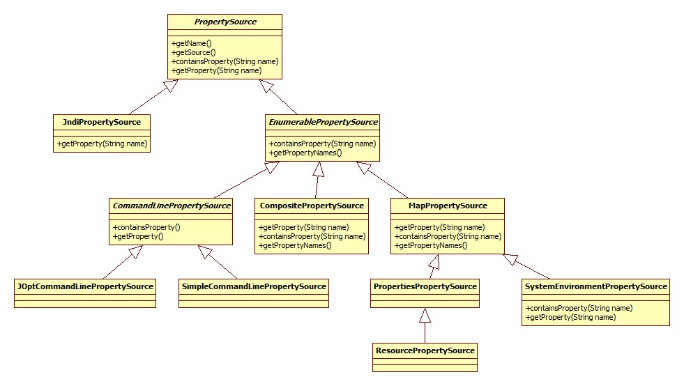

# IoC基础

一个简单例子 > me.icro.java.spring.ch01_basic.Main:

```text
ClassPathXmlApplicationContext context = new ClassPathXmlApplicationContext("ch01_basic/config.xml");
SimpleBean bean = context.getBean(SimpleBean.class);
bean.send();
context.close();
```

通过3个问题:

* 配置文件是如何被加载的
* BeanFactory是如何创建的
* getBean()如何获得实例

来看看IoC的实现。

想加深入的了解IoC和DI，请参考大师级人物Martin Fowler的一篇经典文章《Inversion of Control Containers and the Dependency Injection pattern》，原文地址：http://www.martinfowler.com/articles/injection.html。

下面来看看IoC容器的构建，及客户端如何获取容器里的Bean。

## 初探IoC容器

Spring的IoC容器的基本功能由 `BeanFactory` 接口提供，`ApplicationContext`做了扩展，提供了更多支持企业级功能支持（与Spring AOP集成、国际化处理、事件传播及提供不同层次的context实现）。

3种IoC容器实现:

* XmlBeanFactory: 基本的IoC容器功能，从classpath或文件系统等获取资源。

```text
File file = new File("fileSystemConfig.xml");
Resource resource = new FileSystemResource(file);
BeanFactory beanFactory = new XmlBeanFactory(resource);
```

* ClassPathXmlApplicationContext：ApplicationContext实现，从classpath获取配置文件；

```text
BeanFactory beanFactory = new ClassPathXmlApplicationContext("classpath.xml");
```

* FileSystemXmlApplicationContext：ApplicationContext实现，从文件系统获取配置文件。

```text
BeanFactory beanFactory = new FileSystemXmlApplicationContext("fileSystemConfig.xml");
```

IoC容器的工作流程:

* 加载配置文件，实例中的 `config.xml`文件，在配置文件中声明Bean定义也就是为Bean配置元数据。
* 创建IoC容器 并解析元数据，IoC容器的Bean Reader读取并解析配置文件，根据定义生成BeanDefinition配置元数据对象，IoC容器根据BeanDefinition进行实例化、配置及组装Bean。
* 客户端通过`getBean()`获得Bean。

整个过程就是这么简单，下面来看看具体是如何实现的。


## 源码解析

从`ClassPathXmlApplicationContext`开始，代码见`me.icro.java.spring.ch01_basic`。

`ClassPathXmlApplicationContext`：`ApplicationContext`实现之一，从classpath获取配置文件。

整体继承体系是: 


`ResourceLoader`代表了加载资源的一种方式，正是`策略模式`的实现。

*`ClassPathXmlApplicationContext`构造过程: 获取资源解析器、设置配置文件路径(Environment、路径占位符处理、解析)、组装*

#### 获取资源解析器

```text
public ClassPathXmlApplicationContext(String[] configLocations, boolean refresh, ApplicationContext parent) {
    //null
    super(parent);
    setConfigLocations(configLocations);
    //默认true
    if (refresh) {
        refresh();
    }
}
```

沿着继承往上找到`AbstractApplicationContext`:

```text
public AbstractApplicationContext(ApplicationContext parent) {
    this();
    setParent(parent);
}
public AbstractApplicationContext() {
    this.resourcePatternResolver = getResourcePatternResolver();
}
```

获取资源解析器 `getResourcePatternResolver`:

```text
protected ResourcePatternResolver getResourcePatternResolver() {
    return new PathMatchingResourcePatternResolver(this);
}
```

默认的资源解析器是`PathMatchingResourcePatternResolver`, supporting Ant-style location patterns.

#### 设置配置文件路径

AbstractRefreshableConfigApplicationContext.setConfigLocations:

```text
public void setConfigLocations(String... locations) {
    if (locations != null) {
        Assert.noNullElements(locations, "Config locations must not be null");
        this.configLocations = new String[locations.length];
        for (int i = 0; i < locations.length; i++) {
            this.configLocations[i] = resolvePath(locations[i]).trim();
        }
    } else {
        this.configLocations = null;
    }
}
```

resolvePath的作用是:

```text
protected String resolvePath(String path) {
    return getEnvironment().resolveRequiredPlaceholders(path);
}
```

此方法的目的在于将占位符(placeholder)解析成实际的地址。比如可以这么写: `new ClassPathXmlApplicationContext("classpath:config.xml")`; 那么`classpath:`就是需要被解析的。

再往里看，发现getEnvironment(), 用来获取当前的所处环境, 自于ConfigurableApplicationContext接口，源码很简单，如果为空就调用createEnvironment创建一个。

```text
protected ConfigurableEnvironment createEnvironment() {
    return new StandardEnvironment();
}
```

##### 插注: Environment

Environment的继承体系:


其主要和profile、Property相关。

**Profile**解决这样一种问题: 线上环境和测试环境使用不同的配置或是数据库或是其它。有了Profile便可以在 不同环境之间无缝切换。

```text
<beans profile="develop">  
    <context:property-placeholder location="classpath*:jdbc-develop.properties"/>  
</beans>  
<beans profile="production">  
    <context:property-placeholder location="classpath*:jdbc-production.properties"/>  
</beans>  
<beans profile="test">  
    <context:property-placeholder location="classpath*:jdbc-test.properties"/>  
</beans>
```

在启动代码中可以用如下代码设置活跃(当前使用的)Profile:

```text
context.getEnvironment().setActiveProfiles("dev");
```

Profile的更多参考:

* spring3.1 profile 配置不同的环境 <https://www.iteye.com/blog/radiumxie-1851919>
* Spring Profiles example <https://www.mkyong.com/spring/spring-profiles-example/>

**Property**指的是程序运行时的一些参数: properties files, JVM system properties, system environment variables, JNDI, servlet context parameters, ad-hoc Properties objects,Maps, and so on

Environment构造器:

```text
private final MutablePropertySources propertySources = new MutablePropertySources(this.logger);
public AbstractEnvironment() {
    customizePropertySources(this.propertySources);
}
```

构造函数涉及到的PropertySources的继承体系:


默认的MutablePropertySources实现内部含有一个CopyOnWriteArrayList作为存储载体。

返回到设置配置文件路径的默认`StandardEnvironment`实现:

```text
/** System environment property source name: {@value} */
public static final String SYSTEM_ENVIRONMENT_PROPERTY_SOURCE_NAME = "systemEnvironment";
/** JVM system properties property source name: {@value} */
public static final String SYSTEM_PROPERTIES_PROPERTY_SOURCE_NAME = "systemProperties";
@Override
protected void customizePropertySources(MutablePropertySources propertySources) {
    propertySources.addLast(new MapPropertySource
        (SYSTEM_PROPERTIES_PROPERTY_SOURCE_NAME, getSystemProperties()));
    propertySources.addLast(new SystemEnvironmentPropertySource
        (SYSTEM_ENVIRONMENT_PROPERTY_SOURCE_NAME, getSystemEnvironment()));
}
```

使用了`PropertySource`表示键值对的信息，继承体系是:



开始处理路径占位符。

进入 AbstractPropertyResolver.resolveRequiredPlaceholders:

```text
@Override
public String resolveRequiredPlaceholders(String text) throws IllegalArgumentException {
    if (this.strictHelper == null) {
        this.strictHelper = createPlaceholderHelper(false);
    }
    return doResolvePlaceholders(text, this.strictHelper);
}

private PropertyPlaceholderHelper createPlaceholderHelper(boolean ignoreUnresolvablePlaceholders) {
    //三个参数分别是${, }, :
    return new PropertyPlaceholderHelper(this.placeholderPrefix, this.placeholderSuffix,
        this.valueSeparator, ignoreUnresolvablePlaceholders);
}

private String doResolvePlaceholders(String text, PropertyPlaceholderHelper helper) {
    //PlaceholderResolver接口依然是策略模式的体现
    return helper.replacePlaceholders(text, new PropertyPlaceholderHelper.PlaceholderResolver() {
        @Override
        public String resolvePlaceholder(String placeholderName) {
            return getPropertyAsRawString(placeholderName);
        }
    });
}
```

到目前为止，是在解析配置文件占位符(placeHolder)，看个case:

```text
System.setProperty("spring", "classpath");
ClassPathXmlApplicationContext context = new ClassPathXmlApplicationContext("${spring}:config.xml");
SimpleBean bean = context.getBean(SimpleBean.class);
```

这样，以上就可以正确解析了。`${spring}`被替换成`classpath`，通过`PropertySourcesPropertyResolver.getProperty`获取。

```text
@Override
protected String getPropertyAsRawString(String key) {
    return getProperty(key, String.class, false);
}
protected <T> T getProperty(String key, Class<T> targetValueType, boolean resolveNestedPlaceholders) {
    if (this.propertySources != null) {
        for (PropertySource<?> propertySource : this.propertySources) {
            Object value = propertySource.getProperty(key);
            return value;
        }
    }
    return null;
}
```

#### 解析

开始解析 Spring bean。

AbstractApplicationContext.refresh:

```text
@Override
public void refresh() throws BeansException, IllegalStateException {
    synchronized (this.startupShutdownMonitor) {
        // Prepare this context for refreshing.
        prepareRefresh();
        // Tell the subclass to refresh the internal bean factory.
        ConfigurableListableBeanFactory beanFactory = obtainFreshBeanFactory();
        // Prepare the bean factory for use in this context.
        prepareBeanFactory(beanFactory);
        try {
            // Allows post-processing of the bean factory in context subclasses.
            postProcessBeanFactory(beanFactory);
            // Invoke factory processors registered as beans in the context.
            invokeBeanFactoryPostProcessors(beanFactory);
            // Register bean processors that intercept bean creation.
            registerBeanPostProcessors(beanFactory);
            // Initialize message source for this context.
            initMessageSource();
            // Initialize event multicaster for this context.
            initApplicationEventMulticaster();
            // Initialize other special beans in specific context subclasses.
            onRefresh();
            // Check for listener beans and register them.
            registerListeners();
            // Instantiate all remaining (non-lazy-init) singletons.
            finishBeanFactoryInitialization(beanFactory);
            // Last step: publish corresponding event.
            finishRefresh();
        } catch (BeansException ex) {
            // Destroy already created singletons to avoid dangling resources.
            destroyBeans();
            // Reset 'active' flag.
            cancelRefresh(ex);
            // Propagate exception to caller.
            throw ex;
        } finally {
            // Reset common introspection caches in Spring's core, since we
            // might not ever need metadata for singleton beans anymore...
            resetCommonCaches();
        }
    }
}
```

详细步骤拆分:

* prepareRefresh: 准备、校验

```text
protected void prepareRefresh() {
    this.startupDate = System.currentTimeMillis();
    this.closed.set(false);
    this.active.set(true);
    // Initialize any placeholder property sources in the context environment
    //空实现
    initPropertySources();
    // Validate that all properties marked as required are resolvable
    // see ConfigurablePropertyResolver#setRequiredProperties
    getEnvironment().validateRequiredProperties();
    // Allow for the collection of early ApplicationEvents,
    // to be published once the multicaster is available...
    this.earlyApplicationEvents = new LinkedHashSet<ApplicationEvent>();
}
```

* obtainFreshBeanFactory: 创建BeanFactory

```text
@Override
protected final void refreshBeanFactory() throws BeansException {
    //如果已经存在，那么销毁之前的
    if (hasBeanFactory()) {
        destroyBeans();
        closeBeanFactory();
    }
    //创建了一个DefaultListableBeanFactory对象
    DefaultListableBeanFactory beanFactory = createBeanFactory();
    beanFactory.setSerializationId(getId());
    customizeBeanFactory(beanFactory);
    loadBeanDefinitions(beanFactory);
    synchronized (this.beanFactoryMonitor) {
        this.beanFactory = beanFactory;
    }
}
```

创建的BeanFactory实际上就是Bean容器，继承体系是:


* 通过`customizeBeanFactory(beanFactory)`定制BeanFactory:

```text
protected void customizeBeanFactory(DefaultListableBeanFactory beanFactory) {
    if (this.allowBeanDefinitionOverriding != null) {
        //默认false，不允许覆盖
        beanFactory.setAllowBeanDefinitionOverriding(this.allowBeanDefinitionOverriding);
    }
    if (this.allowCircularReferences != null) {
        //默认false，不允许循环引用
        beanFactory.setAllowCircularReferences(this.allowCircularReferences);
    }
}
```

* `loadBeanDefinitions` - 最核心部分，bean加载:

```text
@Override
protected void loadBeanDefinitions(DefaultListableBeanFactory beanFactory) {
    // Create a new XmlBeanDefinitionReader for the given BeanFactory.
    XmlBeanDefinitionReader beanDefinitionReader = new XmlBeanDefinitionReader(beanFactory);
    // Configure the bean definition reader with this context's
    // resource loading environment.
    beanDefinitionReader.setEnvironment(this.getEnvironment());
    beanDefinitionReader.setResourceLoader(this);
    beanDefinitionReader.setEntityResolver(new ResourceEntityResolver(this));
    // Allow a subclass to provide custom initialization of the reader,
    // then proceed with actually loading the bean definitions.
    //默认空实现
    initBeanDefinitionReader(beanDefinitionReader);
    loadBeanDefinitions(beanDefinitionReader);
}
```

其中 `EntityResolver` 和 `BeanDefinitionReader`，他们的继承体系是:


下一步，路径解析(Ant)

```text
protected void loadBeanDefinitions(XmlBeanDefinitionReader reader) {
    Resource[] configResources = getConfigResources();
    if (configResources != null) {
        reader.loadBeanDefinitions(configResources);
    }
    String[] configLocations = getConfigLocations();
    //here
    if (configLocations != null) {
        reader.loadBeanDefinitions(configLocations);
    }
}
```

`loadBeanDefinitions`:

```text
@Override
public int loadBeanDefinitions(String... locations) throws BeanDefinitionStoreException {
    Assert.notNull(locations, "Location array must not be null");
    int counter = 0;
    for (String location : locations) {
        counter += loadBeanDefinitions(location);
    }
    return counter;
}
```

最终调用 `AbstractBeanDefinitionReader.loadBeanDefinitions(String location, Set<Resource> actualResources)`

```text
//第二个参数为空
public int loadBeanDefinitions(String location, Set<Resource> actualResources) {
    ResourceLoader resourceLoader = getResourceLoader();
    //参见ResourceLoader类图，ClassPathXmlApplicationContext实现了此接口
    if (resourceLoader instanceof ResourcePatternResolver) {
        // Resource pattern matching available.
        try {
            Resource[] resources = ((ResourcePatternResolver) resourceLoader).getResources(location);
            int loadCount = loadBeanDefinitions(resources);
            if (actualResources != null) {
                for (Resource resource : resources) {
                    actualResources.add(resource);
                }
            }
            return loadCount;
        }
        catch (IOException ex) {
            throw new BeanDefinitionStoreException(
                    "Could not resolve bean definition resource pattern [" + location + "]", ex);
        }
    }
    else {
        // Can only load single resources by absolute URL.
        Resource resource = resourceLoader.getResource(location);
        int loadCount = loadBeanDefinitions(resource);
        if (actualResources != null) {
            actualResources.add(resource);
        }
        return loadCount;
    }
}
```

调用 `PathMatchingResourcePatternResolver.getResources(String locationPattern)`,

```text
@Override
public Resource[] getResources(String locationPattern) throws IOException {
    Assert.notNull(locationPattern, "Location pattern must not be null");
    //classpath:
    if (locationPattern.startsWith(CLASSPATH_ALL_URL_PREFIX)) {
        // a class path resource (multiple resources for same name possible)
        //matcher是一个AntPathMatcher对象
        if (getPathMatcher().isPattern(locationPattern
            .substring(CLASSPATH_ALL_URL_PREFIX.length()))) {
            // a class path resource pattern
            return findPathMatchingResources(locationPattern);
        } else {
            // all class path resources with the given name
            return findAllClassPathResources(locationPattern
                .substring(CLASSPATH_ALL_URL_PREFIX.length()));
        }
    } else {
        // Only look for a pattern after a prefix here
        // (to not get fooled by a pattern symbol in a strange prefix).
        int prefixEnd = locationPattern.indexOf(":") + 1;
        if (getPathMatcher().isPattern(locationPattern.substring(prefixEnd))) {
            // a file pattern
            return findPathMatchingResources(locationPattern);
        }
        else {
            // a single resource with the given name
            return new Resource[] {getResourceLoader().getResource(locationPattern)};
        }
    }
}
```

这里可以看到 `classpath*:` 以及 可以看出配置文件路径是支持ant风格的。

接下来是 配置文件加载 - `int loadCount = loadBeanDefinitions(resources);`

```text
//加载
Resource[] resources = ((ResourcePatternResolver) resourceLoader).getResources(location);
//解析
int loadCount = loadBeanDefinitions(resources);
```

可以看到 就是在 逐个调用 `XmlBeanDefinitionReader.loadBeanDefinitions`:

```text
@Override
public int loadBeanDefinitions(Resource resource) {
    return loadBeanDefinitions(new EncodedResource(resource));
}
```

这里的 `Resource`是一种资源的接口，而 `EncodedResource` 扮演的其实是一个装饰器的模式，为InputStreamSource添加了字符编码(虽然默认为null)。

之前的关键调用是

```text
InputSource inputSource = new InputSource(inputStream);
if (encodedResource.getEncoding() != null) {
	inputSource.setEncoding(encodedResource.getEncoding());
}
return doLoadBeanDefinitions(inputSource, encodedResource.getResource());
```

then, `doLoadBeanDefinitions`:

```text
protected int doLoadBeanDefinitions(InputSource inputSource, Resource resource) {
    Document doc = doLoadDocument(inputSource, resource);
    return registerBeanDefinitions(doc, resource);
}
```

then, `doLoadDocument`：

```text
protected Document doLoadDocument(InputSource inputSource, Resource resource) {
    return this.documentLoader.loadDocument(inputSource, getEntityResolver(), this.errorHandler,
        getValidationModeForResource(resource), isNamespaceAware());
}
```

往里看，可以看到，Spring还是使用了dom的方式解析。

开始解析 Bean, XmlBeanDefinitionReader.registerBeanDefinitions:

```text
public int registerBeanDefinitions(Document doc, Resource resource) {
    BeanDefinitionDocumentReader documentReader = createBeanDefinitionDocumentReader();
    int countBefore = getRegistry().getBeanDefinitionCount();
    documentReader.registerBeanDefinitions(doc, createReaderContext(resource));
    return getRegistry().getBeanDefinitionCount() - countBefore;
}
```

最终调用 `DefaultBeanDefinitionDocumentReader.doRegisterBeanDefinitions`:

```text
protected void doRegisterBeanDefinitions(Element root) {
    BeanDefinitionParserDelegate parent = this.delegate;
    this.delegate = createDelegate(getReaderContext(), root, parent);
    //默认的命名空间即
    //http://www.springframework.org/schema/beans
    if (this.delegate.isDefaultNamespace(root)) {
        //检查profile属性
        String profileSpec = root.getAttribute(PROFILE_ATTRIBUTE);
        if (StringUtils.hasText(profileSpec)) {
            //profile属性可以以,分割
            String[] specifiedProfiles = StringUtils.tokenizeToStringArray(
                    profileSpec, BeanDefinitionParserDelegate.MULTI_VALUE_ATTRIBUTE_DELIMITERS);
            if (!getReaderContext().getEnvironment().acceptsProfiles(specifiedProfiles)) {
                return;
            }
        }
    }
    preProcessXml(root);
    parseBeanDefinitions(root, this.delegate);
    postProcessXml(root);
    this.delegate = parent;
}
```

delegate的作用在于处理beans标签的嵌套，其实Spring配置文件是可以写成这样的:

```text
<?xml version="1.0" encoding="UTF-8"?>    
<beans>    
    <bean class="base.SimpleBean"></bean>
    <beans>
        <bean class="java.lang.Object"></bean>
    </beans>
</beans>
```

xml(schema)的命名空间其实类似于java的包名，命名空间采用URL，比如Spring的是这样:

```text
<?xml version="1.0" encoding="UTF-8"?>    
<beans xmlns="http://www.springframework.org/schema/beans"></beans>
```

import, alias, bean, 嵌套的beans四种元素 解析：

```text
private void parseDefaultElement(Element ele, BeanDefinitionParserDelegate delegate) {
		if (delegate.nodeNameEquals(ele, IMPORT_ELEMENT)) {
			importBeanDefinitionResource(ele);
		}
		else if (delegate.nodeNameEquals(ele, ALIAS_ELEMENT)) {
			processAliasRegistration(ele);
		}
		else if (delegate.nodeNameEquals(ele, BEAN_ELEMENT)) {
			processBeanDefinition(ele, delegate);
		}
		else if (delegate.nodeNameEquals(ele, NESTED_BEANS_ELEMENT)) {
			// recurse
			doRegisterBeanDefinitions(ele);
		}
	}
```

**import**

写法示例:

```text
<import resource="CTIContext.xml" />
<import resource="customerContext.xml" />
```

**alias**

```text
<alias name="componentA-dataSource" alias="componentB-dataSource"/>
```

**bean**

bean节点是Spring最最常见的节点，首先获取到bean的class属性和parent属性，配置了parent之后，当前bean会继承父bean的属性。之后根据class和parent创建BeanDefinition对象。

BeanDefiniton数据结构:


其他的模块(国际化处理、事件传播等)留个坑，日后再挖。

#### getBean()如何获得实例

这里便是bean初始化的核心逻辑，源码很复杂，从 `AbstractBeanFactory.getBean`说起:

```text
@Override
	public Object getBean(String name) throws BeansException {
		assertBeanFactoryActive();
		return getBeanFactory().getBean(name);
	}

	@Override
	public <T> T getBean(String name, Class<T> requiredType) throws BeansException {
		assertBeanFactoryActive();
		return getBeanFactory().getBean(name, requiredType);
	}

	@Override
	public Object getBean(String name, Object... args) throws BeansException {
		assertBeanFactoryActive();
		return getBeanFactory().getBean(name, args);
	}

	@Override
	public <T> T getBean(Class<T> requiredType) throws BeansException {
		assertBeanFactoryActive();
		return getBeanFactory().getBean(requiredType);
	}

	@Override
	public <T> T getBean(Class<T> requiredType, Object... args) throws BeansException {
		assertBeanFactoryActive();
		return getBeanFactory().getBean(requiredType, args);
	}
```

后面的坑待填... // todo

#### 参考:

* [spring-analysis](https://github.com/seaswalker/spring-analysis)