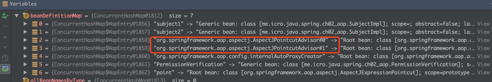

# AOP基础

AOP 的实现是基于代理模式，代理模式是AOP实现的基础。

它的实现原理是 通过代理模式为目标对象生产代理对象，并将横切逻辑(通知)插入到目标方法执行的前后。

在介绍 AOP 的实现步骤之前，先引入 Spring AOP 中的一些概念，接下来我们会用到这些概念。

## 基本概念

先说说，非常多的概念。

### 通知(Advice)

通知 Advice 即我们定义的横切逻辑。

有5种类型:

* `Before` 在方法调用前，发生通知的调用
* `After` 在方法完成后，发生通知的调用，无论方法是否成功执行
* `After-returning` 在方法成功执行之后，发生通知的调用
* `After-throwing` 在方法抛出异常后，发生通知的调用
* `Round` 目标方法被通知包裹，通知在目标方法执行前和执行后都被会调用

接口源码:

```java
public interface Advice {

}

/** BeforeAdvice */
public interface BeforeAdvice extends Advice {

}

public interface MethodBeforeAdvice extends BeforeAdvice {

    void before(Method method, Object[] args, Object target) throws Throwable;
}

/** AfterAdvice */
public interface AfterAdvice extends Advice {

}

public interface AfterReturningAdvice extends AfterAdvice {

    void afterReturning(Object returnValue, Method method, Object[] args, Object target) throws Throwable;
}
```

### 切点（Pointcut）

切点定义了在何处执行通知，切点在Spring AOP中确实是对应系统中的方法，切点的作用就是通过匹配规则查找合适的连接点（Joinpoint），AOP 会在这些连接点上织入通知。

接口源码:

```java
public interface Pointcut {

    /** 返回一个类型过滤器 */
    ClassFilter getClassFilter();

    /** 返回一个方法匹配器 */
    MethodMatcher getMethodMatcher();

    Pointcut TRUE = TruePointcut.INSTANCE;
}
```

### 连接点（Join point）

方法调用、方法执行、字段设置/获取、异常处理执行、类初始化、甚至是 for 循环中的某个点。

接口源码:

```java
public interface Joinpoint {

    /** 用于执行拦截器链中的下一个拦截器逻辑 */
    Object proceed() throws Throwable;

    Object getThis();

    AccessibleObject getStaticPart();

}
```

### 切面（Aspect）

切面包含了通知和切点，通知和切点共同定义了切面是什么，在何时，何处执行切面逻辑。

举个例子:

```xml
<bean id="aopCode" class="xyz.coolblog.aop.AopCode"/>

<aop:config expose-proxy="true">
    <aop:aspect ref="aopCode">
    <!-- pointcut -->
        <aop:pointcut id="helloPointcut" expression="execution(* xyz.coolblog.aop.*.hello*(..))" />

        <!-- advoce -->
        <aop:before method="before" pointcut-ref="helloPointcut"/>
        <aop:after method="after" pointcut-ref="helloPointcut"/>
    </aop:aspect>
</aop:config>
```

如上，一个切面中配置了一个切点和两个通知，两个通知均引用了同一个切点，即 pointcut-ref=“helloPointcut”。这里在一个切面中，一个切点对应多个通知，是一对多的关系（可以配置多个 pointcut，形成多对多的关系）。

### 引入（Introduction）

引用允许我们向现有的类添加新的方法或者属性。

### 织入（Weaving）

入就是在切点的引导下，将通知逻辑插入到方法调用上，使得我们的通知逻辑在方法调用时得以执行。

组装方面来创建一个被通知对象。这可以在编译时完成（例如使用AspectJ编译器），也可以在运行时完成。Spring和其他纯Java AOP框架一样，在运行时完成织入。

那么，Spring 是通过何种方式将通知织入到目标方法？通过实现后置处理器 BeanPostProcessor 接口。该接口是 Spring 提供的一个拓展接口，通过实现该接口，用户可在 bean 初始化前后做一些自定义操作。在 bean 初始化完成后，即 bean 执行完初始化方法（init-method）。Spring通过切点对 bean 类中的方法进行匹配。若匹配成功，则会为该 bean 生成代理对象，并将代理对象返回给容器。容器向后置处理器输入 bean 对象，得到 bean 对象的代理，这样就完成了织入过程。

## 简单的 AOP 实现

先看一下简单 AOP 的代码结构：

```java
MethodInvocation 接口  // 实现类包含了切面逻辑，如上面的 logMethodInvocation
Advice 接口        // 继承了 InvocationHandler 接口
BeforeAdvice 类    // 实现了 Advice 接口，是一个前置通知
SimpleAOP 类       // 生成代理类
SimpleAOPTest      // SimpleAOP 从测试类
HelloService 接口   // 目标对象接口
HelloServiceImpl   // 目标对象
```

## 源码

先说说，Spring AOP 是在何处向目标 bean 中织入通知（Advice）？如何将 AOP 和 IOC 模块整合到一起？A: 通过拓展点 BeanPostProcessor 接口。

抽象代理创建器实现了 BeanPostProcessor 接口，源码:

```java
public abstract class AbstractAutoProxyCreator extends ProxyProcessorSupport
        implements SmartInstantiationAwareBeanPostProcessor, BeanFactoryAware {

    @Override
    /** bean 初始化后置处理方法 */
    public Object postProcessAfterInitialization(Object bean, String beanName) throws BeansException {
        if (bean != null) {
            Object cacheKey = getCacheKey(bean.getClass(), beanName);
            if (!this.earlyProxyReferences.contains(cacheKey)) {
                // 如果需要，为 bean 生成代理对象
                return wrapIfNecessary(bean, beanName, cacheKey);
            }
        }
        return bean;
    }

    protected Object wrapIfNecessary(Object bean, String beanName, Object cacheKey) {
        if (beanName != null && this.targetSourcedBeans.contains(beanName)) {
            return bean;
        }
        if (Boolean.FALSE.equals(this.advisedBeans.get(cacheKey))) {
            return bean;
        }

        /*
         * 如果是基础设施类（Pointcut、Advice、Advisor 等接口的实现类），或是应该跳过的类，
         * 则不应该生成代理，此时直接返回 bean
         */
        if (isInfrastructureClass(bean.getClass()) || shouldSkip(bean.getClass(), beanName)) {
            // 将 <cacheKey, FALSE> 键值对放入缓存中，供上面的 if 分支使用
            this.advisedBeans.put(cacheKey, Boolean.FALSE);
            return bean;
        }

        // 为目标 bean 查找合适的通知器
        Object[] specificInterceptors = getAdvicesAndAdvisorsForBean(bean.getClass(), beanName, null);
        /*
         * 若 specificInterceptors != null，即 specificInterceptors != DO_NOT_PROXY，
         * 则为 bean 生成代理对象，否则直接返回 bean
         */
        if (specificInterceptors != DO_NOT_PROXY) {
            this.advisedBeans.put(cacheKey, Boolean.TRUE);
            // 创建代理
            Object proxy = createProxy(
                    bean.getClass(), beanName, specificInterceptors, new SingletonTargetSource(bean));
            this.proxyTypes.put(cacheKey, proxy.getClass());
            /*
             * 返回代理对象，此时 IOC 容器输入 bean，得到 proxy。此时，
             * beanName 对应的 bean 是代理对象，而非原始的 bean
             */
            return proxy;
        }

        this.advisedBeans.put(cacheKey, Boolean.FALSE);
        // specificInterceptors = null，直接返回 bean
        return bean;
    }
}
```

以上就是 Spring AOP 创建代理对象的入口方法:

* 若 bean 是 AOP 基础设施类型，则直接返回
* 为 bean 查找合适的通知器
* 如果通知器数组不为空，则为 bean 生成代理对象，并返回该对象
* 若数组为空，则返回原始 bean

### 筛选合适的通知器

首先，使用 AspectJ 表达式筛选通知器的过程:

```java
protected Object[] getAdvicesAndAdvisorsForBean(Class<?> beanClass, String beanName, TargetSource targetSource) {
    // 查找合适的通知器
    List<Advisor> advisors = findEligibleAdvisors(beanClass, beanName);
    if (advisors.isEmpty()) {
        return DO_NOT_PROXY;
    }
    return advisors.toArray();
}

protected List<Advisor> findEligibleAdvisors(Class<?> beanClass, String beanName) {
    // 查找所有的通知器
    List<Advisor> candidateAdvisors = findCandidateAdvisors();
    /*
     * 筛选可应用在 beanClass 上的 Advisor，通过 ClassFilter 和 MethodMatcher
     * 对目标类和方法进行匹配
     */
    List<Advisor> eligibleAdvisors = findAdvisorsThatCanApply(candidateAdvisors, beanClass, beanName);
    // 拓展操作
    extendAdvisors(eligibleAdvisors);
    if (!eligibleAdvisors.isEmpty()) {
        eligibleAdvisors = sortAdvisors(eligibleAdvisors);
    }
    return eligibleAdvisors;
}
```

* 先查询出所有的通知器
* 然后再调用 findAdvisorsThatCanApply 对通知器进行筛选

下面围绕XML配置方式

```xml
<?xml version="1.0" encoding="UTF-8"?>
<beans xmlns="http://www.springframework.org/schema/beans"
       xmlns:xsi="http://www.w3.org/2001/XMLSchema-instance" xmlns:aop="http://www.springframework.org/schema/aop"
       xsi:schemaLocation="
            http://www.springframework.org/schema/beans
            http://www.springframework.org/schema/beans/spring-beans-2.5.xsd
            http://www.springframework.org/schema/aop
            http://www.springframework.org/schema/aop/spring-aop-2.5.xsd">
    <!--目标-->
    <bean id="subject1" class="me.icro.java.spring.ch02_aop.SubjectImpl"/>
    <bean id="subject2" class="me.icro.java.spring.ch02_aop.SubjectImpl"/>
    <!--切面类-->
    <bean id="PermissionVerification" class="me.icro.java.spring.ch02_aop.PermissionVerification"/>

    <aop:config>
        <aop:aspect id="do" ref="PermissionVerification">
            <!--定义切点 使用expression语言 表示该接口中定义的所有方法都会被执行-->
            <aop:pointcut id="point" expression="execution(* me.icro.java.spring.ch02_aop.Subject.*(..))"/>
            <!--定义通知-->
            <aop:before method="canLogin" pointcut-ref="point"/>
            <aop:after method="saveMessage" pointcut-ref="point"/>
        </aop:aspect>
    </aop:config>

</beans>
```

解析以上配置，得到:



#### findCandidateAdvisors

```java
public abstract class AbstractAdvisorAutoProxyCreator extends AbstractAutoProxyCreator {

    private BeanFactoryAdvisorRetrievalHelper advisorRetrievalHelper;

    //...

    protected List<Advisor> findCandidateAdvisors() {
        return this.advisorRetrievalHelper.findAdvisorBeans();
    }

    //...
}
```

then, 逻辑封装在了一个 `BeanFactoryAdvisorRetrievalHelper` 的 `findAdvisorBeans` `方法中，BeanFactoryAdvisorRetrievalHelper` 可以理解为从 `bean` 容器中获取 `Advisor` 的帮助类，`findAdvisorBeans` 则可理解为查找 `Advisor` 类型的 `bean。`

```java
public List<Advisor> findAdvisorBeans() {
    String[] advisorNames = null;
    synchronized (this) {
        // cachedAdvisorBeanNames 是 advisor 名称的缓存
        advisorNames = this.cachedAdvisorBeanNames;
        /*
         * 如果 cachedAdvisorBeanNames 为空，这里到容器中查找，
         * 并设置缓存，后续直接使用缓存即可
         */
        if (advisorNames == null) {
            // 从容器中查找 Advisor 类型 bean 的名称
            advisorNames = BeanFactoryUtils.beanNamesForTypeIncludingAncestors(
                    this.beanFactory, Advisor.class, true, false);
            // 设置缓存
            this.cachedAdvisorBeanNames = advisorNames;
        }
    }
    if (advisorNames.length == 0) {
        return new LinkedList<Advisor>();
    }

    List<Advisor> advisors = new LinkedList<Advisor>();
    // 遍历 advisorNames
    for (String name : advisorNames) {
        if (isEligibleBean(name)) {
            // 忽略正在创建中的 advisor bean
            if (this.beanFactory.isCurrentlyInCreation(name)) {
                if (logger.isDebugEnabled()) {
                    logger.debug("Skipping currently created advisor '" + name + "'");
                }
            }
            else {
                try {
                    /*
                     * 调用 getBean 方法从容器中获取名称为 name 的 bean，
                     * 并将 bean 添加到 advisors 中
                     */
                    advisors.add(this.beanFactory.getBean(name, Advisor.class));
                }
                catch (BeanCreationException ex) {
                    Throwable rootCause = ex.getMostSpecificCause();
                    if (rootCause instanceof BeanCurrentlyInCreationException) {
                        BeanCreationException bce = (BeanCreationException) rootCause;
                        if (this.beanFactory.isCurrentlyInCreation(bce.getBeanName())) {
                            if (logger.isDebugEnabled()) {
                                logger.debug("Skipping advisor '" + name +
                                        "' with dependency on currently created bean: " + ex.getMessage());
                            }
                            continue;
                        }
                    }
                    throw ex;
                }
            }
        }
    }

    return advisors;
}
```

* 从容器中查找所有类型为 Advisor 的 bean 对应的名称
* 遍历 advisorNames，并从容器中获取对应的 bean

#### findAdvisorsThatCanApply

查找出所有的通知器，整个流程还没算完，接下来我们还要对这些通知器进行筛选。适合应用在当前 bean 上的通知器留下，不适合的就让它自生自灭吧。那下面我们来分析一下通知器筛选的过程，如下：

```java
protected List<Advisor> findAdvisorsThatCanApply(
        List<Advisor> candidateAdvisors, Class<?> beanClass, String beanName) {

    ProxyCreationContext.setCurrentProxiedBeanName(beanName);
    try {
        // 调用重载方法
        return AopUtils.findAdvisorsThatCanApply(candidateAdvisors, beanClass);
    }
    finally {
        ProxyCreationContext.setCurrentProxiedBeanName(null);
    }
}

public static List<Advisor> findAdvisorsThatCanApply(List<Advisor> candidateAdvisors, Class<?> clazz) {
    if (candidateAdvisors.isEmpty()) {
        return candidateAdvisors;
    }
    List<Advisor> eligibleAdvisors = new LinkedList<Advisor>();
    for (Advisor candidate : candidateAdvisors) {
        // 筛选 IntroductionAdvisor 类型的通知器
        if (candidate instanceof IntroductionAdvisor && canApply(candidate, clazz)) {
            eligibleAdvisors.add(candidate);
        }
    }
    boolean hasIntroductions = !eligibleAdvisors.isEmpty();
    for (Advisor candidate : candidateAdvisors) {
        if (candidate instanceof IntroductionAdvisor) {
            continue;
        }

        // 筛选普通类型的通知器
        if (canApply(candidate, clazz, hasIntroductions)) {
            eligibleAdvisors.add(candidate);
        }
    }
    return eligibleAdvisors;
}

public static boolean canApply(Advisor advisor, Class<?> targetClass, boolean hasIntroductions) {
    if (advisor instanceof IntroductionAdvisor) {
        /*
         * 从通知器中获取类型过滤器 ClassFilter，并调用 matchers 方法进行匹配。
         * ClassFilter 接口的实现类 AspectJExpressionPointcut 为例，该类的
         * 匹配工作由 AspectJ 表达式解析器负责，具体匹配细节这个就没法分析了，我
         * AspectJ 表达式的工作流程不是很熟
         */
        return ((IntroductionAdvisor) advisor).getClassFilter().matches(targetClass);
    }
    else if (advisor instanceof PointcutAdvisor) {
        PointcutAdvisor pca = (PointcutAdvisor) advisor;
        // 对于普通类型的通知器，这里继续调用重载方法进行筛选
        return canApply(pca.getPointcut(), targetClass, hasIntroductions);
    }
    else {
        return true;
    }
}

public static boolean canApply(Pointcut pc, Class<?> targetClass, boolean hasIntroductions) {
    Assert.notNull(pc, "Pointcut must not be null");
    // 使用 ClassFilter 匹配 class
    if (!pc.getClassFilter().matches(targetClass)) {
        return false;
    }

    MethodMatcher methodMatcher = pc.getMethodMatcher();
    if (methodMatcher == MethodMatcher.TRUE) {
        return true;
    }

    IntroductionAwareMethodMatcher introductionAwareMethodMatcher = null;
    if (methodMatcher instanceof IntroductionAwareMethodMatcher) {
        introductionAwareMethodMatcher = (IntroductionAwareMethodMatcher) methodMatcher;
    }

    /*
     * 查找当前类及其父类（以及父类的父类等等）所实现的接口，由于接口中的方法是 public，
     * 所以当前类可以继承其父类，和父类的父类中所有的接口方法
     */
    Set<Class<?>> classes = new LinkedHashSet<Class<?>>(ClassUtils.getAllInterfacesForClassAsSet(targetClass));
    classes.add(targetClass);
    for (Class<?> clazz : classes) {
        // 获取当前类的方法列表，包括从父类中继承的方法
        Method[] methods = ReflectionUtils.getAllDeclaredMethods(clazz);
        for (Method method : methods) {
            // 使用 methodMatcher 匹配方法，匹配成功即可立即返回
            if ((introductionAwareMethodMatcher != null &&
                    introductionAwareMethodMatcher.matches(method, targetClass, hasIntroductions)) ||
                    methodMatcher.matches(method, targetClass)) {
                return true;
            }
        }
    }

    return false;
}
```

#### extendAdvisors(eligibleAdvisors)

拓展筛选出通知器列表，源码:

```java
protected void extendAdvisors(List<Advisor> candidateAdvisors) {
    AspectJProxyUtils.makeAdvisorChainAspectJCapableIfNecessary(candidateAdvisors);
}

public static boolean makeAdvisorChainAspectJCapableIfNecessary(List<Advisor> advisors) {
    // 如果通知器列表是一个空列表，则啥都不做
    if (!advisors.isEmpty()) {
        boolean foundAspectJAdvice = false;
        /*
         * 下面的 for 循环用于检测 advisors 列表中是否存在
         * AspectJ 类型的 Advisor 或 Advice
         */
        for (Advisor advisor : advisors) {
            if (isAspectJAdvice(advisor)) {
                foundAspectJAdvice = true;
            }
        }

        /*
         * 向 advisors 列表的首部添加 DefaultPointcutAdvisor?
         */
        if (foundAspectJAdvice && !advisors.contains(ExposeInvocationInterceptor.ADVISOR)) {
            advisors.add(0, ExposeInvocationInterceptor.ADVISOR);
            return true;
        }
    }
    return false;
}

private static boolean isAspectJAdvice(Advisor advisor) {
    return (advisor instanceof InstantiationModelAwarePointcutAdvisor ||
            advisor.getAdvice() instanceof AbstractAspectJAdvice ||
            (advisor instanceof PointcutAdvisor &&
                     ((PointcutAdvisor) advisor).getPointcut() instanceof AspectJExpressionPointcut));
}
```

主要的目的是向通知器列表首部添加 DefaultPointcutAdvisor 类型的通知器，也就是ExposeInvocationInterceptor.ADVISOR。没有深入，不展开。

### 创建代理对象

现在通知器选好了，接下来就要通过代理的方式将通知器（Advisor）所持有的通知（Advice）织入到 bean 的某些方法前后。

#### 背景: 动态代理

##### 基于 JDK 的动态代理

DK 的动态代理主要是通过 JDK 提供的代理创建类 Proxy 为目标对象创建代理，Proxy 中创建代理的方法声明:

```java
public static Object newProxyInstance(ClassLoader loader,
                                          Class<?>[] interfaces,
                                          InvocationHandler h)
```

* loader - 类加载器
* interfaces - 目标类所实现的接口列表
* h - 用于封装代理逻辑

JDK 动态代理对目标类是有一定要求的，即要求目标类必须实现了接口，JDK 动态代理只能为实现了接口的目标类生成代理对象。至于 InvocationHandler，是一个接口类型，定义了一个 invoke 方法。使用者需要实现该方法，并在其中封装代理逻辑。

举个`JDK 动态代理`例子,

目标类:

```java
/**
 * 描述:
 *
 * @author Lin
 * @since 2019-12-18 9:35 PM
 */
public interface UserService {

    void save(User user);

    void update(User user);
}

/**
 * 描述:
 *
 * @author Lin
 * @since 2019-12-18 9:35 PM
 */
public class UserServiceImpl implements UserService {

    @Override
    public void save(User user) {
        System.out.println("save user.");
    }

    @Override
    public void update(User user) {
        System.out.println("update user.");
    }
}
```

代理创建者:

```java
/**
 * 代理创建者
 *
 * Created by Lin on 2019/12/18.
 */
public interface ProxyCreator {
    Object getProxy();
}

/**
 * 描述:
 *
 * @author Lin
 * @since 2019-12-18 9:43 PM
 */
public class JdkProxyCreator implements ProxyCreator, InvocationHandler {

    private Object target;

    public JdkProxyCreator(Object target) {
        this.target = target;
        Class<?>[] interfaces = target.getClass().getInterfaces();
        if (interfaces.length == 0) {
            throw new IllegalArgumentException("target class don`t implement any interface");
        }
    }

    @Override
    public Object invoke(Object proxy, Method method, Object[] args) throws Throwable {
        System.out.println(System.currentTimeMillis() + " - " + method.getName() + " method start");
        // 调用目标方法
        Object retVal = method.invoke(target, args);
        System.out.println(System.currentTimeMillis() + " - " + method.getName() + " method over");

        return retVal;
    }

    @Override
    public Object getProxy() {
        Class<?> clazz = target.getClass();
        return Proxy.newProxyInstance(clazz.getClassLoader(), clazz.getInterfaces(), this);
    }
}
```

测试代码:

```java
/**
 * 描述:
 *
 * @author Lin
 * @since 2019-12-18 9:46 PM
 */
public class JdkProxyCreatorTest {
    public static void main(String[] args) {
        ProxyCreator proxyCreator = new JdkProxyCreator(new UserServiceImpl());
        UserService userService = (UserService) proxyCreator.getProxy();

        System.out.println("proxy type = " + userService.getClass());
        System.out.println();
        userService.save(null);
        System.out.println();
        userService.update(null);
    }
}
```

可以看出，我们的代理逻辑正常执行了。另外，注意一下 userService 指向对象的类型，并非是 xyz.coolblog.proxy.UserServiceImpl，而是 com.sun.proxy.$Proxy4。

##### 基于 CGLIB 的动态代理

为未实现接口的类生成代理时，就无法使用 JDK 动态代理了。那么此类的目标对象生成代理时应该怎么办呢？当然是使用 CGLIB 了。在 CGLIB 中，代理逻辑是封装在 MethodInterceptor 实现类中的，代理对象则是通过 Enhancer 类的 create 方法进行创建。下面我来演示一下 CGLIB 创建代理对象的过程，如下：

CGLIB 代理创建者:

```java
/**
 * 描述: CGLIB 代理创建者
 *
 * @author Lin
 * @since 2019-12-18 9:54 PM
 */
public class CglibProxyCreator implements ProxyCreator {

    private Object target;

    private MethodInterceptor methodInterceptor;

    public CglibProxyCreator(Object target, MethodInterceptor methodInterceptor) {
        this.target = target;
        this.methodInterceptor = methodInterceptor;
    }

    @Override
    public Object getProxy() {
        Enhancer enhancer = new Enhancer();
        // 设置代理类的父类
        enhancer.setSuperclass(target.getClass());
        // 设置代理逻辑
        enhancer.setCallback(methodInterceptor);
        // 创建代理对象
        return enhancer.create();
    }
}
```

MethodInterceptor:

```java
/**
 * 描述: 方法拦截器
 *
 * @author Lin
 * @since 2019-12-18 9:57 PM
 */
public class UserServiceImplInterceptor implements MethodInterceptor {
    @Override
    public Object intercept(Object o, Method method, Object[] objects, MethodProxy methodProxy) throws Throwable {
        System.out.println(System.currentTimeMillis() + " - " + method.getName() + " method start");
        // 调用目标方法
        methodProxy.invokeSuper(o, objects);
        System.out.println(System.currentTimeMillis() + " - " + method.getName() + " method over");
        return null;
    }
}
```

测试:

```java
/**
 * 描述:
 *
 * @author Lin
 * @since 2019-12-18 9:59 PM
 */
public class CglibProxyCreatorTest {
    public static void main(String[] args) {
        ProxyCreator proxyCreator = new CglibProxyCreator(new UserServiceImpl(), new UserServiceImplInterceptor());
        UserServiceImpl userService = (UserServiceImpl) proxyCreator.getProxy();

        System.out.println("proxy class = " + userService.getClass());
        System.out.println();
        userService.save(null);
        System.out.println();
        userService.update(null);
    }
}
```

### 回到源码: 创建代理对象

Spring 在为目标 bean 创建代理的过程中，要根据 bean 是否实现接口，以及一些其他配置来决定使用 AopProxy 何种实现类为目标 bean 创建代理对象。下面我们就来看一下代理创建的过程，如下：

```java
protected Object createProxy(
        Class<?> beanClass, String beanName, Object[] specificInterceptors, TargetSource targetSource) {

    if (this.beanFactory instanceof ConfigurableListableBeanFactory) {
        AutoProxyUtils.exposeTargetClass((ConfigurableListableBeanFactory) this.beanFactory, beanName, beanClass);
    }

    ProxyFactory proxyFactory = new ProxyFactory();
    proxyFactory.copyFrom(this);

    /*
     * 默认配置下，或用户显式配置 proxy-target-class = "false" 时，
     * 这里的 proxyFactory.isProxyTargetClass() 也为 false
     */
    if (!proxyFactory.isProxyTargetClass()) {
        if (shouldProxyTargetClass(beanClass, beanName)) {
            proxyFactory.setProxyTargetClass(true);
        }
        else {
            /*
             * 检测 beanClass 是否实现了接口，若未实现，则将
             * proxyFactory 的成员变量 proxyTargetClass 设为 true
             */
            evaluateProxyInterfaces(beanClass, proxyFactory);
        }
    }

    // specificInterceptors 中若包含有 Advice，此处将 Advice 转为 Advisor
    Advisor[] advisors = buildAdvisors(beanName, specificInterceptors);
    proxyFactory.addAdvisors(advisors);
    proxyFactory.setTargetSource(targetSource);
    customizeProxyFactory(proxyFactory);

    proxyFactory.setFrozen(this.freezeProxy);
    if (advisorsPreFiltered()) {
        proxyFactory.setPreFiltered(true);
    }

    // 创建代理
    return proxyFactory.getProxy(getProxyClassLoader());
}

public Object getProxy(ClassLoader classLoader) {
    // 先创建 AopProxy 实现类对象，然后再调用 getProxy 为目标 bean 创建代理对象
    return createAopProxy().getProxy(classLoader);
}
```

getProxy 这里有两个方法调用，一个是调用 createAopProxy 创建 AopProxy 实现类对象，然后再调用 AopProxy 实现类对象中的 getProxy 创建代理对象。这里我们先来看一下创建 AopProxy 实现类对象的过程，如下：

```java
protected final synchronized AopProxy createAopProxy() {
    if (!this.active) {
        activate();
    }
    return getAopProxyFactory().createAopProxy(this);
}

public class DefaultAopProxyFactory implements AopProxyFactory, Serializable {

    @Override
    public AopProxy createAopProxy(AdvisedSupport config) throws AopConfigException {
        /*
         * 下面的三个条件简单分析一下：
         *
         *   条件1：config.isOptimize() - 是否需要优化，这个属性没怎么用过，
         *         细节我不是很清楚
         *   条件2：config.isProxyTargetClass() - 检测 proxyTargetClass 的值，
         *         前面的代码会设置这个值
         *   条件3：hasNoUserSuppliedProxyInterfaces(config)
         *         - 目标 bean 是否实现了接口
         */
        if (config.isOptimize() || config.isProxyTargetClass() || hasNoUserSuppliedProxyInterfaces(config)) {
            Class<?> targetClass = config.getTargetClass();
            if (targetClass == null) {
                throw new AopConfigException("TargetSource cannot determine target class: " +
                        "Either an interface or a target is required for proxy creation.");
            }
            if (targetClass.isInterface() || Proxy.isProxyClass(targetClass)) {
                return new JdkDynamicAopProxy(config);
            }
            // 创建 CGLIB 代理，ObjenesisCglibAopProxy 继承自 CglibAopProxy
            return new ObjenesisCglibAopProxy(config);
        }
        else {
            // 创建 JDK 动态代理
            return new JdkDynamicAopProxy(config);
        }
    }
}
```

getProxy 方法的逻辑:

```java
public Object getProxy() {
    return getProxy(ClassUtils.getDefaultClassLoader());
}

public Object getProxy(ClassLoader classLoader) {
    if (logger.isDebugEnabled()) {
        logger.debug("Creating JDK dynamic proxy: target source is " + this.advised.getTargetSource());
    }
    Class<?>[] proxiedInterfaces = AopProxyUtils.completeProxiedInterfaces(this.advised, true);
    findDefinedEqualsAndHashCodeMethods(proxiedInterfaces);

    // 调用 newProxyInstance 创建代理对象
    return Proxy.newProxyInstance(classLoader, proxiedInterfaces, this);
}
```

发现 JdkDynamicAopProxy 最终调用 Proxy.newProxyInstance 方法创建代理对象。

## 参考

* [Spring Framework Reference Documentation](https://docs.spring.io/spring/docs/4.3.17.RELEASE/spring-framework-reference/htmlsingle/#aop-pfb-proxy-types)
* [spring-analysis](https://github.com/seaswalker/spring-analysis)
* [Spring AOP 源码分析系列文章导读](http://www.tianxiaobo.com/2018/06/17/Spring-AOP-%E6%BA%90%E7%A0%81%E5%88%86%E6%9E%90%E7%B3%BB%E5%88%97%E6%96%87%E7%AB%A0%E5%AF%BC%E8%AF%BB/)
