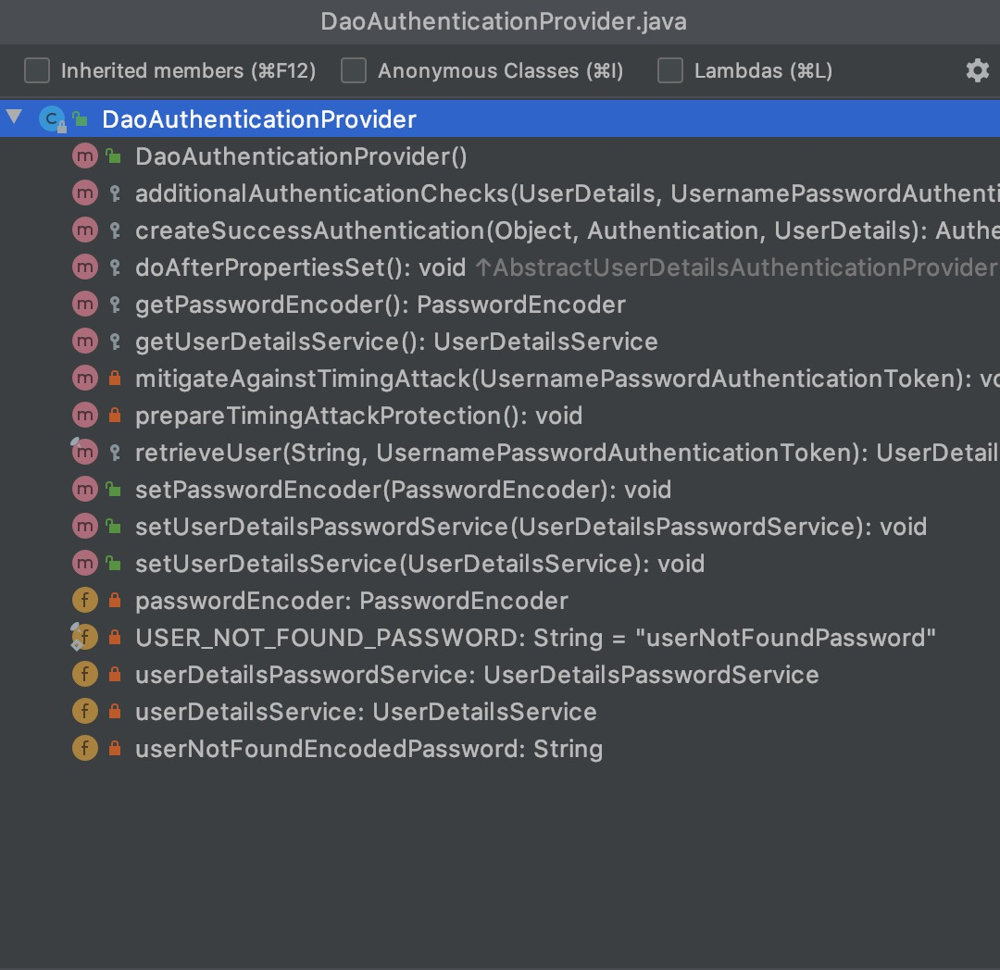
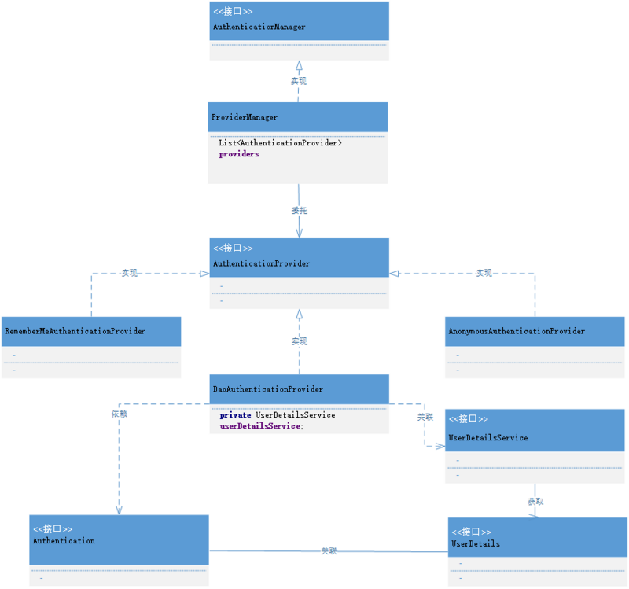
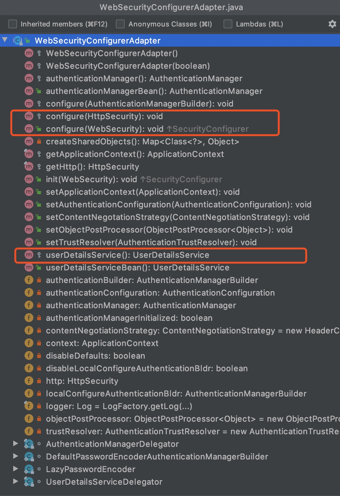

# Spring Security

## 核心组件

### SecurityContextHolder

`SecurityContextHolder` 用于存储安全上下文（security context）的信息。当前操作的用户是谁，该用户是否已经被认证，他拥有哪些角色权限… 这些都被保存在 `SecurityContextHolder` `中。SecurityContextHolder` 默认使用 `ThreadLocal` 策略来存储认证信息。

#### 获取当前用户的信息

的获取当前登录用户的姓名:

```java
// getAuthentication()返回了认证信息
// getPrincipal() 返回了身份信息
Object principal = SecurityContextHolder.getContext().getAuthentication().getPrincipal();

// UserDetails 是 Spring 对身份信息封装的一个接口
if (principal instanceof UserDetails) {
    String username = ((UserDetails)principal).getUsername();
  } else {
    String username = principal.toString();
}
```

### Authentication

```java
package org.springframework.security.core;

/**
Authentication 是 最高级别的身份 / 认证的抽象，继承自 Principal 类。
通过这个接口，我们可以得到用户拥有的权限信息列表，密码，用户细节信息，用户身份信息，认证信息。
**/
public interface Authentication extends Principal, Serializable {
    // 权限信息列表
    Collection<? extends GrantedAuthority> getAuthorities();
    // 密码
    Object getCredentials();
    // 用户细节信息
    Object getDetails();
    // 用户身份信息 重点 -- 大部分情况下返回的是 UserDetails 接口的实现类
    Object getPrincipal();

    boolean isAuthenticated();

    void setAuthenticated(boolean var1) throws IllegalArgumentException;
}
```

#### Spring Security 如何完成身份认证

1. 用户名和密码被过滤器获取到，封装成 `Authentication`, 通常情况下是 `UsernamePasswordAuthenticationToken` 这个实现类。
2. `AuthenticationManager` 身份管理器负责验证这个 `Authentication`
3. 认证成功后，`AuthenticationManager` 身份管理器返回一个被填充满了信息的（包括上面提到的权限信息，身份信息，细节信息，但密码通常会被移除）Authentication 实例。
4. `SecurityContextHolder` 安全上下文容器将第 3 步填充了信息的 `Authentication`，通过 `SecurityContextHolder.getContext().setAuthentication(…)` 方法，设置到其中。

这个抽象的认证流程代码 大致上是这样的:

```java
public class AuthenticationExample {

    private static AuthenticationManager authenticationManager = new SampleAuthenticationManager();

    public static void main(String[] args) throws IOException {
        BufferedReader in = new BufferedReader(new InputStreamReader(System.in));

        while (true) {
            System.out.println("Please enter your username:");
            String name = in.readLine();
            System.out.println("Please enter your password:");
            String password = in.readLine();

            try {
                Authentication request = new UsernamePasswordAuthenticationToken(name, password);
                Authentication result = authenticationManager.authenticate(request);
                SecurityContextHolder.getContext().setAuthentication(result);
            } catch (BadCredentialsException e) {
                System.out.println("Authentication failed:" + e.getMessage());
                continue;
            }
            System.out.println("Successfully authenticated. Security context contains:" + SecurityContextHolder.getContext().getAuthentication());
        }
    }
}

public class SampleAuthenticationManager implements AuthenticationManager {

    private static final List<GrantedAuthority> AUTHORITIES = new ArrayList<>();

    @Override
    public Authentication authenticate(Authentication authentication) throws AuthenticationException {
        if (authentication.getName().equals(authentication.getCredentials())) {
            return new UsernamePasswordAuthenticationToken(authentication.getName(), authentication.getCredentials(), AUTHORITIES);
        }
        throw new BadCredentialsException("Bad Credentials");
    }
}
```

### AuthenticationManager

`AuthenticationManager`（接口）是认证相关的核心接口，也是发起认证的出发点，因为在实际需求中，我们可能会允许用户使用用户名 + 密码登录，同时允许用户使用邮箱 + 密码，手机号码 + 密码登录，甚至，可能允许用户使用指纹登录，所以说 `AuthenticationManager` 一般不直接认证，`AuthenticationManager` 接口的常用实现类 ProviderManager 内部会维护一个 `List<AuthenticationProvider>`列表，存放多种认证方式，实际上这是委托者模式的应用（`Delegate`）。

核心的认证入口始终只有一个：`AuthenticationManager`，不同的认证方式：用户名 + 密码（`UsernamePasswordAuthenticationToken`），邮箱 + 密码，手机号码 + 密码登录则对应了三个 AuthenticationProvider。

在默认策略下，只需要通过一个 AuthenticationProvider 的认证，即可被认为是登录成功。

看看ProviderManager 源码:

```java
public class ProviderManager implements AuthenticationManager, MessageSourceAware,
  InitializingBean {

    // 维护一个 AuthenticationProvider 列表
    private List<AuthenticationProvider> providers = Collections.emptyList();

    public Authentication authenticate(Authentication authentication)
          throws AuthenticationException {
       Class<? extends Authentication> toTest = authentication.getClass();
       AuthenticationException lastException = null;
       Authentication result = null;

       // 依次认证
       for (AuthenticationProvider provider : getProviders()) {
          if (!provider.supports(toTest)) {
             continue;
          }
          try {
             result = provider.authenticate(authentication);

             if (result != null) {
                copyDetails(authentication, result);
                break;
             }
          }
          ...
          catch (AuthenticationException e) {
             lastException = e;
          }
       }
       // 如果有 Authentication 信息，则直接返回
       if (result != null) {
          if (eraseCredentialsAfterAuthentication
            && (result instanceof CredentialsContainer)) {
            // 移除密码
            ((CredentialsContainer) result).eraseCredentials();
          }
             // 发布登录成功事件
        eventPublisher.publishAuthenticationSuccess(result);
        return result;
    }
    ...
       // 执行到此，说明没有认证成功，包装异常信息
       if (lastException == null) {
          lastException = new ProviderNotFoundException(messages.getMessage(
                "ProviderManager.providerNotFound",
                new Object[] { toTest.getName() },
                "No AuthenticationProvider found for {0}"));
       }
       prepareException(lastException, authentication);
       throw lastException;
    }
}
```

### DaoAuthenticationProvider

DaoAuthenticationProvider 是 AuthenticationProvider 的最常用的一个实现。

看看这个类的结构:



认证一个用户的流程:

* 用户提交了用户名和密码，提交的用户名和密码，被封装成了 `UsernamePasswordAuthenticationToke`n；
* 根据用户名加载用户的任务则是交给了 `UserDetailsService`，在 `DaoAuthenticationProvider` 中，对应的方法便是 `retrieveUser`；
* `UsernamePasswordAuthenticationToken` 和 `UserDetails` 密码的比对，由 `additionalAuthenticationChecks` 方法完成，如果没有抛异常，则认为比对成功。

总之，`DaoAuthenticationProvider` 获取用户提交的用户名和密码，比对其正确性，如果正确，返回一个数据库中的用户信息。

### UserDetails 与 UserDetailsService

`UserDetails` 这个接口，它代表了最详细的用户信息，这个接口涵盖了一些必要的用户信息字段，具体的实现类对它进行了扩展。

```java
public interface UserDetails extends Serializable {

   Collection<? extends GrantedAuthority> getAuthorities();

   String getPassword();

   String getUsername();

   boolean isAccountNonExpired();

   boolean isAccountNonLocked();

   boolean isCredentialsNonExpired();

   boolean isEnabled();
}
```

`Authentication` 的 `getCredentials()`与 `UserDetails` 中的 `getPassword()` 的区别：前者是用户提交的密码凭证，后者是用户正确的密码，认证器其实就是对这两者的比对。

`UserDetailsService`:

```java
public interface UserDetailsService {
   UserDetails loadUserByUsername(String username) throws UsernameNotFoundException;
}
```

`UserDetailsService` 只负责从特定的地方（通常是数据库）加载用户信息，仅此而已。

`UserDetailsService` 常见的实现类有 `JdbcDaoImpl`，`InMemoryUserDetailsManager`，前者从数据库加载用户，后者从Redis中加载用户，也可以自己实现 `UserDetailsService`，通常这更加灵活。

### 核心组件的关系(UML)

Spring Security 的一张非典型的 UML 图:



## Spring Security Guides

一个入门的例子，来了解 `Spring Security` 是如何保护我们的应用。

官网地址见: <https://spring.io/guides/gs/securing-web/>。

代码 `git clone https://github.com/spring-guides/gs-securing-web.git`。

## 核心配置

Spring Security Guides 中的配置项:

```java
@Configuration
@EnableWebSecurity
public class WebSecurity extends WebSecurityConfigurerAdapter {
    @Override
    protected void configure(HttpSecurity http) throws Exception {
        http.authorizeRequests()
                .antMatchers("/", "/home").permitAll()
                .anyRequest().authenticated()
                .and()
                .formLogin()
                .loginPage("/login").permitAll()
                .and()
                .logout()
                .permitAll();
    }

    @Bean
    @Override
    protected UserDetailsService userDetailsService() {
        UserDetails user =
                User.withDefaultPasswordEncoder()
                        .username("admin")
                        .password("admin")
                        .roles("USER")
                        .build();

        return new InMemoryUserDetailsManager(user);
    }
}
```

配置了以下内容:

* 除了“/”,”/home”(首页),”/login”(登录),”/logout”(注销), 之外，其他路径都需要认证。
* 指定“/login”该路径为登录页面，当未认证的用户尝试访问任何受保护的资源时，都会跳转到“/login”。
* 默认指定“/logout”为注销页面
* 配置一个内存中的身份信息管理器，使用 admin/admin 作为用户名和密码，具有 USER 角色
* 防止 CSRF 攻击
* Session Fixation protection
* Security Header配置
  * HTTP Strict Transport Security for secure requests
  * 集成 X-Content-Type-Options
  * 缓存控制
  * 集成 X-XSS-Protection.aspx
  * X-Frame-Options integration to help prevent Clickjacking(iframe 被默认禁止使用)
* Servlet API 集成了如下的几个方法
  * HttpServletRequest#getRemoteUser()
  * HttpServletRequest.html#getUserPrincipal()
  * HttpServletRequest.html#isUserInRole(java.lang.String)
  * HttpServletRequest.html#login(java.lang.String, java.lang.String)
  * HttpServletRequest.html#logout()

### @EnableWebSecurity

配置类 `WebSecurityConfig` 加上了 `@EnableWebSecurity` 注解，同时继承了 `WebSecurityConfigurerAdapter`。`@EnableWebSecurity` 起到决定性的配置作用，它其实是个组合注解。

```java
@Import({WebSecurityConfiguration.class, SpringWebMvcImportSelector.class, OAuth2ImportSelector.class})
@EnableGlobalAuthentication
@Configuration
public @interface EnableWebSecurity {
    boolean debug() default false;
}
```

* `SpringWebMvcImportSelector` 的作用是判断当前的环境是否包含 springmvc，因为 spring security 可以在非 spring 环境下使用
* `WebSecurityConfiguration` 用来配置 web 安全

`@EnableGlobalAuthentication` 注解的源码:

```java
@Import({AuthenticationConfiguration.class})
@Configuration
public @interface EnableGlobalAuthentication {
}
```

激活了 `AuthenticationConfiguration` 这样的一个配置类，用来配置认证相关的核心类。

`@EnableWebSecurity` 完成的工作便是加载了 `WebSecurityConfiguration`，`AuthenticationConfiguration` 这两个核心配置类，也就此将 spring security 的职责划分为了配置安全信息，配置认证信息两部分。

### WebSecurityConfiguration

注意一个重要的Bean被注册:

```java
@Configuration
public class WebSecurityConfiguration {

 /**
  * Creates the Spring Security Filter Chain
  * @return the {@link Filter} that represents the security filter chain
  * @throws Exception
  */
 @Bean(name = AbstractSecurityWebApplicationInitializer.DEFAULT_FILTER_NAME)
 public Filter springSecurityFilterChain() throws Exception {
  boolean hasConfigurers = webSecurityConfigurers != null
    && !webSecurityConfigurers.isEmpty();
  if (!hasConfigurers) {
   WebSecurityConfigurerAdapter adapter = objectObjectPostProcessor
     .postProcess(new WebSecurityConfigurerAdapter() {
     });
   webSecurity.apply(adapter);
  }
  return webSecurity.build();
 }

 }
```

`springSecurityFilterChain` 是 spring security 的核心过滤器，是整个认证的入口。`WebSecurityConfiguration` 中完成了声明 springSecurityFilterChain 的作用，并且最终交给 DelegatingFilterProxy 这个代理类，负责拦截请求。

### AuthenticationConfiguration

```java
@Configuration
@Import(ObjectPostProcessorConfiguration.class)
public class AuthenticationConfiguration {

  @Bean
  public AuthenticationManagerBuilder authenticationManagerBuilder(
    ObjectPostProcessor<Object> objectPostProcessor, ApplicationContext context) {
    LazyPasswordEncoder defaultPasswordEncoder = new LazyPasswordEncoder(context);
    AuthenticationEventPublisher authenticationEventPublisher = getBeanOrNull(context, AuthenticationEventPublisher.class);

    DefaultPasswordEncoderAuthenticationManagerBuilder result = new DefaultPasswordEncoderAuthenticationManagerBuilder(objectPostProcessor, defaultPasswordEncoder);
    if (authenticationEventPublisher != null) {
    result.authenticationEventPublisher(authenticationEventPublisher);
    }
    return result;
  }

  public AuthenticationManager getAuthenticationManager() throws Exception {
    ...
  }

}
```

`AuthenticationConfiguration` 的主要任务，便是负责生成全局的身份认证管理者 `AuthenticationManager`。

### WebSecurityConfigurerAdapter

WebSecurityConfigurerAdapter 中我们可以选择自己想要修改的内容，来进行重写，而其提供了三个 configure 重载方法，是我们主要关心的：



分别是对 userDetailsService，WebSecurity，HttpSecurity 进行个性化的配置。

### HttpSecurity 常用配置

```java
@Configuration
@EnableWebSecurity
public class CustomWebSecurityConfig extends WebSecurityConfigurerAdapter {

    @Override
    protected void configure(HttpSecurity http) throws Exception {
        http
            .authorizeRequests()
                .antMatchers("/resources/**", "/signup", "/about").permitAll()
                .antMatchers("/admin/**").hasRole("ADMIN")
                .antMatchers("/db/**").access("hasRole('ADMIN') and hasRole('DBA')")
                .anyRequest().authenticated()
                .and()
            .formLogin()
                .usernameParameter("username")
                .passwordParameter("password")
                .failureForwardUrl("/login?error")
                .loginPage("/login")
                .permitAll()
                .and()
            .logout()
                .logoutUrl("/logout")
                .logoutSuccessUrl("/index")
                .permitAll()
                .and()
            .httpBasic()
                .disable();
    }
}
```

上述是一个使用 Java Configuration 配置 HttpSecurity 的典型配置，其中 http 作为根开始配置，每一个 and()对应了一个模块的配置（等同于 xml 配置中的结束标签），并且 and() 返回了 HttpSecurity 本身，于是可以连续进行配置。

* authorizeRequests() 配置路径拦截，表明路径访问所对应的权限，角色，认证信息。
* formLogin() 对应表单认证相关的配置
* logout() 对应了注销相关的配置
* httpBasic() 可以配置 basic 登录

### AuthenticationManagerBuilder

```java
@Configuration
@EnableWebSecurity
public class WebSecurity extends WebSecurityConfigurerAdapter {

    @Override
    protected void configure(AuthenticationManagerBuilder auth) throws Exception {
        auth.inMemoryAuthentication()
                .withUser("admin").password("admin").roles("USER");
    }
}
```

在 WebSecurityConfigurerAdapter 中进行认证相关的配置，可以使用 configure(AuthenticationManagerBuilder auth) 暴露一个 AuthenticationManager 的建造器：AuthenticationManagerBuilder 。如上所示，我们便完成了内存中用户的配置。
