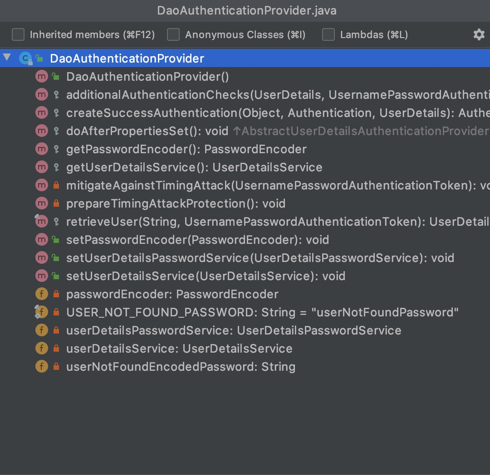
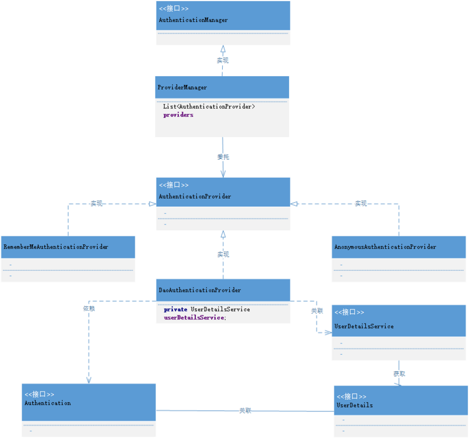
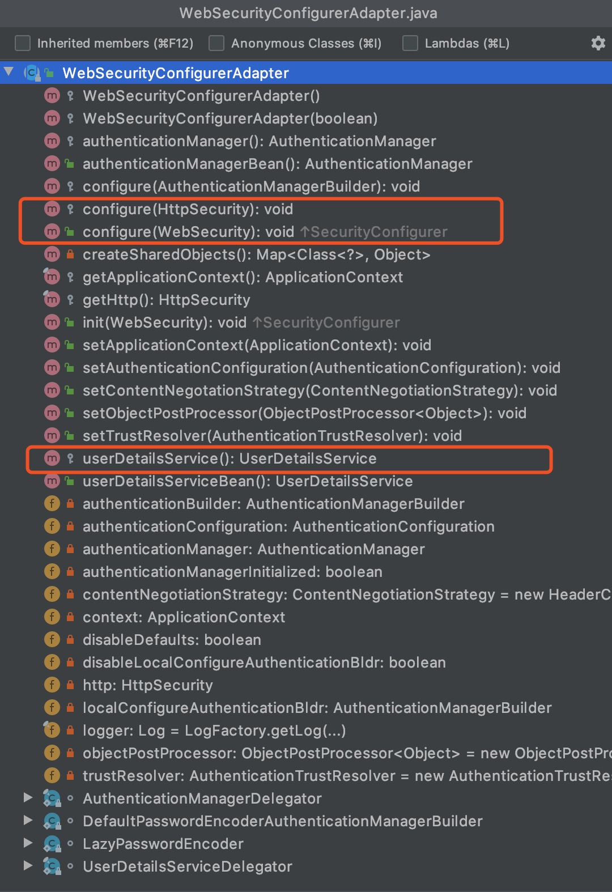

# Spring Security

## 核心组件

### SecurityContextHolder

`SecurityContextHolder` 用于存储安全上下文（security context）的信息。当前操作的用户是谁，该用户是否已经被认证，他拥有哪些角色权限… 这些都被保存在 `SecurityContextHolder` `中。SecurityContextHolder` 默认使用 `ThreadLocal` 策略来存储认证信息。

#### 获取当前用户的信息

的获取当前登录用户的姓名:

```java
// getAuthentication()返回了认证信息
// getPrincipal() 返回了身份信息
Object principal = SecurityContextHolder.getContext().getAuthentication().getPrincipal();

// UserDetails 是 Spring 对身份信息封装的一个接口
if (principal instanceof UserDetails) {
    String username = ((UserDetails)principal).getUsername();
  } else {
    String username = principal.toString();
}
```

### Authentication

```java
package org.springframework.security.core;

/**
Authentication 是 最高级别的身份 / 认证的抽象，继承自 Principal 类。
通过这个接口，我们可以得到用户拥有的权限信息列表，密码，用户细节信息，用户身份信息，认证信息。
**/
public interface Authentication extends Principal, Serializable {
    // 权限信息列表
    Collection<? extends GrantedAuthority> getAuthorities();
    // 密码
    Object getCredentials();
    // 用户细节信息
    Object getDetails();
    // 用户身份信息 重点 -- 大部分情况下返回的是 UserDetails 接口的实现类
    Object getPrincipal();

    boolean isAuthenticated();

    void setAuthenticated(boolean var1) throws IllegalArgumentException;
}
```

#### Spring Security 如何完成身份认证

1. 用户名和密码被过滤器获取到，封装成 `Authentication`, 通常情况下是 `UsernamePasswordAuthenticationToken` 这个实现类。
2. `AuthenticationManager` 身份管理器负责验证这个 `Authentication`
3. 认证成功后，`AuthenticationManager` 身份管理器返回一个被填充满了信息的（包括上面提到的权限信息，身份信息，细节信息，但密码通常会被移除）Authentication 实例。
4. `SecurityContextHolder` 安全上下文容器将第 3 步填充了信息的 `Authentication`，通过 `SecurityContextHolder.getContext().setAuthentication(…)` 方法，设置到其中。

这个抽象的认证流程代码 大致上是这样的:

```java
public class AuthenticationExample {

    private static AuthenticationManager authenticationManager = new SampleAuthenticationManager();

    public static void main(String[] args) throws IOException {
        BufferedReader in = new BufferedReader(new InputStreamReader(System.in));

        while (true) {
            System.out.println("Please enter your username:");
            String name = in.readLine();
            System.out.println("Please enter your password:");
            String password = in.readLine();

            try {
                Authentication request = new UsernamePasswordAuthenticationToken(name, password);
                Authentication result = authenticationManager.authenticate(request);
                SecurityContextHolder.getContext().setAuthentication(result);
            } catch (BadCredentialsException e) {
                System.out.println("Authentication failed:" + e.getMessage());
                continue;
            }
            System.out.println("Successfully authenticated. Security context contains:" + SecurityContextHolder.getContext().getAuthentication());
        }
    }
}

public class SampleAuthenticationManager implements AuthenticationManager {

    private static final List<GrantedAuthority> AUTHORITIES = new ArrayList<>();

    @Override
    public Authentication authenticate(Authentication authentication) throws AuthenticationException {
        if (authentication.getName().equals(authentication.getCredentials())) {
            return new UsernamePasswordAuthenticationToken(authentication.getName(), authentication.getCredentials(), AUTHORITIES);
        }
        throw new BadCredentialsException("Bad Credentials");
    }
}
```

### AuthenticationManager

`AuthenticationManager`（接口）是认证相关的核心接口，也是发起认证的出发点，因为在实际需求中，我们可能会允许用户使用用户名 + 密码登录，同时允许用户使用邮箱 + 密码，手机号码 + 密码登录，甚至，可能允许用户使用指纹登录，所以说 `AuthenticationManager` 一般不直接认证，`AuthenticationManager` 接口的常用实现类 ProviderManager 内部会维护一个 `List<AuthenticationProvider>`列表，存放多种认证方式，实际上这是委托者模式的应用（`Delegate`）。

核心的认证入口始终只有一个：`AuthenticationManager`，不同的认证方式：用户名 + 密码（`UsernamePasswordAuthenticationToken`），邮箱 + 密码，手机号码 + 密码登录则对应了三个 AuthenticationProvider。

在默认策略下，只需要通过一个 AuthenticationProvider 的认证，即可被认为是登录成功。

看看ProviderManager 源码:

```java
public class ProviderManager implements AuthenticationManager, MessageSourceAware,
  InitializingBean {

    // 维护一个 AuthenticationProvider 列表
    private List<AuthenticationProvider> providers = Collections.emptyList();

    public Authentication authenticate(Authentication authentication)
          throws AuthenticationException {
       Class<? extends Authentication> toTest = authentication.getClass();
       AuthenticationException lastException = null;
       Authentication result = null;

       // 依次认证
       for (AuthenticationProvider provider : getProviders()) {
          if (!provider.supports(toTest)) {
             continue;
          }
          try {
             result = provider.authenticate(authentication);

             if (result != null) {
                copyDetails(authentication, result);
                break;
             }
          }
          ...
          catch (AuthenticationException e) {
             lastException = e;
          }
       }
       // 如果有 Authentication 信息，则直接返回
       if (result != null) {
          if (eraseCredentialsAfterAuthentication
            && (result instanceof CredentialsContainer)) {
            // 移除密码
            ((CredentialsContainer) result).eraseCredentials();
          }
             // 发布登录成功事件
        eventPublisher.publishAuthenticationSuccess(result);
        return result;
    }
    ...
       // 执行到此，说明没有认证成功，包装异常信息
       if (lastException == null) {
          lastException = new ProviderNotFoundException(messages.getMessage(
                "ProviderManager.providerNotFound",
                new Object[] { toTest.getName() },
                "No AuthenticationProvider found for {0}"));
       }
       prepareException(lastException, authentication);
       throw lastException;
    }
}
```

### DaoAuthenticationProvider

DaoAuthenticationProvider 是 AuthenticationProvider 的最常用的一个实现。

看看这个类的结构:



认证一个用户的流程:

* 用户提交了用户名和密码，提交的用户名和密码，被封装成了 `UsernamePasswordAuthenticationToken`；
* 根据用户名加载用户的任务则是交给了 `UserDetailsService`，在 `DaoAuthenticationProvider` 中，对应的方法便是 `retrieveUser`；
* `UsernamePasswordAuthenticationToken` 和 `UserDetails` 密码的比对，由 `additionalAuthenticationChecks` 方法完成，如果没有抛异常，则认为比对成功。

总之，`DaoAuthenticationProvider` 获取用户提交的用户名和密码，比对其正确性，如果正确，返回一个数据库中的用户信息。

### UserDetails 与 UserDetailsService

`UserDetails` 这个接口，它代表了最详细的用户信息，这个接口涵盖了一些必要的用户信息字段，具体的实现类对它进行了扩展。

```java
public interface UserDetails extends Serializable {

   Collection<? extends GrantedAuthority> getAuthorities();

   String getPassword();

   String getUsername();

   boolean isAccountNonExpired();

   boolean isAccountNonLocked();

   boolean isCredentialsNonExpired();

   boolean isEnabled();
}
```

`Authentication` 的 `getCredentials()`与 `UserDetails` 中的 `getPassword()` 的区别：前者是用户提交的密码凭证，后者是用户正确的密码，认证器其实就是对这两者的比对。

`UserDetailsService`:

```java
public interface UserDetailsService {
   UserDetails loadUserByUsername(String username) throws UsernameNotFoundException;
}
```

`UserDetailsService` 只负责从特定的地方（通常是数据库）加载用户信息，仅此而已。

`UserDetailsService` 常见的实现类有 `JdbcDaoImpl`，`InMemoryUserDetailsManager`，前者从数据库加载用户，后者从Redis中加载用户，也可以自己实现 `UserDetailsService`，通常这更加灵活。

### 核心组件的关系(UML)

Spring Security 的一张非典型的 UML 图:



## Spring Security Guides

一个入门的例子，来了解 `Spring Security` 是如何保护我们的应用。

官网地址见: <https://spring.io/guides/gs/securing-web/>。

代码 `git clone https://github.com/spring-guides/gs-securing-web.git`。

## 核心配置

Spring Security Guides 中的配置项:

```java
@Configuration
@EnableWebSecurity
public class WebSecurity extends WebSecurityConfigurerAdapter {
    @Override
    protected void configure(HttpSecurity http) throws Exception {
        http.authorizeRequests()
                .antMatchers("/", "/home").permitAll()
                .anyRequest().authenticated()
                .and()
                .formLogin()
                .loginPage("/login").permitAll()
                .and()
                .logout()
                .permitAll();
    }

    @Bean
    @Override
    protected UserDetailsService userDetailsService() {
        UserDetails user =
                User.withDefaultPasswordEncoder()
                        .username("admin")
                        .password("admin")
                        .roles("USER")
                        .build();

        return new InMemoryUserDetailsManager(user);
    }
}
```

配置了以下内容:

* 除了“/”,”/home”(首页),”/login”(登录),”/logout”(注销), 之外，其他路径都需要认证。
* 指定“/login”该路径为登录页面，当未认证的用户尝试访问任何受保护的资源时，都会跳转到“/login”。
* 默认指定“/logout”为注销页面
* 配置一个内存中的身份信息管理器，使用 admin/admin 作为用户名和密码，具有 USER 角色
* 防止 CSRF 攻击
* Session Fixation protection
* Security Header配置
  * HTTP Strict Transport Security for secure requests
  * 集成 X-Content-Type-Options
  * 缓存控制
  * 集成 X-XSS-Protection.aspx
  * X-Frame-Options integration to help prevent Clickjacking(iframe 被默认禁止使用)
* Servlet API 集成了如下的几个方法
  * HttpServletRequest#getRemoteUser()
  * HttpServletRequest.html#getUserPrincipal()
  * HttpServletRequest.html#isUserInRole(java.lang.String)
  * HttpServletRequest.html#login(java.lang.String, java.lang.String)
  * HttpServletRequest.html#logout()

### @EnableWebSecurity

配置类 `WebSecurityConfig` 加上了 `@EnableWebSecurity` 注解，同时继承了 `WebSecurityConfigurerAdapter`。`@EnableWebSecurity` 起到决定性的配置作用，它其实是个组合注解。

```java
@Import({WebSecurityConfiguration.class, SpringWebMvcImportSelector.class, OAuth2ImportSelector.class})
@EnableGlobalAuthentication
@Configuration
public @interface EnableWebSecurity {
    boolean debug() default false;
}
```

* `SpringWebMvcImportSelector` 的作用是判断当前的环境是否包含 springmvc，因为 spring security 可以在非 spring 环境下使用
* `WebSecurityConfiguration` 用来配置 web 安全

`@EnableGlobalAuthentication` 注解的源码:

```java
@Import({AuthenticationConfiguration.class})
@Configuration
public @interface EnableGlobalAuthentication {
}
```

激活了 `AuthenticationConfiguration` 这样的一个配置类，用来配置认证相关的核心类。

`@EnableWebSecurity` 完成的工作便是加载了 `WebSecurityConfiguration`，`AuthenticationConfiguration` 这两个核心配置类，也就此将 spring security 的职责划分为了配置安全信息，配置认证信息两部分。

### WebSecurityConfiguration

注意一个重要的Bean被注册:

```java
@Configuration
public class WebSecurityConfiguration {

 /**
  * Creates the Spring Security Filter Chain
  * @return the {@link Filter} that represents the security filter chain
  * @throws Exception
  */
 @Bean(name = AbstractSecurityWebApplicationInitializer.DEFAULT_FILTER_NAME)
 public Filter springSecurityFilterChain() throws Exception {
  boolean hasConfigurers = webSecurityConfigurers != null
    && !webSecurityConfigurers.isEmpty();
  if (!hasConfigurers) {
   WebSecurityConfigurerAdapter adapter = objectObjectPostProcessor
     .postProcess(new WebSecurityConfigurerAdapter() {
     });
   webSecurity.apply(adapter);
  }
  return webSecurity.build();
 }

 }
```

`springSecurityFilterChain` 是 spring security 的核心过滤器，是整个认证的入口。`WebSecurityConfiguration` 中完成了声明 springSecurityFilterChain 的作用，并且最终交给 DelegatingFilterProxy 这个代理类，负责拦截请求。

### AuthenticationConfiguration

```java
@Configuration
@Import(ObjectPostProcessorConfiguration.class)
public class AuthenticationConfiguration {

  @Bean
  public AuthenticationManagerBuilder authenticationManagerBuilder(
    ObjectPostProcessor<Object> objectPostProcessor, ApplicationContext context) {
    LazyPasswordEncoder defaultPasswordEncoder = new LazyPasswordEncoder(context);
    AuthenticationEventPublisher authenticationEventPublisher = getBeanOrNull(context, AuthenticationEventPublisher.class);

    DefaultPasswordEncoderAuthenticationManagerBuilder result = new DefaultPasswordEncoderAuthenticationManagerBuilder(objectPostProcessor, defaultPasswordEncoder);
    if (authenticationEventPublisher != null) {
    result.authenticationEventPublisher(authenticationEventPublisher);
    }
    return result;
  }

  public AuthenticationManager getAuthenticationManager() throws Exception {
    ...
  }

}
```

`AuthenticationConfiguration` 的主要任务，便是负责生成全局的身份认证管理者 `AuthenticationManager`。

### WebSecurityConfigurerAdapter

WebSecurityConfigurerAdapter 中我们可以选择自己想要修改的内容，来进行重写，而其提供了三个 configure 重载方法，是我们主要关心的：



分别是对 userDetailsService，WebSecurity，HttpSecurity 进行个性化的配置。

### HttpSecurity 常用配置

```java
@Configuration
@EnableWebSecurity
public class CustomWebSecurityConfig extends WebSecurityConfigurerAdapter {

    @Override
    protected void configure(HttpSecurity http) throws Exception {
        http
            .authorizeRequests()
                .antMatchers("/resources/**", "/signup", "/about").permitAll()
                .antMatchers("/admin/**").hasRole("ADMIN")
                .antMatchers("/db/**").access("hasRole('ADMIN') and hasRole('DBA')")
                .anyRequest().authenticated()
                .and()
            .formLogin()
                .usernameParameter("username")
                .passwordParameter("password")
                .failureForwardUrl("/login?error")
                .loginPage("/login")
                .permitAll()
                .and()
            .logout()
                .logoutUrl("/logout")
                .logoutSuccessUrl("/index")
                .permitAll()
                .and()
            .httpBasic()
                .disable();
    }
}
```

上述是一个使用 Java Configuration 配置 HttpSecurity 的典型配置，其中 http 作为根开始配置，每一个 and()对应了一个模块的配置（等同于 xml 配置中的结束标签），并且 and() 返回了 HttpSecurity 本身，于是可以连续进行配置。

* authorizeRequests() 配置路径拦截，表明路径访问所对应的权限，角色，认证信息。
* formLogin() 对应表单认证相关的配置
* logout() 对应了注销相关的配置
* httpBasic() 可以配置 basic 登录

### AuthenticationManagerBuilder

```java
@Configuration
@EnableWebSecurity
public class WebSecurity extends WebSecurityConfigurerAdapter {

    @Override
    protected void configure(AuthenticationManagerBuilder auth) throws Exception {
        auth.inMemoryAuthentication()
                .withUser("admin").password("admin").roles("USER");
    }
}
```

在 WebSecurityConfigurerAdapter 中进行认证相关的配置，可以使用 configure(AuthenticationManagerBuilder auth) 暴露一个 AuthenticationManager 的建造器：AuthenticationManagerBuilder 。如上所示，我们便完成了内存中用户的配置。

## 核心过滤器

Spring Security 使用 springSecurityFillterChian 作为了安全过滤的入口，分析一下这个过滤器链都包含了哪些关键的过滤器，并且各自的使命是什么。

### 核心过滤器概述

先看看在 Spring Security Guides 为例，自动配置了哪些过滤器:

```log
o.s.s.web.DefaultSecurityFilterChain     : Creating filter chain: any request, [org.springframework.security.web.context.request.async.WebAsyncManagerIntegrationFilter@bf71cec, org.springframework.security.web.context.SecurityContextPersistenceFilter@6f330eb9, org.springframework.security.web.header.HeaderWriterFilter@36c54a56, org.springframework.security.web.csrf.CsrfFilter@1b1637e1, org.springframework.security.web.authentication.logout.LogoutFilter@2617f816, org.springframework.security.web.authentication.UsernamePasswordAuthenticationFilter@57f64f5e, org.springframework.security.web.savedrequest.RequestCacheAwareFilter@584f5497, org.springframework.security.web.servletapi.SecurityContextHolderAwareRequestFilter@2fb69ff6, org.springframework.security.web.authentication.AnonymousAuthenticationFilter@22d6cac2, org.springframework.security.web.session.SessionManagementFilter@7ba63fe5, org.springframework.security.web.access.ExceptionTranslationFilter@3ecedf21, org.springframework.security.web.access.intercept.FilterSecurityInterceptor@253c1256]
```

下面介绍这些常用的过滤器，对其中关键的过滤器进行一些源码分析。先大致介绍下每个过滤器的作用：

* WebAsyncManagerIntegrationFilter: 提供了对securityContext和WebAsyncManager的集成，据请求封装获取WebAsyncManager。
* **SecurityContextPersistenceFilter**: 两个主要职责，请求来，创建 SecurityContext 安全上下文信息；请求结束，清空 SecurityContextHolder。
* HeaderWriterFilter: 用来给 http 响应添加一些 Header, 比如 X-Frame-Options, X-XSS-Protection*，X-Content-Type-Options。
* CsrfFilter: spring4 这个版本中被默认开启的一个过滤器，用于防止 csrf 攻击。
* LogoutFilter: 处理注销的过滤器。
* **UsernamePasswordAuthenticationFilter**: 重点，表单提交了 username 和 password，被封装成 token 进行一系列的认证，便是主要通过这个过滤器完成的，在表单认证的方法中，这是最最关键的过滤器。
* RequestCacheAwareFilter: 内部维护了一个 RequestCache，用于缓存 request 请求。
* SecurityContextHolderAwareRequestFilter: 对 ServletRequest 进行了一次包装，使得 request 具有更加丰富的 API。
* **AnonymousAuthenticationFilter**: 匿名身份过滤器，spring security 为了兼容未登录的访问，也走了一套认证流程，只不过是一个匿名的身份。
* SessionManagementFilter 和 session 相关的过滤器，内部维护了一个 SessionAuthenticationStrategy，两者组合使用，常用来防止 session-fixation protection attack，以及限制同一用户开启多个会话的数量。
* **ExceptionTranslationFilter** 直译成异常翻译过滤器，还是比较形象的，这个过滤器本身不处理异常，而是将认证过程中出现的异常交给内部维护的一些类去处理。
* **FilterSecurityInterceptor** 这个过滤器决定了访问特定路径应该具备的权限，访问的用户的角色，权限是什么？访问的路径需要什么样的角色和权限？这些判断和处理都是由该类进行的。

加粗的过滤器可以被认为是 Spring Security 的核心过滤器。

### SecurityContextPersistenceFilter

SecurityContextPersistenceFilter 的两个主要作用便是请求来临时，创建 SecurityContext 安全上下文信息和请求结束时清空 SecurityContextHolder。

```java
public class SecurityContextPersistenceFilter extends GenericFilterBean {

   static final String FILTER_APPLIED = "__spring_security_scpf_applied";
   // 安全上下文存储的仓库
   private SecurityContextRepository repo;

   public SecurityContextPersistenceFilter() {
      //HttpSessionSecurityContextRepository 是 SecurityContextRepository 接口的一个实现类
      // 使用 HttpSession 来存储 SecurityContext
      this(new HttpSessionSecurityContextRepository());
   }

   public void doFilter(ServletRequest req, ServletResponse res, FilterChain chain)
         throws IOException, ServletException {
      HttpServletRequest request = (HttpServletRequest) req;
      HttpServletResponse response = (HttpServletResponse) res;

      if (request.getAttribute(FILTER_APPLIED) != null) {
         // ensure that filter is only applied once per request
         chain.doFilter(request, response);
         return;
      }
      request.setAttribute(FILTER_APPLIED, Boolean.TRUE);
      // 包装 request，response
      HttpRequestResponseHolder holder = new HttpRequestResponseHolder(request,
            response);
      // 从 Session 中获取安全上下文信息
      SecurityContext contextBeforeChainExecution = repo.loadContext(holder);
      try {
         // 请求开始时，设置安全上下文信息，这样就避免了用户直接从 Session 中获取安全上下文信息
         SecurityContextHolder.setContext(contextBeforeChainExecution);
         chain.doFilter(holder.getRequest(), holder.getResponse());
      }
      finally {
         // 请求结束后，清空安全上下文信息
         SecurityContext contextAfterChainExecution = SecurityContextHolder
               .getContext();
         SecurityContextHolder.clearContext();
         repo.saveContext(contextAfterChainExecution, holder.getRequest(),
               holder.getResponse());
         request.removeAttribute(FILTER_APPLIED);
         if (debug) {
            logger.debug("SecurityContextHolder now cleared, as request processing completed");
         }
      }
   }

}
```

过滤器的设计 只负责核心的处理流程，而具体的业务实现，通常交给其中聚合的其他实体类，这在 Filter 的设计中很常见，同时也符合职责分离模式。这里存储安全上下文和读取安全上下文的工作完全委托给了 HttpSessionSecurityContextRepository 去处理，看看这个类的几个方法:

```java
public class HttpSessionSecurityContextRepository implements SecurityContextRepository {
   // 'SPRING_SECURITY_CONTEXT' 是安全上下文默认存储在 Session 中的键值
   public static final String SPRING_SECURITY_CONTEXT_KEY = "SPRING_SECURITY_CONTEXT";
   ...
   private final Object contextObject = SecurityContextHolder.createEmptyContext();
   private boolean allowSessionCreation = true;
   private boolean disableUrlRewriting = false;
   private String springSecurityContextKey = SPRING_SECURITY_CONTEXT_KEY;

   private AuthenticationTrustResolver trustResolver = new AuthenticationTrustResolverImpl();

   // 从当前 request 中取出安全上下文，如果 session 为空，则会返回一个新的安全上下文
   public SecurityContext loadContext(HttpRequestResponseHolder requestResponseHolder) {
      HttpServletRequest request = requestResponseHolder.getRequest();
      HttpServletResponse response = requestResponseHolder.getResponse();
      HttpSession httpSession = request.getSession(false);
      SecurityContext context = readSecurityContextFromSession(httpSession);
      if (context == null) {
         context = generateNewContext();
      }
      ...
      return context;
   }

   ...

   public boolean containsContext(HttpServletRequest request) {
      HttpSession session = request.getSession(false);
      if (session == null) {
         return false;
      }
      return session.getAttribute(springSecurityContextKey) != null;
   }

   private SecurityContext readSecurityContextFromSession(HttpSession httpSession) {
      if (httpSession == null) {
         return null;
      }
      ...
      // Session 存在的情况下，尝试获取其中的 SecurityContext
      Object contextFromSession = httpSession.getAttribute(springSecurityContextKey);
      if (contextFromSession == null) {
         return null;
      }
      ...
      return (SecurityContext) contextFromSession;
   }

   // 初次请求时创建一个新的 SecurityContext 实例
   protected SecurityContext generateNewContext() {
      return SecurityContextHolder.createEmptyContext();
   }

}
```

SecurityContextPersistenceFilter 和 HttpSessionSecurityContextRepository 配合使用，构成了后续的过滤器中大概率会依赖 Session 信息和安全上下文信息。

### UsernamePasswordAuthenticationFilter

表单认证是最常用的一个认证方式，一个最直观的业务场景便是允许用户在表单中输入用户名和密码进行登录，而这背后的 UsernamePasswordAuthenticationFilter，在整个 Spring Security 的认证体系中则扮演着至关重要的角色。


UsernamePasswordAuthenticationFilter 主要肩负起了调用身份认证器，校验身份的作用。

attemptAuthentication:

```java
public Authentication attemptAuthentication(HttpServletRequest request,
      HttpServletResponse response) throws AuthenticationException {
   // 获取表单中的用户名和密码
   String username = obtainUsername(request);
   String password = obtainPassword(request);
   ...
   username = username.trim();
   // 组装成 username+password 形式的 token
   UsernamePasswordAuthenticationToken authRequest = new UsernamePasswordAuthenticationToken(
         username, password);
   // Allow subclasses to set the "details" property
   setDetails(request, authRequest);
   // 交给内部的 AuthenticationManager 去认证，并返回认证信息
   return this.getAuthenticationManager().authenticate(authRequest);
}
```

UsernamePasswordAuthenticationFilter 非常简略，而在其父类 AbstractAuthenticationProcessingFilter 中包含了大量的细节:

```java
public abstract class AbstractAuthenticationProcessingFilter extends GenericFilterBean
      implements ApplicationEventPublisherAware, MessageSourceAware {
 // 包含了一个身份认证器
 private AuthenticationManager authenticationManager;
 // 用于实现 remeberMe
 private RememberMeServices rememberMeServices = new NullRememberMeServices();
 private RequestMatcher requiresAuthenticationRequestMatcher;
 // 这两个 Handler 很关键，分别代表了认证成功和失败相应的处理器
 private AuthenticationSuccessHandler successHandler = new SavedRequestAwareAuthenticationSuccessHandler();
 private AuthenticationFailureHandler failureHandler = new SimpleUrlAuthenticationFailureHandler();

 public void doFilter(ServletRequest req, ServletResponse res, FilterChain chain)
   throws IOException, ServletException {

  HttpServletRequest request = (HttpServletRequest) req;
  HttpServletResponse response = (HttpServletResponse) res;
  ...
  Authentication authResult;
  try {
   // 此处实际上就是调用 UsernamePasswordAuthenticationFilter 的 attemptAuthentication 方法
   authResult = attemptAuthentication(request, response);
   if (authResult == null) {
    // 子类未完成认证，立刻返回
    return;
   }
   sessionStrategy.onAuthentication(authResult, request, response);
  }
  // 在认证过程中可以直接抛出异常，在过滤器中，就像此处一样，进行捕获
  catch (InternalAuthenticationServiceException failed) {
   // 内部服务异常
   unsuccessfulAuthentication(request, response, failed);
   return;
  }
  catch (AuthenticationException failed) {
   // 认证失败
   unsuccessfulAuthentication(request, response, failed);
   return;
  }
  // 认证成功
  if (continueChainBeforeSuccessfulAuthentication) {
   chain.doFilter(request, response);
  }
  // 注意，认证成功后过滤器把 authResult 结果也传递给了成功处理器
  successfulAuthentication(request, response, chain, authResult);
 }

}
```

整个流程主要就是内部调用了 authenticationManager 完成认证，根据认证结果执行 successfulAuthentication 或者 unsuccessfulAuthentication，无论成功失败，一般的实现都是转发或者重定向等处理。

### AnonymousAuthenticationFilter

匿名认证过滤器，Spirng Security 为了整体逻辑的统一性，即使是未通过认证的用户，也给予了一个匿名身份。而 AnonymousAuthenticationFilter 该过滤器的位置也是非常的科学的，它位于常用的身份认证过滤器（如 UsernamePasswordAuthenticationFilter、BasicAuthenticationFilter、RememberMeAuthenticationFilter）之后，意味着只有在上述身份过滤器执行完毕后，SecurityContext 依旧没有用户信息，AnonymousAuthenticationFilter 该过滤器才会有意义 —- 基于用户一个匿名身份。

```java
public class AnonymousAuthenticationFilter extends GenericFilterBean implements
      InitializingBean {

   private AuthenticationDetailsSource<HttpServletRequest, ?> authenticationDetailsSource = new WebAuthenticationDetailsSource();
   private String key;
   private Object principal;
   private List<GrantedAuthority> authorities;


   // 自动创建一个 "anonymousUser" 的匿名用户, 其具有 ANONYMOUS 角色
   public AnonymousAuthenticationFilter(String key) {
      this(key, "anonymousUser", AuthorityUtils.createAuthorityList("ROLE_ANONYMOUS"));
   }

   /**
    *
    * @param key key 用来识别该过滤器创建的身份
    * @param principal principal 代表匿名用户的身份
    * @param authorities authorities 代表匿名用户的权限集合
    */
   public AnonymousAuthenticationFilter(String key, Object principal,
         List<GrantedAuthority> authorities) {
      Assert.hasLength(key, "key cannot be null or empty");
      Assert.notNull(principal, "Anonymous authentication principal must be set");
      Assert.notNull(authorities, "Anonymous authorities must be set");
      this.key = key;
      this.principal = principal;
      this.authorities = authorities;
   }

   ...

   public void doFilter(ServletRequest req, ServletResponse res, FilterChain chain)
         throws IOException, ServletException {
      // 过滤器链都执行到匿名认证过滤器这儿了还没有身份信息，塞一个匿名身份进去
      if (SecurityContextHolder.getContext().getAuthentication()== null) {
         SecurityContextHolder.getContext().setAuthentication(
               createAuthentication((HttpServletRequest) req));
      }
      chain.doFilter(req, res);
   }

   protected Authentication createAuthentication(HttpServletRequest request) {
     // 创建一个 AnonymousAuthenticationToken
      AnonymousAuthenticationToken auth = new AnonymousAuthenticationToken(key,
            principal, authorities);
      auth.setDetails(authenticationDetailsSource.buildDetails(request));

      return auth;
   }
   ...
}
```

### ExceptionTranslationFilter

ExceptionTranslationFilter 异常转换过滤器，处理两大类异常：AccessDeniedException 访问异常和 AuthenticationException 认证异常。

这个过滤器非常重要，因为它将 Java 中的异常和 HTTP 的响应连接在了一起，这样在处理异常时，我们不用考虑密码错误该跳到什么页面，账号锁定该如何，只需要关注自己的业务逻辑，抛出相应的异常便可。如果该过滤器检测到 AuthenticationException，则将会交给内部的 AuthenticationEntryPoint 去处理，如果检测到 AccessDeniedException，需要先判断当前用户是不是匿名用户，如果是匿名访问，则和前面一样运行 AuthenticationEntryPoint，否则会委托给 AccessDeniedHandler 去处理，而 AccessDeniedHandler 的默认实现，是 AccessDeniedHandlerImpl。所以 ExceptionTranslationFilter 内部的 AuthenticationEntryPoint 是至关重要的，顾名思义：认证的入口点。

```java
public class ExceptionTranslationFilter extends GenericFilterBean {
  // 处理异常转换的核心方法
  private void handleSpringSecurityException(HttpServletRequest request,
        HttpServletResponse response, FilterChain chain, RuntimeException exception)
        throws IOException, ServletException {
     if (exception instanceof AuthenticationException) {
        // 重定向到登录端点
        sendStartAuthentication(request, response, chain,
              (AuthenticationException) exception);
     }
     else if (exception instanceof AccessDeniedException) {
        Authentication authentication = SecurityContextHolder.getContext().getAuthentication();
        if (authenticationTrustResolver.isAnonymous(authentication) || authenticationTrustResolver.isRememberMe(authentication)) {
    // 重定向到登录端点
           sendStartAuthentication(
                 request,
                 response,
                 chain,
                 new InsufficientAuthenticationException(
                       "Full authentication is required to access this resource"));
        }
        else {
           // 交给 accessDeniedHandler 处理
           accessDeniedHandler.handle(request, response,
                 (AccessDeniedException) exception);
        }
     }
  }
}
```

下面得看看 AuthenticationEntryPoint 和 AccessDeniedHandler。


LoginUrlAuthenticationEntryPoint 是认证失败之后，让用户跳转到登录页面。之前的 Guides 是怎么配置表单登录页面的？

```java
@Configuration
@EnableWebSecurity
public class WebSecurityConfig extends WebSecurityConfigurerAdapter {

    @Override
    protected void configure(HttpSecurity http) throws Exception {
        http
            .authorizeRequests()
                .antMatchers("/", "/home").permitAll()
                .anyRequest().authenticated()
                .and()
            .formLogin()//FormLoginConfigurer
                .loginPage("/login")
                .permitAll()
                .and()
            .logout()
                .permitAll();
    }
}
```

在 FormLoginConfigurer 的父类 AbstractAuthenticationFilterConfigurer 中可以找到配置了 AuthenticationEntryPoint，就是配置了 AuthenticationEntryPoint。

登录端点还有 Http401AuthenticationEntryPoint，Http403ForbiddenEntryPoint 这些都是很简单的实现，有时候我们访问受限页面，又没有配置登录，就看到了一个空荡荡的默认错误页面，上面显示着 401,403，就是这两个入口起了作用。

AccessDeniedHandler，AccessDeniedHandlerImpl 是这个的默认实现类会根据 errorPage 和状态码来判断，最终决定跳转的页面。

```java
public void handle(HttpServletRequest request, HttpServletResponse response,
      AccessDeniedException accessDeniedException) throws IOException,
      ServletException {
   if (!response.isCommitted()) {
      if (errorPage != null) {
         // Put exception into request scope (perhaps of use to a view)
         request.setAttribute(WebAttributes.ACCESS_DENIED_403,
               accessDeniedException);
         // Set the 403 status code.
         response.setStatus(HttpServletResponse.SC_FORBIDDEN);
         // forward to error page.
         RequestDispatcher dispatcher = request.getRequestDispatcher(errorPage);
         dispatcher.forward(request, response);
      }
      else {
         response.sendError(HttpServletResponse.SC_FORBIDDEN,
               accessDeniedException.getMessage());
      }
   }
}
```

### FilterSecurityInterceptor

FilterSecurityInterceptor 来控制哪些资源是受限的，这些受限的资源需要什么权限，需要什么角色。

FilterSecurityInterceptor 从 SecurityContextHolder 中获取 Authentication 对象，然后比对用户拥有的权限和资源所需的权限。前者可以通过 Authentication 对象直接获得，而后者则需要引入我们之前一直未提到过的两个类：SecurityMetadataSource，AccessDecisionManager。

通常如下配置路径的访问控制：

```java
@Override
protected void configure(HttpSecurity http) throws Exception {
 http
  .authorizeRequests()
   .antMatchers("/resources/**", "/signup", "/about").permitAll()
             .antMatchers("/admin/**").hasRole("ADMIN")
             .antMatchers("/db/**").access("hasRole('ADMIN') and hasRole('DBA')")
             .anyRequest().authenticated()
   .withObjectPostProcessor(new ObjectPostProcessor<FilterSecurityInterceptor>() {
    public <O extends FilterSecurityInterceptor> O postProcess(
      O fsi) {
     fsi.setPublishAuthorizationSuccess(true);
     return fsi;
    }
   });
}
```
